# PRD — Auto-Remediator (mcp-kubernetes-platform-engineer)

Generated from audit-run-001. 50 review agents produced 480 findings across 112 components. 25 synthesis agents produced this PRD. See §22 for the done bar and §25 for the work-split contract.

---

## Table of Contents

- [§01 — PRD Section 01 — Executive Summary and Roadmap](#section-01)
- [§02 — Current State Inventory](#section-02)
- [§03 — Section 03 — Restart-First Remediation Ladder](#section-03)
- [§04 — Section 04 — 5-Minute Watchdog](#section-04)
- [§05 — PRD Section 05 — DPO Pair Issue Schema for corey-coder Ingest](#section-05)
- [§06 — Section 06 — Trading Namespace Hardblock and Safety Allowlist](#section-06)
- [§07 — PRD Section 07 — Cluster Event Stream Watcher](#section-07)
- [§08 — PRD Section 08 — NIM Backend + Finding-Hash Cache](#section-08)
- [§09 — PRD Section 09 — Analyzer Base Class + Pod Analyzer](#section-09)
- [§10 — PRD Section 10 — Service, Endpoints, and Ingress Analyzers](#section-10)
- [§11 — PRD Section 11 — PVC/Storage and Node Analyzers](#section-11)
- [§12 — PRD Section 12 — Deployment, ReplicaSet, and StatefulSet Analyzers](#section-12)
- [§13 — Section 13 — CronJob Analyzer + Orphan Job Cleanup](#section-13)
- [§14 — PRD Section 14 — NetworkPolicy, PDB, and HPA Analyzers](#section-14)
- [§15 — PRD Section 15 — vcluster Sandbox Lifecycle](#section-15)
- [§16 — Section 16 — GitOps Auto-PR Generation](#section-16)
- [§17 — Section 17 — Deterministic Remediation Table](#section-17)
- [§18 — Section 18 — Audit Log, Finding Persistence, and Deduplication](#section-18)
- [§19 — Section 19 — RBAC Split: Read-Only Diagnosis vs. Namespaced Write](#section-19)
- [§20 — PRD Section 20 — CI/CD Pipeline (albright-runners) + Image Pinning](#section-20)
- [§21 — PRD Section 21 — Security Hardening](#section-21)
- [§22 — PRD Section 22 — Acceptance Criteria and Definition of Done](#section-22)
- [§23 — PRD Section 23: Documentation De-Claim + Master TOC Backlink](#section-23)
- [§24 — PRD Section 24 — Dead Code Removal](#section-24)
- [§25 — Section 25 — Iteration State Machine + SQLite Worklist + Work-Split Algorithm](#section-25)


<a id='section-01'></a>

# PRD Section 01 — Executive Summary and Roadmap

## TL;DR

`mcp-kubernetes-platform-engineer` is intended to become an auto-remediating Kubernetes platform
engineer: a system that watches the live cluster event stream, classifies failures, executes a
deterministic restart-first escalation ladder, verifies healing in a vcluster sandbox before
applying to production namespaces, proposes changes for GitOps-gated namespaces via GitHub PR, and
feeds every healed session back into a DPO learning loop so the NIM-backed model improves with
each incident. Today it is none of those things. An audit of 48 review agents across all source
components produced 480 confirmed defects — 117 critical, 215 high, 116 medium, 10 low, 22 info —
spanning every layer of the stack: 129 behavior gaps (nothing is implemented), 79 MCP tool stubs
that return hardcoded strings instead of real API responses, 54 enhanced-tool schemas that are
dead code never wired into the server, 73 Python defects including the absence of any
`kubernetes` client import, 45 shell-script failures, 43 false documentation claims, 38 broken
Kubernetes manifests, and 19 vacuous tests that mock the very methods they claim to exercise. The
README and CHANGELOG assert "Production Ready," a 390-test suite, live cluster IP readiness, and
45,720+ indexed GitHub issues; every one of those claims is directly contradicted by stub-only
manager code. Closing this gap requires three focused sprints and a commitment to not marking any
story DONE until it is deployed and verified in production.

---

## Why This Matters

- **The k8sgpt gap.** k8sgpt ships approximately 20 analyzers (pod, node, service, ingress, PVC,
  HPA, event, deployment, replicaset, statefulset, daemonset, cronjob, networkpolicy, pdb,
  configmap, secret, rbac, gateway, certificate, and resource-quota checks) backed by a real
  `client-go` Kubernetes client. This repo currently ships zero working analyzers. Until Sprint 2
  reaches analyzer parity, `mcp-kubernetes-platform-engineer` cannot replace or complement
  k8sgpt for any production use case. The differentiating bet — sandbox-verified, GitOps-gated,
  DPO-learning remediation — only matters once the diagnostic foundation is solid.

- **The cluster events that triggered this work.** The Albright Laboratories GPU cluster and the
  trading namespaces (`ibkr-live-trader`, `daxxon-trading`, `brightflow-live`) have experienced
  incidents where auto-remediation tooling with no namespace guard could cause financial or
  infrastructure harm. The 117 critical findings include two independent reports of a missing
  trading-namespace hardblock (§10), meaning any caller can today pass those namespace names to
  `execute_remediation` without restriction. A real Kubernetes client that can actually call the
  API combined with that missing guard is a live risk that must be closed in Sprint 1 before any
  real client integration goes in.

- **The corey-coder DPO learning loop.** The longer-term value of this system is its ability to
  produce DPO training pairs from resolved remediation sessions — chosen actions (those that
  healed the cluster) versus rejected alternatives — and emit them as structured GitHub issue
  bodies for nightly model fine-tuning. That loop is entirely unimplemented (finding
  `behavior:dpo_pair_extraction`): no `DPOPair` datatype, no extraction logic, no emission path.
  Sprint 3 closes this gap and connects the remediator output to the corey-coder nightly audit
  cycle.

---

## Roadmap

### Sprint 1 — Gut and Rebuild (weeks 1–2)

Goal: replace all stubs with a real Kubernetes client, remove dead code, retract false claims, and
establish a green CI baseline.

| Work item | Finding references |
|---|---|
| Add `kubernetes` Python client; implement `initialize()` with in-cluster / kubeconfig loading | `mcp-tool:execute_remediation`, `mcp-tool:get_recommendations`, `mcp-tool:diagnose_cluster_health`, `mcp-tool:performance_analysis` |
| Trading-namespace hardblock: `TRADING_BLOCKED_NAMESPACES` constant, `check_namespace_allowed()`, `ProtectedNamespaceError` | `behavior:trading_ns_hardblock` (two independent findings) |
| Wire `enhanced_tools.py` into `mcp_server.py`; remove dead-code stubs | `src/enhanced_tools.py` (two critical findings), `enhanced:kubectl_rollout`, `enhanced:helm_install`, `enhanced:helm_upgrade`, `enhanced:helm_status`, `enhanced:kubectl_delete` |
| Rewrite `README.md`, `CHANGELOG.md`, `GETTING_STARTED.md`, `GettingStarted.md`, `functional_unit_test.md`, `coming_soon.md` to remove all false production-readiness claims | `README.md`, `CHANGELOG.md`, `GETTING_STARTED.md`, `GettingStarted.md`, `functional_unit_test.md`, `coming_soon.md` |
| Fix all shell scripts: `set -euo pipefail`, remove hardcoded paths, add input validation | `setup-vscode-k8s.sh` (two findings), `setup-vscode-nodeport.sh` (two findings), `push-and-deploy.sh` (two findings), `logs.sh`, `stop.sh`, `security-scan-demo.sh`, `mcp-port-forward.sh` |
| Fix `src/logger.py` loguru `exc_info` misuse (stack traces silently swallowed) | `src/logger.py` |
| Fix `k8s/kustomization.yaml` missing `.env` files; pin image tag off `latest` | `k8s/kustomization.yaml` |
| Fix `k8s/ingress.yaml`: enable TLS redirect, remove stdio-only port routing | `k8s/ingress.yaml` |
| Implement structured append-only `AuditLogger` | `behavior:audit_log` |
| Set up GitHub Actions CI: lint (ruff/shellcheck), pytest with mocked k8s client, `kustomize build` dry-run, image build | (no existing CI; Sprint 1 establishes baseline) |

Sprint 1 exit criterion: `pytest` green on mocked-client unit tests, `kustomize build k8s/`
succeeds on a clean clone, image builds and pushes to GHCR, no source file contains the string
`stub implementation`.

---

### Sprint 2 — Analyzer Parity (weeks 3–5)

Goal: implement the ~20 k8sgpt-equivalent analyzers using the real Kubernetes client wired in
Sprint 1, backed by the NIM inference backend for AI-assisted root-cause summary.

| Analyzer | Finding reference |
|---|---|
| `PodAnalyzer` — CrashLoopBackOff, ImagePullBackOff, OOMKilled, probe failures | `behavior:analyzer_pod` |
| `PVCAnalyzer` — Pending (no PV/StorageClass), FailedMount/FailedAttach, capacity high | `behavior:analyzer_pvc` |
| `EventStreamWatcher` — live watch loop, classification rules, remediation queue routing | `behavior:event_stream_watcher` (two findings) |
| `FindingDeduplicator` — collapse identical root-cause findings across N resources | `behavior:finding_dedup` |
| `FindingSerializer` — canonical `Finding` dataclass, `FindingStore`, DPO-pair export contract | `behavior:finding_serialization` |
| Node analyzer, Service analyzer, HPA analyzer, NetworkPolicy analyzer, RBAC analyzer | (Sprint 2 scope; correspond to k8sgpt analyzer list) |
| NIM backend integration: replace hardcoded recommendation strings with NIM-generated summaries | `mcp-tool:get_recommendations`, `mcp-tool:get_best_practices` |
| Fix `get_issue_statistics` GitHub token path; add `GITHUB_TOKEN` startup warning | `mcp-tool:get_issue_statistics` |
| Implement `analyze_issue_pattern` in `GitHubIssuesManager`; remove vacuous mocks from tests | `functional_unit_test.md` |

Sprint 2 exit criterion: `kubectl get pods -A | grep -v Running` is empty in a staging cluster
after running the analyzer suite against deliberately-injected failures (one CrashLoopBackOff, one
ImagePullBackOff, one Pending PVC) and the remediator resolves all three within 30 minutes.

---

### Sprint 3 — Differentiators (weeks 6–8)

Goal: implement the capabilities that go beyond k8sgpt and make this system the production
auto-remediator for the Albright Laboratories cluster fleet.

| Work item | Finding reference |
|---|---|
| `RemediationStateMachine` — IDLE → RESTART_ISSUED → WAITING → VERIFY → ESCALATED → RESOLVED; SQLite-backed `WorklistDB` with atomic claim/release | `behavior:iteration_state_machine`, `behavior:restart_first_ladder`, `behavior:worklist_sqlite` |
| Five-minute watchdog: dual-poll readiness + zero-warning-event gate; `healed` requires two consecutive passing polls | `behavior:five_min_watchdog` |
| vcluster sandbox: run remediation in an ephemeral vcluster before applying to the target namespace | (Sprint 3 design task; referenced in PRD framing) |
| GitOps PR gate: for namespaces not in `ALLOWED_AUTO_REMEDIATE_NAMESPACES`, serialize the patch as a GitHub PR instead of applying directly | `behavior:safety_allowlist` |
| RBAC split: read `ServiceAccount` for all diagnostic tools; write `ServiceAccount` for remediation; `ProtectedNamespaceError` for trading namespaces | `behavior:rbac_split` |
| DPO pair extraction: `DPOPair` dataclass, `extract_dpo_pairs(session)`, GitHub issue body emission, gate on `session.state == DONE` | `behavior:dpo_pair_extraction` |
| Image-tag migration remediator: detect `ImagePullBackOff` caused by yanked tags, propose concrete replacement via registry API | `behavior:image_tag_migration_remediation` |

Sprint 3 exit criterion: a live cluster event (CrashLoopBackOff injected in `staging` namespace)
triggers the full ladder, heals within 5 minutes as confirmed by the watchdog, produces a DPO
pair emitted to GitHub, and the `ibkr-live-trader` namespace returns `ProtectedNamespaceError`
when targeted by `execute_remediation`.

---

## Success Criteria Reference

Full success criteria and acceptance test specifications are defined in §22. The headline bar is:

- `pytest` green (all unit tests pass against mocked kubernetes client; no test mocks the method
  it is testing).
- Image builds and pushes to GHCR without error from a clean clone.
- Cluster events clean for 30 consecutive minutes after injecting a standard failure set (one
  CrashLoopBackOff, one ImagePullBackOff, one Pending PVC, one node taint).
- `kubectl get pods -A | grep -v Running` returns empty output in the staging cluster after the
  remediator completes its ladder.

See §3 for the full restart-first escalation ladder, §10 for the trading-namespace hardblock
specification, §15 for the vcluster sandbox protocol, §18 for the GitOps PR gate, and §21 for the
DPO extraction schema.


---


<a id='section-02'></a>

# Current State Inventory

Source: `docs/audit-run-001/all-findings.json` — 480 findings from 48 review agents.

---

## Counts by Severity

| Severity | Count |
|----------|-------|
| critical | 117   |
| high     | 215   |
| medium   | 116   |
| low      | 10    |
| info     | 22    |
| **Total**| **480** |

---

## Counts by Fix Class

| Fix Class  | Count |
|------------|-------|
| rewrite    | 218   |
| design     | 92    |
| implement  | 60    |
| wire-up    | 57    |
| document   | 53    |

---

## Top 15 Most-Cited Components

Each component listed with its finding count, highest confirmed severity, primary fix class, and the consensus diagnosis from auditors.

| # | Component | Findings | Max Severity | Primary Fix | Consensus Diagnosis |
|---|-----------|----------|--------------|-------------|---------------------|
| 1 | `src/helm_manager.py` | 7 | high | rewrite | `install_helm_chart` passes the repository URL string as the Helm repo name, producing invalid `helm repo add` invocations; the entire manager returns subprocess stubs with no real Helm CLI integration. |
| 2 | `behavior:rbac_split` | 6 | critical | design | All operations — read-only diagnosis and write/apply — share a single Kubernetes identity; no least-privilege ServiceAccount separation exists anywhere in the codebase. |
| 3 | `behavior:audit_log` | 6 | critical | design | Write actions are logged only to the application logger at INFO level; no tamper-evident, persistent audit log records actor, target, evidence, or outcome. |
| 4 | `mcp-tool:diagnose_cluster_health` | 6 | critical | rewrite | The tool is fully stubbed and returns invented node names, pod counts, and IP addresses; no kubernetes client call is made anywhere in the call chain. |
| 5 | `k8s/pvc.yaml` | 6 | high | document | PVC hardcodes the `local-path` storage class, which is non-portable and absent on most production clusters; `volumeMode` is undeclared. |
| 6 | `enhanced:kubectl_describe` | 6 | critical | wire-up | Tool schema is defined in `enhanced_tools.py` but `mcp_server.py` never imports that module, so the tool is unreachable by any MCP client. |
| 7 | `K8S_ANNOUNCEMENT.md` | 6 | critical | document | The announcement makes at least three falsifiable production-grade claims — hourly GitHub learning, automated remediation, deep diagnostics — that are directly contradicted by stub-only managers. |
| 8 | `src/documentation_manager.py` | 6 | high | rewrite | Server startup is coupled to live HTTP requests to kubernetes.io with no offline fallback; crawl depth is uncapped; missing doc keys cause `KeyError` at runtime. |
| 9 | `TEST_SUITE_IMPLEMENTATION_SUMMARY.md` | 6 | critical | document | Document claims 390 tests, 78 dependencies, and four test directories; actual counts are 55 tests across 2 directories; the integration/performance/security suites do not exist. |
| 10 | `mcp-tool:check_network_connectivity` | 6 | critical | rewrite | The tool handler dispatches correctly but the implementation is an explicit stub returning fabricated connectivity data with no real kubernetes networking API call. |
| 11 | `mcp-tool:execute_remediation` | 5 | critical | rewrite | `execute_remediation` returns fabricated action strings based on string-matching `issue_type`; no kubernetes client is imported and no API call is ever made. |
| 12 | `behavior:iteration_state_machine` | 5 | high | design | No review → PRD → split → implement → verify loop or state machine exists anywhere in the codebase; the behavior must be designed from scratch. |
| 13 | `setup-vscode-k8s.sh` | 5 | critical | rewrite | Python heredoc uses single-quoted `<< 'EOF'` preventing `$SETTINGS_FILE` expansion; a hardcoded malformed path is used instead, causing `FileNotFoundError` on every machine. |
| 14 | `setup-vscode-nodeport.sh` | 5 | high | rewrite | `CLUSTER_IP` and `NODEPORT` are read from `kubectl` with no empty-output guard; unquoted heredoc allows variable expansion that can corrupt generated JSON. |
| 15 | `push-and-deploy.sh` | 5 | high | rewrite | Script uses only `set -e`, omitting `-u` and `-o pipefail`; hardcodes `:latest` mutable tag; no rollback on partial failure; no registry login check. |

---

## Critical Findings Table

The 30 highest-severity items, sorted by severity then component_id. One row per unique (component, severity) pair.

| Component | Severity | Diagnosis (one sentence) | Fix Class |
|-----------|----------|--------------------------|-----------|
| `CHANGELOG.md` | critical | v1.0.0 and v1.1.0 entries falsely claim production REST endpoints are operational, 390 tests pass, and real Kubernetes integration exists. | document |
| `K8S_ANNOUNCEMENT.md` | critical | The announcement makes three falsifiable production-grade claims — continuous learning, automated remediation, deep diagnostics — none of which are implemented. | document |
| `README.md` | critical | The README makes at least five production-readiness claims directly contradicted by stub-only manager code. | document |
| `TEST_SUITE_IMPLEMENTATION_SUMMARY.md` | critical | Document fabricates test counts (390 vs 55 actual), dependency counts, directory structure, and completion status. | document |
| `behavior:analyzer_pod` | critical | PodAnalyzer behaviors (ImagePullBackOff, CrashLoopBackOff, OOMKilled, probe failures) are claimed by tool descriptions but the diagnostics manager returns static fake data. | implement |
| `behavior:audit_log` | critical | All write actions are logged only at INFO level; no tamper-evident persistent audit record exists. | design |
| `behavior:rbac_split` | critical | All operations share a single Kubernetes identity with no least-privilege separation between read and write paths. | design |
| `behavior:trading_ns_hardblock` | critical | No namespace-level hardblock exists for trading namespaces; the only guard is a global non-destructive-mode flag that is off by default. | design |
| `enhanced:helm_status` | critical | `helm_status` schema is defined in `enhanced_tools.py` but the module is never imported by `mcp_server.py`, making the tool unreachable. | wire-up |
| `enhanced:helm_uninstall` | critical | `uninstall_helm_chart` is defined and implemented but never registered in `mcp_server.py`, so it is completely unreachable. | wire-up |
| `enhanced:helm_upgrade` | critical | `upgrade_helm_chart` schema and implementation exist in separate files but `mcp_server.py` never imports `enhanced_tools`, leaving the tool dead. | wire-up |
| `enhanced:kubectl_describe` | critical | `kubectl_describe` schema exists in `enhanced_tools.py` but `mcp_server.py` never imports that module, so the tool cannot be called. | wire-up |
| `enhanced:kubectl_get` | critical | `enhanced_tools.py` defines `kubectl_get` and 28 other tool schemas that are never registered because `mcp_server.py` never imports the module. | wire-up |
| `enhanced:kubectl_rollout` | critical | `kubectl_rollout` schema is defined but never registered or dispatched; any MCP client call returns "Unknown tool". | wire-up |
| `enhanced:kubectl_scale` | critical | `kubectl_scale` is defined in `enhanced_tools.py` and implemented in `kubectl_manager.py` but never wired into `mcp_server.py`. | wire-up |
| `functional_unit_test.md` | critical | Document claims 390 tests covering a real `analyze_issue_pattern` API; that method does not exist in `GitHubIssuesManager`; every relevant test mocks it onto the object at test time. | implement |
| `k8s/secret.yaml` | critical | Secret manifest ships with an empty `GITHUB_TOKEN` placeholder committed to source control with no external-secrets or sealed-secrets integration. | implement |
| `mcp-tool:analyze_logs` | critical | `analyze_logs` returns hardcoded static log data including a frozen timestamp from 2025-08-09; no `CoreV1Api.read_namespaced_pod_log` call is ever made. | rewrite |
| `mcp-tool:analyze_resource_usage` | critical | Returns entirely fabricated metrics with a hardcoded timestamp; no kubernetes metrics API call is made anywhere in `MonitoringManager`. | rewrite |
| `mcp-tool:check_network_connectivity` | critical | Implementation is an explicit stub returning fabricated connectivity data regardless of which service or namespace is queried. | rewrite |
| `mcp-tool:diagnose_cluster_health` | critical | Fully stubbed; returns invented node names, pod counts, and IPs with no kubernetes API call. | rewrite |
| `mcp-tool:execute_remediation` | critical | Returns fabricated action strings based on string-matching `issue_type`; no kubernetes client is imported and no API call is ever made. | rewrite |
| `mcp-tool:get_cluster_info` | critical | Returns a fabricated cluster snapshot with hardcoded node names and a pinned version string; no real kubernetes API is contacted. | rewrite |
| `mcp-tool:get_recommendations` | critical | Produces static generic advice independent of actual cluster state; `cluster_context` parameter is accepted but ignored. | rewrite |
| `mcp-tool:get_troubleshooting_guide` | critical | Returns an empty list whenever the live kubernetes.io crawl fails at startup; no offline fallback or staleness indicator is surfaced. | implement |
| `mcp-tool:performance_analysis` | critical | All five `_analyze_*` helpers return static fabricated metrics; `MonitoringManager` contains no kubernetes client import. | rewrite |
| `mcp-tool:search_github_issues` | critical | `GITHUB_TOKEN` is mounted into the container but `GitHubIssuesManager` never reads it; all GitHub API calls are unauthenticated and immediately rate-limited. | rewrite |
| `mcp-tool:security_scan` | critical | All sub-scan methods return entirely fabricated data including fake CVE counts and a hardcoded `encryption_at_rest: True` flag. | rewrite |
| `mcp-tool:troubleshoot_pod_issues` | critical | Always returns the same hardcoded CrashLoopBackOff scenario with a frozen log timestamp regardless of which pod is queried. | rewrite |
| `setup-vscode-k8s.sh` | critical | Python heredoc uses single-quoted `<< 'EOF'` preventing `$SETTINGS_FILE` expansion; a malformed hardcoded path is used instead. | rewrite |

---

## Patterns

Five recurring themes across the 480 findings.

**1. Managers return hardcoded data (78 findings)**
Every manager in `src/` — `KubernetesManager`, `DiagnosticsManager`, `MonitoringManager`, `SecurityManager`, `HelmManager` — returns static fabricated dictionaries with no kubernetes client import or API call. Hardcoded timestamps (e.g. `2025-08-09T10:30:00Z`), node names (`master-1`, `worker-1`), and CVE counts appear verbatim in tool responses. Callers receive false data indistinguishable from real cluster output.

**2. `enhanced_tools.py` is entirely dead code (56 findings)**
`src/enhanced_tools.py` defines 30+ Tool schemas including all `kubectl_*` and `helm_*` enhanced operations. `mcp_server.py` never imports the module. No MCP client can discover or call any of these tools. Several tools additionally have real implementations in `kubectl_manager.py` and `helm_manager.py` that are also unreachable because the routing layer is absent.

**3. Docs and changelogs overclaim production readiness (39 findings)**
`README.md`, `CHANGELOG.md`, `K8S_ANNOUNCEMENT.md`, `GETTING_STARTED.md`, `GettingStarted.md`, `functional_unit_test.md`, `TEST_SUITE_IMPLEMENTATION_SUMMARY.md`, and `coming_soon.md` collectively assert: 390 comprehensive tests (actual: 55), 45,720+ indexed GitHub issues, hourly self-updating knowledge base, live cluster health checks, operational REST endpoints, and 99.9% uptime. All of these claims are directly contradicted by the stub-only source code.

**4. Tests are self-validating mock round-trips (13 findings)**
Tests in `tests/production/test_pod_issues.py`, `test_cluster_management.py`, and `test_network_service_issues.py` set an `AsyncMock` return value on the method under test, then call that same mock and assert against the injected value. No production code path is exercised. Several tests also reference fixtures (`cluster_manager`, `network_manager`, `service_mesh_manager`, `storage_manager`) that are not defined in `tests/conftest.py`, causing collection failures.

**5. Shell scripts lack `set -euo pipefail` and error guards (39 findings)**
`push-and-deploy.sh`, `deploy-k8s.sh`, `security-scan-demo.sh`, `setup-vscode-k8s.sh`, `logs.sh`, `stop.sh`, and others use only `set -e` or no error flags at all, omitting `-u` (unbound variables) and `-o pipefail` (pipeline failure propagation). Background process PIDs go uncaptured, hardcoded container and registry paths are scattered throughout, and kubectl or docker failures are swallowed silently, producing false-positive success output.


---


<a id='section-03'></a>

# Section 03 — Restart-First Remediation Ladder

## 1. Design Principle

A restart is always the first remediation action for eligible failure classes. It is not a repair on its own; it is a cheap probe that resolves transient faults before the system spends resources on deeper analysis. If the pod is not healthy within five minutes, the ladder escalates to root-cause analysis, fix synthesis, sandbox verification, and apply-or-escalate.

## 2. State Machine

```mermaid
stateDiagram-v2
    [*] --> Detected : event classified as restart-eligible
    Detected --> RestartIssued : rollout restart issued; timestamp recorded
    RestartIssued --> WatchHealing : timer starts (300 s)
    WatchHealing --> Healed : readiness==True AND zero new Warning events (two consecutive polls)
    WatchHealing --> StillSick : timer expires without healing
    Healed --> [*] : DPO skipped; ladder closes
    StillSick --> Analyze : fetch logs, events, container status
    Analyze --> ProposeFix : structured PodDiagnosis emitted
    ProposeFix --> SandboxVerify : patch applied to ephemeral kind clone
    SandboxVerify --> Apply : sandbox rollout status==Healthy
    SandboxVerify --> Escalate : sandbox fails or confidence < threshold
    Apply --> [*] : DPO pair captured (rejected: restart, chosen: actual fix)
    Escalate --> [*] : DPO pair captured; human notified via webhook
```



---

## 3. Python Interface

```python
from __future__ import annotations

import asyncio
from dataclasses import dataclass, field
from datetime import datetime
from enum import Enum
from typing import Optional

from kubernetes import client as k8s_client  # type: ignore


class LadderState(str, Enum):
    IDLE = "IDLE"
    RESTART_ISSUED = "RESTART_ISSUED"
    WATCH_HEALING = "WATCH_HEALING"
    HEALED = "HEALED"
    STILL_SICK = "STILL_SICK"
    ANALYZE = "ANALYZE"
    PROPOSE_FIX = "PROPOSE_FIX"
    SANDBOX_VERIFY = "SANDBOX_VERIFY"
    APPLY = "APPLY"
    ESCALATE = "ESCALATE"


@dataclass
class ResourceRef:
    namespace: str
    kind: str       # "Deployment" | "StatefulSet" | "DaemonSet" | "Pod"
    name: str


@dataclass
class LadderSession:
    session_id: str
    resource: ResourceRef
    state: LadderState = LadderState.IDLE
    restart_ts: Optional[datetime] = None
    heal_deadline_ts: Optional[datetime] = None
    ladder_cycles_this_hour: int = 0
    dpo_pair: Optional["DPOPair"] = None
    created_at: datetime = field(default_factory=datetime.utcnow)
    updated_at: datetime = field(default_factory=datetime.utcnow)


@dataclass
class PodDiagnosis:
    resource: ResourceRef
    failure_class: str          # maps to EventClass enum strings
    container_name: str
    exit_code: Optional[int]
    restart_count: int
    log_tail: str               # last 100 lines
    event_reasons: list[str]    # raw k8s event reason strings
    recommended_fix: str


@dataclass
class DPOPair:
    session_id: str
    prompt: str
    rejected_action: str        # "rollout_restart"
    chosen_action: str          # e.g. "patch_memory_limit" | "fix_image_tag"
    evidence: dict


class RemediationLadder:
    """
    Coordinates the restart-first remediation lifecycle for a single resource.

    Callers drive transitions by invoking advance() in a loop; each call
    returns the updated LadderSession.  The ladder never auto-mutates state
    outside advance() so callers retain full control.
    """

    WATCH_TIMEOUT_SECONDS: int = 300
    MAX_CYCLES_PER_HOUR: int = 2

    def __init__(
        self,
        core_v1: k8s_client.CoreV1Api,
        apps_v1: k8s_client.AppsV1Api,
        escalation_webhook: str,
        dry_run: bool = True,
    ) -> None:
        self._core_v1 = core_v1
        self._apps_v1 = apps_v1
        self._escalation_webhook = escalation_webhook
        self._dry_run = dry_run

    async def detect(self, resource: ResourceRef) -> LadderSession:
        """
        Create a new LadderSession only if the failure class is restart-eligible.
        Raises ValueError if the resource is in a trading namespace or the
        failure class is not restart-eligible.
        """
        ...

    async def restart(self, session: LadderSession) -> LadderSession:
        """
        Issue `kubectl rollout restart` for the target resource.
        Sets state=RESTART_ISSUED and records restart_ts.
        Raises ProtectedNamespaceError if namespace is in TRADING_NAMESPACES.
        No-ops when dry_run=True.
        """
        ...

    async def watch(self, session: LadderSession) -> LadderSession:
        """
        Poll readiness and warning events every 30 s until the heal deadline.
        Sets state=HEALED when both conditions hold on two consecutive polls.
        Sets state=STILL_SICK on timeout.
        """
        ...

    async def analyze(self, session: LadderSession) -> tuple[LadderSession, PodDiagnosis]:
        """
        Fetch live pod status, container logs (last 100 lines), and events.
        Returns a PodDiagnosis.  Sets state=PROPOSE_FIX.
        """
        ...

    async def sandbox_verify(
        self,
        session: LadderSession,
        proposed_patch: dict,
    ) -> LadderSession:
        """
        Apply proposed_patch to an ephemeral kind cluster.
        Sets state=APPLY if rollout status is healthy within 120 s.
        Sets state=ESCALATE otherwise.
        """
        ...

    async def apply(self, session: LadderSession, patch: dict) -> LadderSession:
        """
        Apply the verified patch to the production namespace.
        Emits a DPO pair with rejected=restart, chosen=patch description.
        Sets state=APPLY (terminal).
        """
        ...

    async def escalate(self, session: LadderSession, diagnosis: PodDiagnosis) -> LadderSession:
        """
        POST to escalation_webhook with the session and diagnosis.
        Emits a DPO pair with rejected=restart, chosen=human_escalation.
        Sets state=ESCALATE (terminal).
        """
        ...

    async def advance(self, session: LadderSession) -> LadderSession:
        """
        Single-step state machine driver.  Call in a loop until session.state
        is one of {HEALED, APPLY, ESCALATE}.
        """
        ...
```

---

## 4. Restart Eligibility Decision Matrix

The following table drives `detect()`. The `event_reason` column contains the exact strings emitted by the Kubernetes control plane in `Event.reason` or `ContainerStatus.state.waiting.reason`.

| Failure Class | Eligible for Restart | Primary Signal (k8s reason string) | Rationale |
|---|---|---|---|
| CrashLoopBackOff (transient) | YES | `CrashLoopBackOff` | Restart count low (< configurable threshold, default 5); process may recover on next start |
| Readiness probe: connection refused (startup race) | YES | `Readiness probe failed: Get ... connection refused` in event message | Indicates the process started but the port was not yet open; a delayed start resolves it |
| Liveness probe timeout (intermittent) | YES | `Liveness probe failed: ... context deadline exceeded` | Intermittent latency spike; pod may self-stabilise |
| ImagePullBackOff | NO | `ImagePullBackOff`, `ErrImagePull` | The image is absent or inaccessible; restarting the pod will retry the pull but cannot fix the image reference — root cause must be addressed first |
| OOMKilled | NO | `OOMKilled` (ContainerStatus.lastState.terminated.reason) | Memory limit is misconfigured; the pod will OOM again immediately on restart — a limit patch is required |
| CreateContainerConfigError | NO | `CreateContainerConfigError` | The pod spec references a missing Secret or ConfigMap; the resource must exist before a restart has any effect |
| PVC Pending | NO | `FailedMount`, `FailedAttach`, or Pod in Pending with PVC unbound | The PersistentVolumeClaim is not bound; storage must be provisioned before the pod can mount the volume |
| CrashLoopBackOff (high restart count) | NO | `CrashLoopBackOff` with restart_count >= threshold | High restart count indicates a structural crash, not a transient fault; escalate directly |

### Eligibility check signature

```python
RESTART_ELIGIBLE_REASONS: frozenset[str] = frozenset({
    "CrashLoopBackOff",
    "ReadinessProbeConnectionRefused",   # normalised from event message
    "LivenessProbeTimeout",              # normalised from event message
})

NON_RESTART_REASONS: frozenset[str] = frozenset({
    "ImagePullBackOff",
    "ErrImagePull",
    "OOMKilled",
    "CreateContainerConfigError",
    "FailedMount",
    "FailedAttach",
})

CRASH_LOOP_HIGH_RESTART_THRESHOLD: int = 5  # configurable via env LADDER_CRASH_THRESHOLD


def is_restart_eligible(reason: str, restart_count: int) -> bool:
    if reason in NON_RESTART_REASONS:
        return False
    if reason == "CrashLoopBackOff" and restart_count >= CRASH_LOOP_HIGH_RESTART_THRESHOLD:
        return False
    return reason in RESTART_ELIGIBLE_REASONS
```

---

## 5. Five-Minute Watchdog

### Healing conditions (both must hold for two consecutive 30-second polls)

1. **Readiness gate**: all containers in the pod report `ContainerStatus.ready == True` via `CoreV1Api.read_namespaced_pod_status()`.
2. **Event silence gate**: `CoreV1Api.list_namespaced_event` with `field_selector=involvedObject.name=<pod_name>` returns zero events of `type=Warning` with `lastTimestamp` newer than the restart timestamp.

### "Still sick" definition

The watchdog sets `state=STILL_SICK` when either of the following is true at the 300-second deadline:

- At least one container is not ready (`ContainerStatus.ready == False`).
- At least one `Warning` event for the resource has `lastTimestamp > restart_ts`.

### Watchdog implementation sketch

```python
async def _watchdog(self, session: LadderSession, poll_interval: int = 30) -> LadderSession:
    deadline = session.restart_ts.timestamp() + self.WATCH_TIMEOUT_SECONDS
    consecutive_healthy = 0
    while asyncio.get_event_loop().time() < deadline:
        pod = self._core_v1.read_namespaced_pod_status(
            name=session.resource.name, namespace=session.resource.namespace)
        all_ready = all(cs.ready for cs in (pod.status.container_statuses or []))
        events = self._core_v1.list_namespaced_event(
            namespace=session.resource.namespace,
            field_selector=f"involvedObject.name={session.resource.name}")
        new_warnings = [
            e for e in events.items
            if e.type == "Warning" and e.last_timestamp and e.last_timestamp > session.restart_ts
        ]
        consecutive_healthy = (consecutive_healthy + 1) if (all_ready and not new_warnings) else 0
        if consecutive_healthy >= 2:
            session.state = LadderState.HEALED
            return session
        await asyncio.sleep(poll_interval)
    session.state = LadderState.STILL_SICK
    return session
```

---

## 6. Idempotency and Circuit Breaker

### Per-resource cycle limit

`LadderSession.ladder_cycles_this_hour: int` is persisted in SQLite and reset each hour. `restart()` raises `CircuitBreakerError` when the count reaches `MAX_CYCLES_PER_HOUR` (2); the caller routes directly to `escalate()`.

```python
if session.ladder_cycles_this_hour >= RemediationLadder.MAX_CYCLES_PER_HOUR:
    raise CircuitBreakerError(
        f"{session.resource.namespace}/{session.resource.name} exhausted "
        f"{RemediationLadder.MAX_CYCLES_PER_HOUR} ladder cycles this hour."
    )
```

### Per-namespace circuit breaker

`NAMESPACE_LADDER_CAP = 10` (env `LADDER_NS_CAP`). `detect()` raises `NamespaceCircuitOpenError` when in-flight sessions for the namespace exceed the cap, preventing mass-restart storms.

```python
class NamespaceCircuitBreaker:
    def __init__(self) -> None:
        self._counts: dict[str, int] = {}

    def acquire(self, namespace: str) -> None:
        current = self._counts.get(namespace, 0)
        if current >= NAMESPACE_LADDER_CAP:
            raise NamespaceCircuitOpenError(f"{namespace}: {current} active sessions.")
        self._counts[namespace] = current + 1

    def release(self, namespace: str) -> None:
        self._counts[namespace] = max(0, self._counts.get(namespace, 1) - 1)
```

---

## 7. Trading Namespace Rule

The namespaces `ibkr-live-trader`, `daxxon-trading`, and `brightflow-live` are OBSERVE-ONLY. The ladder will classify and log events for these namespaces but will never issue a restart or any mutating action.

```python
TRADING_NAMESPACES: frozenset[str] = frozenset({
    "ibkr-live-trader",
    "daxxon-trading",
    "brightflow-live",
})


class ProtectedNamespaceError(Exception):
    """Raised when any mutating ladder action targets a trading namespace."""


def _assert_not_trading(namespace: str, action: str) -> None:
    if namespace in TRADING_NAMESPACES:
        raise ProtectedNamespaceError(
            f"Action '{action}' blocked: namespace '{namespace}' is OBSERVE-ONLY. "
            "File a PR for manual review."
        )
```

`_assert_not_trading` is called at the top of `restart()`, `apply()`, and `sandbox_verify()`. It is NOT called in `detect()`, `watch()`, or `analyze()` — observation is permitted. Blocked attempts are logged at WARNING with full resource ref and action name for audit purposes.

---

## 8. DPO Pair Emission on Failed Restart

When `watch()` returns `STILL_SICK` and the ladder reaches `Apply` or `Escalate`, a DPO pair is emitted. The pair captures the contrast between the naive action that was attempted (restart) and the action that was actually needed.

```python
@dataclass
class DPOPair:
    session_id: str
    prompt: str                 # the triggering event description
    rejected_action: str        # always "rollout_restart" for this ladder
    rejected_outcome: str       # "pod_still_sick_after_300s"
    chosen_action: str          # e.g. "patch_memory_limit_512Mi_to_1Gi"
    chosen_outcome: str         # "pod_healed_in_sandbox_within_120s"
    evidence: dict              # PodDiagnosis fields as JSON-serialisable dict


def emit_dpo_pair(session: LadderSession, diagnosis: PodDiagnosis, chosen: str, chosen_outcome: str) -> DPOPair:
    pair = DPOPair(
        session_id=session.session_id,
        prompt=(
            f"Pod {session.resource.namespace}/{session.resource.name} "
            f"failed with {diagnosis.failure_class}; "
            f"restart_count={diagnosis.restart_count}."
        ),
        rejected_action="rollout_restart",
        rejected_outcome="pod_still_sick_after_300s",
        chosen_action=chosen,
        chosen_outcome=chosen_outcome,
        evidence={
            "failure_class": diagnosis.failure_class,
            "exit_code": diagnosis.exit_code,
            "restart_count": diagnosis.restart_count,
            "event_reasons": diagnosis.event_reasons,
            "log_tail_lines": len(diagnosis.log_tail.splitlines()),
        },
    )
    # Caller is responsible for persisting the pair; see §5 (DPO schema) for storage contract.
    return pair
```

DPO pairs are only emitted after `session.state` reaches `APPLY` or `ESCALATE`. The full schema is defined in section §5 of the PRD.

---

## 9. Test Requirements

| Test | Type | Pass Condition |
|---|---|---|
| `test_restart_eligible_crash_loop_low_count` | Unit | `is_restart_eligible("CrashLoopBackOff", 2)` returns `True` |
| `test_restart_ineligible_oom` | Unit | `is_restart_eligible("OOMKilled", 0)` returns `False` |
| `test_restart_ineligible_image_pull` | Unit | `is_restart_eligible("ImagePullBackOff", 0)` returns `False` |
| `test_restart_ineligible_high_restart_count` | Unit | `is_restart_eligible("CrashLoopBackOff", 5)` returns `False` |
| `test_watchdog_heals` | Unit | Mock pod: Ready=False x1, Ready=True x2; assert state==HEALED |
| `test_watchdog_still_sick` | Unit | Mock pod: Ready=False throughout; assert state==STILL_SICK after 300s |
| `test_circuit_breaker_per_resource` | Unit | 3rd `restart()` call in same hour raises `CircuitBreakerError` |
| `test_circuit_breaker_per_namespace` | Unit | 11th active session raises `NamespaceCircuitOpenError` |
| `test_trading_namespace_restart_blocked` | Unit | `restart()` with namespace=`ibkr-live-trader` raises `ProtectedNamespaceError` |
| `test_trading_namespace_observe_allowed` | Unit | `detect()` and `analyze()` with namespace=`daxxon-trading` do not raise |
| `test_dpo_pair_emitted_on_still_sick` | Unit | After `escalate()`, `session.dpo_pair` is not None and `rejected_action=="rollout_restart"` |
| `test_full_ladder_kind_cluster` | Integration | Deploy crashloop pod; assert HEALED within 300s or ESCALATE fires with DPO pair |


---


<a id='section-04'></a>

# Section 04 — 5-Minute Watchdog

## Purpose

After the restart-first ladder issues any remediation action, the watchdog
monitors the targeted resource for up to 5 minutes and returns a structured
verdict: **healed** or **still-sick**. This section defines the health
criteria, the polling strategy, the async implementation, and the test
fixtures that prove both happy and failure paths.

---

## 1. Health Verdicts

### 1.1 Healed

A resource is considered healed when ALL three conditions hold simultaneously
at the moment of evaluation:

1. **Readiness probe true** — the pod reports `Ready` condition
   `status: "True"` in `pod.status.conditions`.
2. **Zero new Warning events in the last 60 s** — no `Event` objects with
   `type: Warning` referencing this pod/resource have `last_timestamp` within
   the trailing 60-second window.
3. **Restart count not increasing** — the `restart_count` sampled at verdict
   time equals the restart count sampled at watch start (delta == 0 after the
   initial baseline is established).

### 1.2 Still Sick

A resource is still sick if ANY of the following is observed:

- Pod phase is not `Running` (e.g. `Pending`, `Failed`, `Unknown`).
- `Ready` condition remains `False` past `initialDelaySeconds` (derived from
  the container's readiness probe; default assumed 30 s when not set).
- New `Warning` events appear referencing this resource after baseline.
- `restart_count` increased compared to the value recorded at watch start.
- Finalizers are present and the pod has been in `Terminating` state for more
  than 90 s without progressing.

---

## 2. Polling Backoff Schedule

| Window           | Poll interval | Rationale                                      |
|------------------|---------------|------------------------------------------------|
| 0 – 60 s         | 5 s           | Catch fast crashloops immediately              |
| 61 – 180 s       | 15 s          | Reduce API pressure during normal startup      |
| 181 – 300 s      | 30 s          | Long-tail observation before final verdict     |

The event stream runs **continuously** via a `watch.Watch()` context for the
full 5-minute window, independent of the readiness poll loop.

---

## 3. WatchResult Payload

```python
from dataclasses import dataclass, field
from typing import List, Literal

@dataclass
class WatchResult:
    result: Literal["healed", "still-sick", "deleted", "namespace-deleted", "timeout"]
    duration_seconds: float
    events_seen: List[dict]          # raw event objects collected during watch
    restart_count_delta: int         # final_restart_count - baseline_restart_count
    final_phase: str                 # last observed pod.status.phase
```

---

## 4. Watch Implementation

```python
import asyncio
import time
from typing import Optional

from kubernetes import client, watch as k8s_watch


async def run_watchdog(
    namespace: str,
    pod_name: str,
    timeout_seconds: int = 300,
) -> WatchResult:
    """
    Monitor a single pod for up to timeout_seconds.
    Returns a WatchResult with the final health verdict.
    """
    core_v1 = client.CoreV1Api()
    start_time = time.monotonic()
    deadline = start_time + timeout_seconds

    # --- baseline snapshot ---
    try:
        pod = core_v1.read_namespaced_pod(name=pod_name, namespace=namespace)
    except client.exceptions.ApiException as exc:
        if exc.status == 404:
            return WatchResult(
                result="deleted",
                duration_seconds=0.0,
                events_seen=[],
                restart_count_delta=0,
                final_phase="Unknown",
            )
        raise

    baseline_restart = _sum_restart_counts(pod)
    events_seen: list[dict] = []
    event_timestamps_seen: set[str] = set()

    # --- async event stream (runs concurrently with readiness poll) ---
    stop_event = asyncio.Event()

    async def stream_events() -> None:
        w = k8s_watch.Watch()
        field_sel = (
            f"involvedObject.name={pod_name},"
            f"involvedObject.namespace={namespace},"
            "type=Warning"
        )
        for raw_event in w.stream(
            core_v1.list_namespaced_event,
            namespace=namespace,
            field_selector=field_sel,
            timeout_seconds=timeout_seconds,
        ):
            if stop_event.is_set():
                w.stop()
                break
            obj = raw_event["object"]
            uid = str(getattr(obj.metadata, "uid", id(obj)))
            if uid not in event_timestamps_seen:
                event_timestamps_seen.add(uid)
                events_seen.append(
                    {
                        "reason": obj.reason,
                        "message": obj.message,
                        "last_timestamp": str(obj.last_timestamp),
                        "count": obj.count,
                    }
                )
            await asyncio.sleep(0)  # yield to event loop

    event_task = asyncio.create_task(stream_events())

    # --- readiness poll loop ---
    result: Optional[str] = None
    final_phase = pod.status.phase or "Unknown"
    restart_count_delta = 0

    try:
        while time.monotonic() < deadline:
            elapsed = time.monotonic() - start_time
            interval = _poll_interval(elapsed)

            await asyncio.sleep(interval)

            try:
                pod = core_v1.read_namespaced_pod(
                    name=pod_name, namespace=namespace
                )
            except client.exceptions.ApiException as exc:
                if exc.status == 404:
                    result = "deleted"
                    break
                raise

            final_phase = pod.status.phase or "Unknown"
            current_restart = _sum_restart_counts(pod)
            restart_count_delta = current_restart - baseline_restart

            # check namespace deletion via pod unknown phase + no node
            if final_phase == "Unknown" and not pod.spec.node_name:
                result = "namespace-deleted"
                break

            if _is_healed(pod, events_seen, restart_count_delta, start_time):
                result = "healed"
                break

            if _is_still_sick(pod, events_seen, restart_count_delta):
                result = "still-sick"
                break

    finally:
        stop_event.set()
        event_task.cancel()
        try:
            await event_task
        except asyncio.CancelledError:
            pass

    if result is None:
        result = "still-sick"  # timed out without healing

    return WatchResult(
        result=result,
        duration_seconds=time.monotonic() - start_time,
        events_seen=events_seen,
        restart_count_delta=restart_count_delta,
        final_phase=final_phase,
    )


# ---------------------------------------------------------------------------
# Helpers
# ---------------------------------------------------------------------------

def _poll_interval(elapsed: float) -> float:
    if elapsed < 60:
        return 5.0
    if elapsed < 180:
        return 15.0
    return 30.0


def _sum_restart_counts(pod: client.V1Pod) -> int:
    total = 0
    statuses = (pod.status.container_statuses or []) + (
        pod.status.init_container_statuses or []
    )
    for cs in statuses:
        total += cs.restart_count or 0
    return total


def _is_ready(pod: client.V1Pod) -> bool:
    for cond in pod.status.conditions or []:
        if cond.type == "Ready" and cond.status == "True":
            return True
    return False


def _recent_warning_events(events_seen: list[dict], window_seconds: int = 60) -> bool:
    """Return True if any collected event has a last_timestamp within window."""
    import datetime
    cutoff = datetime.datetime.utcnow() - datetime.timedelta(seconds=window_seconds)
    for ev in events_seen:
        ts_str = ev.get("last_timestamp", "")
        if not ts_str or ts_str == "None":
            continue
        try:
            ts = datetime.datetime.fromisoformat(ts_str.replace("Z", "+00:00"))
            ts_naive = ts.replace(tzinfo=None)
            if ts_naive >= cutoff:
                return True
        except ValueError:
            pass
    return False


def _is_healed(
    pod: client.V1Pod,
    events_seen: list[dict],
    restart_delta: int,
    start_time: float,
) -> bool:
    if pod.status.phase != "Running":
        return False
    if not _is_ready(pod):
        return False
    if _recent_warning_events(events_seen):
        return False
    if restart_delta != 0:
        return False
    return True


def _is_still_sick(
    pod: client.V1Pod,
    events_seen: list[dict],
    restart_delta: int,
) -> bool:
    if pod.status.phase in ("Failed", "Unknown"):
        return True
    for cs in pod.status.container_statuses or []:
        waiting = cs.state.waiting if cs.state else None
        if waiting and waiting.reason in (
            "CrashLoopBackOff",
            "OOMKilled",
            "Error",
            "ImagePullBackOff",
            "ErrImagePull",
        ):
            return True
    if restart_delta > 0:
        return True
    # finalizer stuck: terminating longer than 90 s
    if pod.metadata.deletion_timestamp and pod.metadata.finalizers:
        import datetime
        del_ts = pod.metadata.deletion_timestamp
        if hasattr(del_ts, "replace"):
            del_ts_naive = del_ts.replace(tzinfo=None)
            age = (datetime.datetime.utcnow() - del_ts_naive).total_seconds()
            if age > 90:
                return True
    return False
```

---

## 5. Stop Conditions

| Condition                        | `WatchResult.result`  |
|----------------------------------|-----------------------|
| Healed criteria all met          | `"healed"`            |
| Still-sick criteria met          | `"still-sick"`        |
| Pod 404 during poll              | `"deleted"`           |
| Phase Unknown, no node assigned  | `"namespace-deleted"` |
| 5-minute deadline reached        | `"still-sick"`        |

---

## 6. Tests

```python
import asyncio
import datetime
from unittest.mock import MagicMock, patch

import pytest

from your_package.watchdog import run_watchdog, WatchResult


# ---------------------------------------------------------------------------
# Fake kubernetes fixtures
# ---------------------------------------------------------------------------

def _make_pod(
    phase: str,
    ready: bool,
    restart_count: int = 0,
    waiting_reason: str = None,
    node_name: str = "node-1",
) -> MagicMock:
    pod = MagicMock()
    pod.status.phase = phase
    pod.spec.node_name = node_name
    pod.metadata.deletion_timestamp = None
    pod.metadata.finalizers = []

    cond = MagicMock()
    cond.type = "Ready"
    cond.status = "True" if ready else "False"
    pod.status.conditions = [cond]

    cs = MagicMock()
    cs.restart_count = restart_count
    if waiting_reason:
        cs.state.waiting.reason = waiting_reason
    else:
        cs.state.waiting = None
    pod.status.container_statuses = [cs]
    pod.status.init_container_statuses = []

    return pod


class FakeWatch:
    """Drives a sequence of synthetic events then stops."""

    def __init__(self, events):
        self._events = iter(events)

    def stream(self, *args, **kwargs):
        for ev in self._events:
            yield ev

    def stop(self):
        pass


# ---------------------------------------------------------------------------
# Happy path: Pending -> Running -> Ready
# ---------------------------------------------------------------------------

@pytest.mark.asyncio
async def test_watchdog_healed_pending_to_ready():
    pod_sequence = [
        _make_pod("Pending", ready=False),
        _make_pod("Pending", ready=False),
        _make_pod("Running", ready=False),
        _make_pod("Running", ready=True),
    ]
    call_count = 0

    def fake_read_pod(name, namespace):
        nonlocal call_count
        pod = pod_sequence[min(call_count, len(pod_sequence) - 1)]
        call_count += 1
        return pod

    with (
        patch("your_package.watchdog.client.CoreV1Api") as mock_api_cls,
        patch("your_package.watchdog.k8s_watch.Watch", return_value=FakeWatch([])),
        patch("your_package.watchdog._poll_interval", return_value=0.01),
    ):
        mock_api = mock_api_cls.return_value
        mock_api.read_namespaced_pod.side_effect = fake_read_pod
        mock_api.list_namespaced_event.return_value = iter([])

        result: WatchResult = await run_watchdog(
            namespace="default", pod_name="my-pod", timeout_seconds=5
        )

    assert result.result == "healed"
    assert result.restart_count_delta == 0
    assert result.final_phase == "Running"


# ---------------------------------------------------------------------------
# Failure path: Pending -> CrashLoopBackOff -> stuck
# ---------------------------------------------------------------------------

@pytest.mark.asyncio
async def test_watchdog_still_sick_crashloop():
    pod_sequence = [
        _make_pod("Pending", ready=False),
        _make_pod("Running", ready=False, restart_count=1),
        _make_pod("Running", ready=False, restart_count=2, waiting_reason="CrashLoopBackOff"),
        _make_pod("Running", ready=False, restart_count=3, waiting_reason="CrashLoopBackOff"),
    ]
    call_count = 0

    def fake_read_pod(name, namespace):
        nonlocal call_count
        pod = pod_sequence[min(call_count, len(pod_sequence) - 1)]
        call_count += 1
        return pod

    with (
        patch("your_package.watchdog.client.CoreV1Api") as mock_api_cls,
        patch("your_package.watchdog.k8s_watch.Watch", return_value=FakeWatch([])),
        patch("your_package.watchdog._poll_interval", return_value=0.01),
    ):
        mock_api = mock_api_cls.return_value
        mock_api.read_namespaced_pod.side_effect = fake_read_pod
        mock_api.list_namespaced_event.return_value = iter([])

        result: WatchResult = await run_watchdog(
            namespace="default", pod_name="crasher", timeout_seconds=5
        )

    assert result.result == "still-sick"
    assert result.restart_count_delta >= 1
    assert result.final_phase == "Running"
```


---


<a id='section-05'></a>

# PRD Section 05 — DPO Pair Issue Schema for corey-coder Ingest

**Repo:** mcp-kubernetes-platform-engineer  
**Source finding:** `behavior:dpo_pair_extraction` (severity: medium, fix_class: design)  
**Owner:** auto-remediator pipeline

---

## 1. Background

Every time the auto-remediator exhausts its cheap remediation path (e.g., pod restart,
rollout restart) and ultimately heals the cluster via an expensive path (image correction,
resource-limit patch, HPA reconfiguration), that session contains a naturally labelled
preference pair:

- **Rejected:** the sequence of actions that were tried and failed.
- **Chosen:** the action sequence that produced a verified healed state.

These pairs are filed as GitHub issues so the nightly `corey-coder` MCP audit loop can
harvest them, build a JSONL dataset, and feed a fine-tune run.

---

## 2. Pydantic Model — `DpoPair`

```python
from __future__ import annotations

from typing import Any
from pydantic import BaseModel, Field


class RemediationAction(BaseModel):
    action_type: str = Field(
        description="Kubernetes operation attempted, e.g. 'pod_restart', 'image_patch'."
    )
    command: str = Field(
        description="Exact kubectl / API call issued, redacted of secrets."
    )
    outcome: str = Field(
        description="Short outcome string: 'crashloop_recurred', 'timeout', 'api_error'."
    )
    duration_seconds: float = Field(
        description="Wall-clock seconds from action issue to outcome observed."
    )


class DpoPairContext(BaseModel):
    events: list[str] = Field(
        description=(
            "kubectl get events output lines for the target resource, "
            "redacted of secret-bearing tokens."
        )
    )
    logs: list[str] = Field(
        description=(
            "Last 50 lines of container logs at detection time, "
            "redacted of any line matching (token|secret|password|key)=\\S+."
        )
    )
    probe_state: dict[str, Any] = Field(
        description=(
            "Liveness/readiness probe status at detection: "
            "{'liveness': 'Failing', 'readiness': 'Failing', 'last_probe_time': '<iso>'}."
        )
    )
    namespace: str = Field(description="Kubernetes namespace of the affected resource.")
    kind: str = Field(description="Kubernetes resource kind, e.g. 'Deployment', 'Pod'.")


class DpoPairMeta(BaseModel):
    sandbox_verified: bool = Field(
        description="True if the chosen action was first validated in a kind/sandbox cluster."
    )
    prod_applied: bool = Field(
        description="True if the chosen action was applied to the production cluster."
    )
    time_to_fix_seconds: float = Field(
        description=(
            "Total elapsed seconds from symptom detection to verified healed state, "
            "covering all rejected attempts plus the chosen action."
        )
    )
    session_id: str = Field(
        description="UUID of the RemediationSession that produced this pair."
    )
    remediator_version: str = Field(
        description="Semver of the auto-remediator at the time of the session."
    )


class DpoPair(BaseModel):
    prompt: str = Field(
        description=(
            "Full cluster state at detection time: pod status, recent events, "
            "probe failure messages, and resource spec. "
            "This is the LLM input during inference."
        )
    )
    chosen: RemediationAction = Field(
        description="The single action that healed the cluster (verified by watchdog)."
    )
    rejected: list[RemediationAction] = Field(
        description=(
            "Ordered list of actions tried before the chosen action, "
            "each with its failure outcome. Must contain at least one entry."
        )
    )
    context: DpoPairContext = Field(
        description="Supporting evidence captured at detection time."
    )
    verification: str = Field(
        description=(
            "Raw kubectl output proving the healed state, e.g. "
            "'NAME   READY  STATUS   RESTARTS  AGE\\nnginx  1/1    Running  0         2m'."
        )
    )
    meta: DpoPairMeta = Field(
        description="Provenance and timing metadata for dataset curation."
    )
```

---

## 3. GitHub Issue — Title Format

```
[DPO] <component>: <symptom> -> <fix-class>
```

**Examples:**

```
[DPO] payments/nginx: CrashLoopBackOff -> image_patch
[DPO] monitoring/prometheus: OOMKilled -> resource_limit_increase
[DPO] infra/coredns: NodeNotReady -> kubelet_restart
```

Rules:
- `<component>` is `<namespace>/<workload-name>`.
- `<symptom>` is the human-readable condition observed at detection (no codes).
- `<fix-class>` maps directly to `chosen.action_type`.

---

## 4. Issue Body Template

The following block is the verbatim contract that `corey-coder` MCP reads.
Do not alter field names or section headers without a matching consumer-side update.

````markdown
<!-- dpo-pair-schema-version: 1 -->

## Prompt

```
{{ dpo_pair.prompt }}
```

## Chosen Action

- **type:** {{ dpo_pair.chosen.action_type }}
- **command:** `{{ dpo_pair.chosen.command }}`
- **outcome:** {{ dpo_pair.chosen.outcome }}
- **duration_seconds:** {{ dpo_pair.chosen.duration_seconds }}

## Rejected Actions


### Attempt {{ loop.index }}

- **type:** {{ r.action_type }}
- **command:** `{{ r.command }}`
- **outcome:** {{ r.outcome }}
- **duration_seconds:** {{ r.duration_seconds }}



## Context

**Namespace:** {{ dpo_pair.context.namespace }}  
**Kind:** {{ dpo_pair.context.kind }}  
**Probe state:** {{ dpo_pair.context.probe_state | tojson }}

### Events

```
{{ dpo_pair.context.events | join('\n') }}
```

### Logs (at detection)

```
{{ dpo_pair.context.logs | join('\n') }}
```

## Verification (post-heal kubectl output)

```
{{ dpo_pair.verification }}
```

## Meta

```json
{{ dpo_pair.meta | tojson(indent=2) }}
```
````

---

## 5. Labels

Every filed issue carries this exact label set:

| Label | Purpose |
|---|---|
| `dpo-pair` | Primary harvest filter for corey-coder MCP |
| `auto-remediation` | Groups all remediator-generated issues |
| `corey-coder-ingest` | Signals dataset-ready status; remove to suppress ingest |
| `ns/<namespace>` | Namespace scoping, e.g. `ns/payments` |
| `kind/<kind>` | Resource kind, e.g. `kind/Deployment` |

The labels `ns/*` and `kind/*` are created on demand if they do not exist.

---

## 6. Where Issues Are Filed

**Default:** `mcp-kubernetes-platform-engineer` issues (this repo).

**Override via config:**

```yaml
# config/dpo.yaml
dpo_issue_repo: "AlbrightLaboratories/corey-coders"   # optional override
dpo_enabled: true
```

If `dpo_issue_repo` is absent or empty, the remediator resolves the repo from the
`GITHUB_REPOSITORY` environment variable set in CI, falling back to a hardcoded
`AlbrightLaboratories/mcp-kubernetes-platform-engineer`.

---

## 7. Privacy and Safety — Redaction

Before any log line or event string is embedded in the issue body, apply:

```python
import re

_REDACT_PATTERN = re.compile(
    r'(token|secret|password|key)=\S+',
    re.IGNORECASE,
)

def redact(line: str) -> str:
    return _REDACT_PATTERN.sub(r'\1=[REDACTED]', line)
```

- Applied to: `context.events`, `context.logs`, `chosen.command`, all `rejected[*].command`.
- The `verification` (post-heal kubectl output) is also passed through `redact()`.
- Redaction runs before serialization; the raw values never leave the process.

---

## 8. What NOT to Capture

Do not file a DPO issue when any of the following conditions is true:

1. **Trading namespace.** The namespace matches any of:
   `brightflow-live`, `ibkr-real-money-gateway`, `daxxon-trading`.
   These namespaces contain sensitive order-flow state. Hard-skip regardless of config.

2. **Single action only.** `len(session.rejected_actions) == 0`.
   A pair requires at least one rejected attempt. Without it there is no preference
   signal; filing would pollute the dataset with uncontested examples.

3. **Session not in DONE state.** Partial sessions contain incomplete evidence;
   only emit after the watchdog confirms healed.

4. **Dry-run mode.** When the remediator runs with `dry_run=True`, no issue is filed
   (no real cluster change occurred, so the chosen action is not verified).

---

## 9. corey-coder Consumer Contract

The `corey-coder` MCP nightly audit/repair/run loop (per project memory) polls
`mcp-kubernetes-platform-engineer` issues with label `corey-coder-ingest` and
`dpo-pair`. For each open issue it:

1. Parses the issue body between the `<!-- dpo-pair-schema-version: 1 -->` marker
   and extracts the `Prompt`, `Chosen Action`, `Rejected Actions`, and `Meta` sections.
2. Validates the extracted data against `DpoPair` (schema version must match).
3. Appends one JSONL record per pair to `datasets/dpo/dpo-<YYYY-MM-DD>.jsonl`
   in the `corey-coders` repo.
4. Closes the issue with label `dpo-ingested` and removes `corey-coder-ingest` to
   prevent double-ingest.
5. After accumulating 50+ records, triggers the fine-tune run via the NVIDIA NIM
   endpoint configured in `corey-coders/config/nim.yaml`.

**Schema version bumps** require a coordinated change to both the issue body template
(this PRD section) and the corey-coder parser. Bump `dpo-pair-schema-version` in the
HTML comment and in `corey-coders/src/dpo_ingester.py:SUPPORTED_VERSIONS`.

---

*Section 05 of 25 — DPO Pair Issue Schema for corey-coder Ingest*


---


<a id='section-06'></a>

# Section 06 — Trading Namespace Hardblock and Safety Allowlist

## Context

This cluster hosts live trading systems. Unattended mutations to these systems can cause
financial loss, corrupt order state, or sever broker connections. The safety gate is
non-negotiable and must be the first check executed before any mutating action.

---

## 1. Hardblock List

Blocked namespaces are defined in `config/safety.yaml` (see Section 3). They are NOT
hardcoded in Python source. The config ships with these defaults:

```yaml
trading_namespaces:
  exact: [ibkr-live-trader, daxxon-trading, brightflow-live]
  pattern: ["*-live", "*-trading", "*-trader", "ibkr-*"]
```

Pattern matching uses `fnmatch` semantics. New namespaces matching a pattern are blocked
automatically without a config change.

---

## 2. Namespace Category Mode Matrix

| Category      | Examples                                   | Auto-restart | Auto-merge | Auto-apply | Action                                      |
|---------------|--------------------------------------------|:------------:|:----------:|:----------:|---------------------------------------------|
| trading       | ibkr-live-trader, daxxon-trading, brightflow-live | NEVER   | NEVER      | NEVER      | Diagnose only; file PR with evidence; no auto-merge |
| stateless-web | brightflow-dashboard, *-ui                 | Allowed (ladder) | Allowed if sandbox-verified | Allowed | Rollback window required |
| batch         | cronjob-*, triton-inference                | Allowed      | Allowed for image migrations and probe tuning | Allowed | No open-order risk |
| system        | kube-system, calico-system, cert-manager   | NEVER        | NEVER      | NEVER      | Notify only; page on-call; never touch      |

**trading tier constraints:** read-only operations (`get`, `describe`, `logs`, `events`)
are permitted for evidence collection. All mutating operations are blocked unconditionally.
Sandbox verification does not override this block. PRs must be human-reviewed and
human-merged; automation must never trigger a merge.

**system tier constraints:** no operations of any kind, including dry-run writes. Emit a
structured alert and page on-call. Do not open PRs for system namespace issues.

---

## 3. Config Schema (`config/safety.yaml`)

```yaml
version: "1"

trading_namespaces:
  exact: [ibkr-live-trader, daxxon-trading, brightflow-live]
  pattern: ["*-live", "*-trading", "*-trader", "ibkr-*"]

system_namespaces:
  exact: [kube-system, kube-public, kube-node-lease, calico-system, cert-manager, ingress-nginx]
  pattern: []

stateless_web_namespaces:
  exact: [brightflow-dashboard]
  pattern: ["*-dashboard", "*-ui"]

batch_namespaces:
  exact: [triton-inference]
  pattern: ["cronjob-*", "*-batch", "*-jobs"]

# Namespaces not matched by any category: pr_required, no auto-merge.
default_policy: pr_required

# Human override: operator sets enabled=true with a labeled PR + expiry.
# Automation must never set this flag.
override:
  enabled: false
  authorized_pr_label: "force-apply"
  authorized_by: ""      # operator GitHub handle; required when enabled=true
  expires_at: ""         # ISO-8601; gate rejects if now() > expires_at
```

The server refuses to start if this file is missing or unparseable. `SAFETY_CONFIG_PATH`
env var overrides the default path (`config/safety.yaml`).

---

## 4. SafetyGate Class

```python
# src/safety_gate.py
import fnmatch
from enum import Enum, auto
from typing import Literal
from .config import SafetyConfig
from .audit import AuditLog


class NamespaceCategory(Enum):
    TRADING = auto()
    SYSTEM = auto()
    STATELESS_WEB = auto()
    BATCH = auto()
    UNKNOWN = auto()


class SafetyGateError(PermissionError):
    def __init__(self, namespace: str, action: str, reason: str) -> None:
        self.namespace = namespace
        self.action = action
        self.reason = reason
        super().__init__(f"SafetyGate DENY | ns={namespace} action={action} | {reason}")


MUTATING_ACTIONS = frozenset({
    "apply", "patch", "delete", "restart", "rollout", "scale",
    "exec", "helm_upgrade", "helm_install", "helm_rollback", "auto_merge",
})


class SafetyGate:
    def __init__(self, config: SafetyConfig, audit: AuditLog) -> None:
        self._cfg = config
        self._audit = audit

    def _categorize(self, namespace: str) -> NamespaceCategory:
        def matches(ns, exact, patterns):
            return ns in exact or any(fnmatch.fnmatch(ns, p) for p in patterns)

        cfg = self._cfg
        if matches(namespace, cfg.trading_namespaces.exact, cfg.trading_namespaces.pattern):
            return NamespaceCategory.TRADING
        if matches(namespace, cfg.system_namespaces.exact, cfg.system_namespaces.pattern):
            return NamespaceCategory.SYSTEM
        if matches(namespace, cfg.stateless_web_namespaces.exact, cfg.stateless_web_namespaces.pattern):
            return NamespaceCategory.STATELESS_WEB
        if matches(namespace, cfg.batch_namespaces.exact, cfg.batch_namespaces.pattern):
            return NamespaceCategory.BATCH
        return NamespaceCategory.UNKNOWN

    def check(self, namespace: str, action: str, dry_run: bool = False) -> Literal[True]:
        """
        Raises SafetyGateError on deny. Never returns False.
        Every caller must invoke this before any mutating operation.
        """
        category = self._categorize(namespace)
        is_mutating = action in MUTATING_ACTIONS
        allowed, reason = True, "permitted"

        if category == NamespaceCategory.TRADING and is_mutating:
            allowed = False
            reason = (
                "trading namespace: mutating actions require human PR review; "
                "sandbox verification does not override this block"
            )
        elif category == NamespaceCategory.SYSTEM and is_mutating:
            allowed = False
            reason = "system namespace: all mutating actions blocked; page on-call"

        self._audit.log_gate_decision({
            "event": "gate_decision",
            "namespace": namespace,
            "action": action,
            "category": category.name,
            "allowed": allowed,
            "reason": reason,
            "dry_run": dry_run,
        })

        if not allowed:
            raise SafetyGateError(namespace, action, reason)
        return True
```

**Wiring:** `SafetyGate.check()` is called at the entry of every write-path function:
`execute_remediation`, `kubectl_apply`, `kubectl_delete`, `kubectl_scale`, `kubectl_patch`,
`kubectl_rollout`, `helm_install`, `helm_upgrade`, `helm_rollback`, `auto_merge_pr`.
The gate is instantiated once at startup and injected; never re-instantiated per request.

---

## 5. Audit Log Record

Every gate decision (allow and deny) emits this record to the append-only audit log
(see Section 18). If the audit log write fails, the gate denies the action and surfaces
the failure.

```json
{
  "event": "gate_decision",
  "timestamp": "<ISO-8601>",
  "namespace": "<str>",
  "action": "<str>",
  "category": "TRADING | SYSTEM | STATELESS_WEB | BATCH | UNKNOWN",
  "allowed": true,
  "reason": "<str>",
  "dry_run": false,
  "session_id": "<UUID or null>"
}
```

---

## 6. Override Escape Hatch

There is no automation path that bypasses the gate. The escape hatch is exclusively
human-driven:

1. Open a PR with the manifest change and a full evidence bundle.
2. Label the PR `force-apply`.
3. An authorized operator sets `override.enabled: true`, `authorized_by`, and
   `expires_at` (maximum 4 hours) in `config/safety.yaml` via a direct commit.
4. A second authorized operator approves and merges that commit.
5. The operator manually applies: `kubectl apply -f <manifest> --dry-run=server`, then
   `kubectl apply -f <manifest>`.
6. Immediately reset `override.enabled: false` and commit.

The gate code contains no override bypass path. There is no CLI flag, env var, or API
endpoint that enables auto-apply to a trading namespace.

---

## 7. Tests

```python
# tests/test_safety_gate.py

@pytest.mark.parametrize("ns", ["ibkr-live-trader", "daxxon-trading", "brightflow-live"])
@pytest.mark.parametrize("action", ["apply", "restart", "delete", "scale", "auto_merge"])
def test_trading_ns_blocks_mutating_actions(gate, ns, action):
    with pytest.raises(SafetyGateError) as exc_info:
        gate.check(namespace=ns, action=action)
    assert "trading namespace" in exc_info.value.reason

@pytest.mark.parametrize("ns", ["ibkr-live-trader", "daxxon-trading", "brightflow-live"])
def test_trading_ns_blocks_mutating_even_when_dry_run_false(gate, ns):
    # Sandbox verification (dry_run=False path) is not a bypass.
    with pytest.raises(SafetyGateError):
        gate.check(namespace=ns, action="apply", dry_run=False)

@pytest.mark.parametrize("ns", ["ibkr-live-trader", "daxxon-trading", "brightflow-live"])
def test_trading_ns_allows_read_only(gate, ns):
    gate.check(namespace=ns, action="get")      # must not raise
    gate.check(namespace=ns, action="logs")     # must not raise

@pytest.mark.parametrize("ns", ["payments-live", "algo-trader", "ibkr-paper"])
def test_pattern_matched_trading_ns_is_blocked(gate, ns):
    with pytest.raises(SafetyGateError):
        gate.check(namespace=ns, action="apply")

def test_system_ns_blocks_mutating(gate):
    with pytest.raises(SafetyGateError):
        gate.check(namespace="kube-system", action="apply")

def test_gate_logs_deny_decision(gate, mock_audit_log):
    with pytest.raises(SafetyGateError):
        gate.check(namespace="ibkr-live-trader", action="restart")
    call_args = mock_audit_log.log_gate_decision.call_args[0][0]
    assert call_args["allowed"] is False
    assert call_args["namespace"] == "ibkr-live-trader"

def test_gate_logs_allow_decision(gate, mock_audit_log):
    gate.check(namespace="brightflow-dashboard", action="restart")
    call_args = mock_audit_log.log_gate_decision.call_args[0][0]
    assert call_args["allowed"] is True
```


---


<a id='section-07'></a>

# PRD Section 07 — Cluster Event Stream Watcher

## Architecture

A single controller pod runs the watcher as a long-lived asyncio task alongside the MCP server
process. It does not run as a separate Deployment; it shares the pod so it inherits the same
ServiceAccount and RBAC grants already defined in `k8s/rbac.yaml` (Events: get, list, watch).

```
mcp-kubernetes-platform-engineer pod
  ├── MCP server (stdio handler, tool dispatch)
  └── EventStreamWatcher task (asyncio background task)
       │  streams from k8s API
       │  filters, deduplicates, classifies
       └──> SQLite work queue  <── remediation worker consumes
```

The watcher uses the synchronous `kubernetes` Python client wrapped in
`asyncio.get_event_loop().run_in_executor` so the watch loop does not block the event loop.
Alternatively, `kubernetes_asyncio` may be used directly if it is added to `requirements.txt`.
The canonical API call is:

```python
from kubernetes import client, watch

core_v1 = client.CoreV1Api()
w = watch.Watch()

for raw_event in w.stream(
    core_v1.list_event_for_all_namespaces,
    timeout_seconds=0,          # stream indefinitely
    resource_version=last_rv,   # resume from last seen position
):
    event_obj = raw_event["object"]   # kubernetes.client.models.CoreV1Event
    event_type = raw_event["type"]    # ADDED | MODIFIED | DELETED
    ...
```

`timeout_seconds=0` keeps the connection open until the server terminates it or a network error
occurs. The watcher stores `event_obj.metadata.resource_version` after every processed event so
that a reconnect can pass `resource_version=last_rv` and resume without replaying the full history.
A `resource_version` of `""` (empty string) forces a full relist — used only when the API returns
HTTP 410 Gone, which means the version fell out of the watch cache.

---

## Reconnect Strategy

Reconnect uses exponential backoff `[1, 2, 4, 8, 16, 30]` seconds. On `ApiException(status=410)`
the watcher resets `last_rv = ""` to force a full relist, then reconnects. A `stop_event:
asyncio.Event` provides clean shutdown. Clean exits (no exception) reset the attempt counter to
zero.

---

## Filter: Which Events Are Actionable

Only `Type == "Warning"` events pass the filter. Normal events (`Type == "Normal"`) are discarded
immediately.

Within Warning events, two categories are dropped:

1. **Low-signal probe spam.** `Reason == "Unhealthy"` events are rate-limited: at most one queue
   entry per (namespace, pod name) per 120 seconds. A burst of probe failures produces a single
   deduplicated entry with an incrementing count.

2. **NodeNotReady during rolling restarts.** `Reason == "NodeNotReady"` is kept (it is genuinely
   interesting) but flagged with `fix_class = "node-issue"` rather than the pod-level classes.

All other Warning reasons proceed to the deduplication step.

```python
DROP_REASONS: set[str] = set()          # nothing unconditionally dropped today

RATE_LIMITED_REASONS: dict[str, int] = {
    "Unhealthy": 120,   # seconds between queue entries for the same pod
}
```

---

## Deduplication

The same incident often produces tens of identical events within seconds. Before inserting into the
queue, the watcher checks whether an entry with the same `(namespace, involvedObject.name, reason)`
was inserted within the last 60 seconds. If so, it increments the `count` column and updates
`last_seen` instead of creating a new row.

```python
DEDUP_WINDOW_SECONDS = 60
```

The dedup key is `(ev.metadata.namespace, ev.involved_object.name, ev.reason)`. This keeps the
queue small during cascading failures and prevents the remediation worker from attempting the same
fix ten times simultaneously.

---

## Classification: Event Reason to fix_class

The watcher maps `event.reason` (and optionally `event.involved_object.kind`) to a `fix_class`
string. The fix_class drives which remediation handler the worker invokes (see PRD sections 03, 09,
and 17).

| Reason | involvedObject.kind | fix_class |
|---|---|---|
| `BackOff` | Pod | `restart-first-ladder` |
| `OOMKilling` | Pod | `restart-first-ladder` |
| `ImagePullBackOff` | Pod | `image-tag-migration` |
| `ErrImagePull` | Pod | `image-tag-migration` |
| `FailedScheduling` | Pod | `resource-shortage` |
| `FailedMount` | Pod | `pvc-issue` |
| `FailedAttachVolume` | Pod | `pvc-issue` |
| `Evicted` | Pod | `resource-shortage` |
| `NodeNotReady` | Node | `node-issue` |
| `FailedCreate` | ReplicaSet | `resource-shortage` |
| `Killing` | Pod | `ignored` (normal shutdown) |

Reasons not in the table are given `fix_class = "unknown"` and inserted into the queue with
`status = "queued"` so a human can review them. They do not block the watcher.

```python
REASON_TO_FIX_CLASS: dict[tuple[str, str], str] = {
    ("BackOff",             "Pod"):        "restart-first-ladder",
    ("OOMKilling",          "Pod"):        "restart-first-ladder",
    ("ImagePullBackOff",    "Pod"):        "image-tag-migration",
    ("ErrImagePull",        "Pod"):        "image-tag-migration",
    ("FailedScheduling",    "Pod"):        "resource-shortage",
    ("FailedMount",         "Pod"):        "pvc-issue",
    ("FailedAttachVolume",  "Pod"):        "pvc-issue",
    ("Evicted",             "Pod"):        "resource-shortage",
    ("NodeNotReady",        "Node"):       "node-issue",
    ("FailedCreate",        "ReplicaSet"): "resource-shortage",
    ("Killing",             "Pod"):        "ignored",
}

def classify(self, ev: client.CoreV1Event) -> str:
    kind = ev.involved_object.kind or ""
    reason = ev.reason or ""
    return REASON_TO_FIX_CLASS.get((reason, kind), "unknown")
```

---

## Queue: SQLite Work Queue

The queue is a SQLite database at `$DATA_DIR/worklist.db` (see PRD section 25 for the full schema
and migration plan). The watcher only writes to this table; the remediation worker only reads and
updates it.

```sql
CREATE TABLE IF NOT EXISTS work_queue (
    id          INTEGER PRIMARY KEY AUTOINCREMENT,
    ns          TEXT    NOT NULL,
    kind        TEXT    NOT NULL,
    name        TEXT    NOT NULL,
    reason      TEXT    NOT NULL,
    fix_class   TEXT    NOT NULL,
    first_seen  TEXT    NOT NULL,   -- ISO-8601 UTC
    last_seen   TEXT    NOT NULL,   -- ISO-8601 UTC
    count       INTEGER NOT NULL DEFAULT 1,
    status      TEXT    NOT NULL DEFAULT 'queued'
                CHECK(status IN ('queued','claimed','resolved','escalated'))
);

CREATE INDEX IF NOT EXISTS idx_wq_status ON work_queue(status);
CREATE INDEX IF NOT EXISTS idx_wq_dedup  ON work_queue(ns, name, reason, last_seen);
```

Insert path: `_upsert` queries for an existing `status='queued'` row with matching
`(ns, name, reason)` and `last_seen > now - 60s`. If found, it runs `UPDATE ... SET count=count+1,
last_seen=?`. If not found, it runs `INSERT`. Both branches execute inside a single
`sqlite3.connect(db_path)` context manager for atomicity.

---

## Backpressure

If the count of `status='queued'` rows exceeds `QUEUE_DEPTH_LIMIT` (default: 50), the watcher
pauses classification: it continues draining the watch stream (to keep `resource_version` current
and avoid a 410 on reconnect) but does not call `_upsert`. It emits a Prometheus counter
`event_watcher_backpressure_total` and logs at ERROR level. When the depth drops below the limit,
classification resumes automatically.

```python
QUEUE_DEPTH_LIMIT = 50

# inside the event processing loop:
if fix_class != "ignored" and self._queue_depth() < QUEUE_DEPTH_LIMIT:
    self._upsert(ev, fix_class)
else:
    BACKPRESSURE_COUNTER.inc()
    logger.error("work queue depth at limit; classification paused")
```

`_queue_depth()` runs `SELECT COUNT(*) FROM work_queue WHERE status='queued'`. The Prometheus
counter `event_watcher_backpressure_total` is exposed on the `/metrics` endpoint (wired Sprint 1).
The watch stream continues draining so `resource_version` stays current.

---

## Tests

### Unit Test: Event Classification

```python
# tests/test_event_watcher.py

import pytest
from unittest.mock import MagicMock
from kubernetes import client
from src.watchers.event_watcher import EventStreamWatcher

def _make_event(reason: str, kind: str) -> client.CoreV1Event:
    ev = client.CoreV1Event()
    ev.reason = reason
    ev.type = "Warning"
    ev.metadata = client.V1ObjectMeta(namespace="default")
    ev.involved_object = client.V1ObjectReference(kind=kind, name="test-pod")
    ev.message = f"fake {reason}"
    return ev

@pytest.mark.parametrize("reason,kind,expected", [
    ("BackOff",          "Pod",        "restart-first-ladder"),
    ("ImagePullBackOff", "Pod",        "image-tag-migration"),
    ("FailedMount",      "Pod",        "pvc-issue"),
    ("FailedScheduling", "Pod",        "resource-shortage"),
    ("NodeNotReady",     "Node",       "node-issue"),
    ("Killing",          "Pod",        "ignored"),
    ("SomeUnknown",      "Pod",        "unknown"),
])
def test_classify(reason, kind, expected, tmp_path):
    watcher = EventStreamWatcher(
        core_v1=MagicMock(),
        db_path=str(tmp_path / "worklist.db"),
    )
    ev = _make_event(reason, kind)
    assert watcher.classify(ev) == expected
```

### Unit Test: Deduplication Within Window

```python
def test_dedup_within_window(tmp_path):
    watcher = EventStreamWatcher(core_v1=MagicMock(), db_path=str(tmp_path / "worklist.db"))
    ev = _make_event("BackOff", "Pod")
    watcher._upsert(ev, "restart-first-ladder")
    watcher._upsert(ev, "restart-first-ladder")  # second call in same 60s window
    with sqlite3.connect(watcher._db_path) as con:
        rows = con.execute("SELECT count FROM work_queue").fetchall()
    assert len(rows) == 1
    assert rows[0][0] == 2   # count incremented, not a second row
```

### Replay Test: Recorded Cluster Failure Stream

```python
# tests/fixtures/crashloop-stream.json -- recorded from a real cluster failure
# Format: [{"type": "ADDED"|"MODIFIED", "object": <CoreV1Event dict>}, ...]

def test_replay_crashloop_stream(tmp_path):
    with open("tests/fixtures/crashloop-stream.json") as f:
        stream_fixture = json.load(f)
    watcher = EventStreamWatcher(core_v1=MagicMock(), db_path=str(tmp_path / "worklist.db"))
    with patch("kubernetes.watch.Watch") as MockWatch:
        MockWatch.return_value.stream.return_value = iter(stream_fixture)
        watcher._consume_stream()
    with sqlite3.connect(watcher._db_path) as con:
        rows = con.execute(
            "SELECT reason, fix_class, status FROM work_queue ORDER BY id"
        ).fetchall()
    # Fixture contains 3 distinct (ns, name, reason) tuples from the failure.
    assert len(rows) == 3
    assert all(r[2] == "queued" for r in rows)
    reasons = {r[0] for r in rows}
    assert "BackOff" in reasons
    assert "ImagePullBackOff" in reasons
```

The fixture `tests/fixtures/crashloop-stream.json` is recorded from a live cluster
(`kubectl get events --watch -o json`) during a CrashLoopBackOff incident. It is committed as a
stable golden input and never regenerated automatically.

---

## Acceptance Criteria

- `EventStreamWatcher` is implemented in `src/watchers/event_watcher.py`.
- `watch.Watch().stream(core_v1.list_event_for_all_namespaces, ...)` is the actual API call; no
  mocked or canned event list is used in production code.
- Reconnect with `resource_version` resume is exercised by the unit test suite.
- All five classification paths in the table above have a passing parametrized test.
- The deduplication test confirms a 60-second window produces one queue row with count=2, not two
  rows.
- The replay test passes against the committed fixture and asserts exact queue state.
- Backpressure test: pre-fill 50 queued rows, assert a 51st event does not add a row and
  increments the Prometheus counter.
- No story is marked DONE until the watcher is running in the production cluster and at least one
  real Warning event has been correctly routed through the queue to the remediation worker.


---


<a id='section-08'></a>

# PRD Section 08 — NIM Backend + Finding-Hash Cache

## 1. Context

Audit findings `behavior:nim_backend_integration` (severity: high) and
`behavior:backend_cache` (severity: medium) both confirm that no LLM backend
interface and no explanation cache exist anywhere in `src/`. The server produces
zero AI-generated explanations despite README claims of intelligent analysis.
This section specifies the design that remedies both gaps.

LLMs are used exclusively to **explain** findings and **propose fixes**. They do
not execute commands or apply manifests. All actionable output is parsed into a
structured `FixCandidate` and surfaced to the operator; free-form text is logged
only.

---

## 2. Data Models

```python
from __future__ import annotations

import hashlib
import json
from dataclasses import dataclass, field
from enum import Enum
from typing import Optional


class FixKind(str, Enum):
    KUBECTL_PATCH = "kubectl_patch"
    MANIFEST_DIFF = "manifest_diff"
    ROLLOUT_RESTART = "rollout_restart"
    SCALE = "scale"
    LABEL_EDIT = "label_edit"
    UNKNOWN = "unknown"


@dataclass(frozen=True)
class Finding:
    """Canonical representation of a single audit finding."""
    component_id: str
    kind: str
    severity: str
    evidence: str
    diagnosis: str
    fix_class: str
    proposed_fix: str
    # Increment when the finding schema changes to bust the cache.
    schema_version: int = 1

    def canonical_json(self) -> str:
        """Deterministic JSON for cache-key hashing."""
        return json.dumps(
            {
                "schema_version": self.schema_version,
                "component_id": self.component_id,
                "kind": self.kind,
                "severity": self.severity,
                "evidence": self.evidence,
                "diagnosis": self.diagnosis,
                "fix_class": self.fix_class,
                "proposed_fix": self.proposed_fix,
            },
            sort_keys=True,
            ensure_ascii=True,
        )

    def cache_key(self) -> str:
        return hashlib.sha256(self.canonical_json().encode()).hexdigest()


@dataclass
class FixCandidate:
    """Structured fix proposed by the LLM or the deterministic table."""
    kind: FixKind
    command_or_diff: str      # e.g. "kubectl patch deploy/foo -p '...'" or a YAML diff
    rationale: str
    rank: int                 # 1 = top recommendation
    source: str               # "llm" | "deterministic"


@dataclass
class Explanation:
    finding_hash: str
    summary: str
    fix_candidates: list[FixCandidate]
    raw_llm_text: Optional[str] = None   # logged only, never executed
    from_cache: bool = False
```

---

## 3. `LlmBackend` Protocol

```python
from typing import Protocol, runtime_checkable


@runtime_checkable
class LlmBackend(Protocol):
    """Pluggable LLM backend.  Implementations must be async-safe."""

    async def explain(self, finding: Finding) -> Explanation:
        """Return a structured Explanation for the given finding."""
        ...
```

### 3.1 `NimBackend` (default)

```python
import asyncio
import logging
import os
from openai import AsyncOpenAI

log = logging.getLogger(__name__)

_JINJA_TEMPLATE = """\
You are a senior Kubernetes SRE with deep expertise in cluster operations,
security hardening, and automated remediation.

## Finding
{{ finding.component_id }} (severity: {{ finding.severity }})

Evidence:
{{ finding.evidence }}

Diagnosis:
{{ finding.diagnosis }}

## Current fix_class from deterministic table
{{ finding.fix_class }}

## Candidate fixes from deterministic table (rank these)

{{ loop.index }}. [{{ c.kind.value }}] {{ c.command_or_diff }}


## Instructions
1. Review the evidence and diagnosis.
2. Rank the candidate fixes from most to least appropriate for this exact finding.
3. Select the single best fix and provide:
   - kind: one of kubectl_patch | manifest_diff | rollout_restart | scale | label_edit | unknown
   - command_or_diff: the exact kubectl command or YAML diff to apply
   - rationale: one paragraph explaining why this fix addresses the root cause
4. If none of the candidates is appropriate, propose a new one under the same schema.
5. Respond ONLY with valid JSON matching this schema:
   {
     "ranked_candidates": [
       {"rank": 1, "kind": "...", "command_or_diff": "...", "rationale": "..."},
       ...
     ],
     "top_pick_rank": 1,
     "summary": "One-sentence plain-English explanation of the finding."
   }
   Do not include any text outside the JSON object.
"""


class NimBackend:
    """NVIDIA NIM chat-completions backend."""

    DEFAULT_MODEL = "meta/llama-3.1-70b-instruct"
    DEFAULT_TIMEOUT = 30.0
    MAX_RETRIES = 2

    def __init__(
        self,
        endpoint_url: str | None = None,
        model: str | None = None,
        api_key: str | None = None,
        timeout: float = DEFAULT_TIMEOUT,
    ) -> None:
        self._endpoint = endpoint_url or os.environ["NIM_BASE_URL"]
        self._model = model or os.environ.get("NIM_MODEL", self.DEFAULT_MODEL)
        self._api_key = api_key or os.environ["NIM_API_KEY"]
        self._timeout = timeout
        self._client = AsyncOpenAI(
            base_url=self._endpoint,
            api_key=self._api_key,
            timeout=self._timeout,
            max_retries=self.MAX_RETRIES,
        )

    async def explain(self, finding: Finding) -> Explanation:
        from jinja2 import Template
        from src.deterministic_table import lookup_candidates

        candidates = lookup_candidates(finding)
        prompt = Template(_JINJA_TEMPLATE).render(
            finding=finding, candidates=candidates
        )

        for attempt in range(self.MAX_RETRIES + 1):
            try:
                resp = await self._client.chat.completions.create(
                    model=self._model,
                    messages=[{"role": "user", "content": prompt}],
                    temperature=0.1,
                )
                raw = resp.choices[0].message.content or ""
                return _parse_llm_response(raw, finding, candidates)
            except Exception as exc:
                log.warning("NIMBackend attempt %d failed: %s", attempt + 1, exc)
                if attempt == self.MAX_RETRIES:
                    raise
                await asyncio.sleep(1.0)
        raise RuntimeError("unreachable")


def _parse_llm_response(
    raw: str, finding: Finding, candidates: list[FixCandidate]
) -> Explanation:
    """Parse structured JSON from the LLM response; log free-form text."""
    import json as _json

    log.debug("LLM raw output for %s: %s", finding.component_id, raw)
    try:
        data = _json.loads(raw)
        ranked = [
            FixCandidate(
                kind=FixKind(c.get("kind", "unknown")),
                command_or_diff=c["command_or_diff"],
                rationale=c["rationale"],
                rank=c["rank"],
                source="llm",
            )
            for c in data["ranked_candidates"]
        ]
        return Explanation(
            finding_hash=finding.cache_key(),
            summary=data.get("summary", ""),
            fix_candidates=ranked,
            raw_llm_text=raw,
        )
    except Exception as exc:
        log.warning(
            "Failed to parse LLM JSON for %s (%s); falling back to deterministic",
            finding.component_id,
            exc,
        )
        return _deterministic_fallback(finding, candidates)
```

### 3.2 `OllamaBackend` (local dev)

```python
class OllamaBackend:
    """Local Ollama endpoint for development; same interface as NimBackend."""

    def __init__(self, endpoint_url: str = "http://localhost:11434") -> None:
        self._endpoint = endpoint_url
        # Reuse NimBackend with overridden URL and a placeholder key.
        self._nim = NimBackend(
            endpoint_url=f"{endpoint_url}/v1",
            model=os.environ.get("OLLAMA_MODEL", "llama3"),
            api_key="ollama",
        )

    async def explain(self, finding: Finding) -> Explanation:
        return await self._nim.explain(finding)
```

### 3.3 `FakeBackend` (tests)

```python
class FakeBackend:
    """Deterministic stub for unit tests; never makes network calls."""

    def __init__(self, fixed_summary: str = "test summary") -> None:
        self._summary = fixed_summary
        self.call_count = 0

    async def explain(self, finding: Finding) -> Explanation:
        self.call_count += 1
        from src.deterministic_table import lookup_candidates
        candidates = lookup_candidates(finding)
        return Explanation(
            finding_hash=finding.cache_key(),
            summary=self._summary,
            fix_candidates=candidates,
        )
```

---

## 4. Deterministic Fallback

```python
def _deterministic_fallback(
    finding: Finding, candidates: list[FixCandidate]
) -> Explanation:
    """Used when the NIM backend is unreachable or returns unparseable output."""
    return Explanation(
        finding_hash=finding.cache_key(),
        summary=f"[no LLM enrichment] {finding.diagnosis[:200]}",
        fix_candidates=candidates,
        raw_llm_text=None,
    )
```

When `NimBackend.explain` raises after all retries, callers catch the exception
and call `_deterministic_fallback` directly. The operator receives a valid
`Explanation` with candidates from the rule table and a summary tag indicating
LLM enrichment was unavailable. No error is surfaced to end-users as a crash.

---

## 5. SQLite Finding-Hash Cache

```python
import sqlite3
import time
from pathlib import Path
from typing import Optional

_TTL_SECONDS = 7 * 24 * 3600   # 7 days
_HIT_COUNT = 0
_MISS_COUNT = 0


class FindingCache:
    """
    SQLite-backed cache keyed by sha256(finding.canonical_json()).
    Thread-safe for single-process use; not suitable for multi-replica without
    an external store.
    """

    def __init__(self, db_path: Path = Path("explanation_cache.db")) -> None:
        self._db_path = db_path
        self._conn = sqlite3.connect(str(db_path), check_same_thread=False)
        self._conn.execute(
            """
            CREATE TABLE IF NOT EXISTS explanation_cache (
                hash        TEXT PRIMARY KEY,
                finding_json TEXT NOT NULL,
                explanation  TEXT NOT NULL,
                model_id     TEXT NOT NULL,
                created_at   REAL NOT NULL,
                expires_at   REAL NOT NULL
            )
            """
        )
        self._conn.commit()

    def get(self, finding: Finding, model_id: str) -> Optional[str]:
        global _HIT_COUNT, _MISS_COUNT
        row = self._conn.execute(
            "SELECT explanation, expires_at, model_id FROM explanation_cache WHERE hash = ?",
            (finding.cache_key(),),
        ).fetchone()
        if row is None or time.time() > row[1] or row[2] != model_id:
            _MISS_COUNT += 1
            return None
        _HIT_COUNT += 1
        return row[0]

    def set(self, finding: Finding, explanation_json: str, model_id: str) -> None:
        now = time.time()
        self._conn.execute(
            """
            INSERT OR REPLACE INTO explanation_cache
                (hash, finding_json, explanation, model_id, created_at, expires_at)
            VALUES (?, ?, ?, ?, ?, ?)
            """,
            (
                finding.cache_key(),
                finding.canonical_json(),
                explanation_json,
                model_id,
                now,
                now + _TTL_SECONDS,
            ),
        )
        self._conn.commit()

    def hit_rate(self) -> float:
        total = _HIT_COUNT + _MISS_COUNT
        return _HIT_COUNT / total if total else 0.0

    def evict_expired(self) -> int:
        cur = self._conn.execute(
            "DELETE FROM explanation_cache WHERE expires_at < ?", (time.time(),)
        )
        self._conn.commit()
        return cur.rowcount
```

The `model_id` column guards against cache poisoning: a cached entry produced by
`meta/llama-3.1-70b-instruct` will not be served when `NIM_MODEL` is changed to
a different model. The `schema_version` field on `Finding` ensures that any
change to the finding data model also busts existing cache entries because
`canonical_json()` embeds the version.

---

## 6. Backend Factory

```python
def make_backend(cache: FindingCache) -> LlmBackend:
    """
    Reads LLM_BACKEND env var (nim | ollama | fake).
    Defaults to nim if NIM_API_KEY is set, otherwise fake.
    """
    mode = os.environ.get("LLM_BACKEND", "").lower()
    if not mode:
        mode = "nim" if os.environ.get("NIM_API_KEY") else "fake"
    if mode == "nim":
        return NimBackend()
    if mode == "ollama":
        return OllamaBackend()
    return FakeBackend()
```

---

## 7. Failure Modes and Mitigations

| Failure | Behavior | Mitigation |
|---|---|---|
| NIM endpoint unreachable | `explain()` raises after 2 retries | Caller catches, uses `_deterministic_fallback`; operator sees `[no LLM enrichment]` prefix |
| NIM returns malformed JSON | `_parse_llm_response` logs warning, falls back | `raw_llm_text` preserved in log for debugging |
| NIM rate-limit (429) | OpenAI client retries with backoff (max 2) | After retries exhausted, falls back to deterministic |
| Cache entry expired | TTL check at read time returns miss | Re-invokes LLM, stores fresh entry |
| Cache poisoning via model change | `model_id` column mismatch = miss | New entry written with updated model_id |
| Finding schema change | `schema_version` bump changes hash | Old entries become unreachable and expire naturally |

---

## 8. Metrics

The `FindingCache.hit_rate()` method returns a float that the metrics endpoint
should expose as `explanation_cache_hit_rate_ratio`. A Prometheus gauge is
appropriate; the value is sampled on each scrape.

```python
# Example Prometheus registration (in metrics.py)
from prometheus_client import Gauge

CACHE_HIT_RATE = Gauge(
    "explanation_cache_hit_rate_ratio",
    "Fraction of LLM explanation requests served from SQLite cache",
)

def update_cache_metrics(cache: FindingCache) -> None:
    CACHE_HIT_RATE.set(cache.hit_rate())
```

---

## 9. Acceptance Criteria

1. `NimBackend.explain` passes `finding.canonical_json()` in the user message
   and returns an `Explanation` with at least one `FixCandidate`.
2. `FakeBackend` never makes network calls; `call_count` increments once per
   `explain` call.
3. Cache hit: calling `explain` twice with the same `Finding` invokes the
   backend exactly once; the second call sets `Explanation.from_cache = True`.
4. Cache miss after TTL: monkeypatching `time.time` past `expires_at` causes a
   re-invocation.
5. When `NIM_API_KEY` is absent and `LLM_BACKEND` is unset, `make_backend`
   returns a `FakeBackend` without raising.
6. Free-form `raw_llm_text` is written to the debug log and never passed to
   `subprocess`, `kubectl`, or any execution layer.


---


<a id='section-09'></a>

# PRD Section 09 — Analyzer Base Class + Pod Analyzer

## Context

The audit found no `BaseAnalyzer`, `Finding`, or abstract analyzer contract anywhere in `src/`. `DiagnosticsManager.troubleshoot_pod_issues` (lines 110-125) returns a hardcoded `CrashLoopBackOff` scenario for every pod, never calling `kubernetes.client`. This section specifies the foundation.

---

## 1. Finding Dataclass

```python
# src/analyzers/base.py
from __future__ import annotations
import hashlib, json
from dataclasses import dataclass
from typing import Any, Dict, Literal, Optional

Severity = Literal["critical", "high", "medium", "low", "info"]

@dataclass(frozen=True)
class ResourceRef:
    kind: str        # e.g. "Pod"
    namespace: str   # "" for cluster-scoped
    name: str
    uid: str         # V1ObjectMeta.uid — must not default to ""

@dataclass(frozen=True)
class Evidence:
    events: tuple[str, ...]   # tuple so it is hashable
    log_tail: str             # last N lines or ""
    status_snapshot: str      # JSON-serialized subset of pod.status

@dataclass(frozen=True)
class Finding:
    resource: ResourceRef
    severity: Severity
    category: str                  # "image-pull" | "crash-loop" | "oom-killed" | ...
    evidence: Evidence
    suggested_fix_class: str       # maps 1:1 to a Remediator subclass name
    root_cause_hypothesis: str

    def fingerprint(self) -> str:
        key = f"{self.resource.kind}/{self.resource.namespace}/{self.resource.name}/{self.category}"
        return hashlib.sha256(key.encode()).hexdigest()[:16]

    def to_dict(self) -> Dict[str, Any]:
        return {
            "fingerprint": self.fingerprint(),
            "resource": {"kind": self.resource.kind, "namespace": self.resource.namespace,
                         "name": self.resource.name, "uid": self.resource.uid},
            "severity": self.severity,
            "category": self.category,
            "evidence": {"events": list(self.evidence.events),
                         "log_tail": self.evidence.log_tail,
                         "status_snapshot": self.evidence.status_snapshot},
            "suggested_fix_class": self.suggested_fix_class,
            "root_cause_hypothesis": self.root_cause_hypothesis,
        }

    def to_json(self) -> str:
        return json.dumps(self.to_dict(), indent=2)
```

`frozen=True` enables `__hash__`. `Evidence.events` is a `tuple` to preserve hashability. `fingerprint()` excludes `restart_count` and `log_tail` so the same pod/category yields the same key across poll cycles.

---

## 2. BaseAnalyzer Abstract Class

```python
# src/analyzers/base.py  (continued)
import logging
from abc import ABC, abstractmethod
from typing import List

from kubernetes.client import CoreV1Api, AppsV1Api

logger = logging.getLogger(__name__)

class BaseAnalyzer(ABC):
    """
    Lifecycle per run_safe() call:
      1. pre_check()       — lightweight gate (RBAC / API reachability)
      2. analyze()         — fetch_resources -> evaluate -> emit Findings
    run_safe() deduplicates by fingerprint and catches all exceptions.
    """
    ANALYZER_ID: str = ""

    def __init__(self, core_v1: CoreV1Api, apps_v1: AppsV1Api, log_tail_lines: int = 100) -> None:
        self.core_v1 = core_v1
        self.apps_v1 = apps_v1
        self.log_tail_lines = log_tail_lines

    async def pre_check(self) -> bool:
        return True

    @abstractmethod
    async def analyze(self, namespace: Optional[str] = None) -> List[Finding]: ...

    async def run_safe(self, namespace: Optional[str] = None) -> List[Finding]:
        if not await self.pre_check():
            logger.info("analyzer %s: pre_check failed, skipping", self.ANALYZER_ID)
            return []
        try:
            findings = await self.analyze(namespace)
            seen: set[str] = set()
            deduped: List[Finding] = []
            for f in findings:
                fp = f.fingerprint()
                if fp not in seen:
                    seen.add(fp)
                    deduped.append(f)
            return deduped
        except Exception as exc:
            logger.exception("analyzer %s raised: %s", self.ANALYZER_ID, exc)
            return []
```

---

## 3. PodAnalyzer

### 3.1 Field Reads by Failure Mode

| Condition | Primary field | Secondary |
|---|---|---|
| ImagePullBackOff | `container_status.state.waiting.reason` in `{"ImagePullBackOff","ErrImagePull"}` | `container_status.image` |
| CrashLoopBackOff | `container_status.state.waiting.reason == "CrashLoopBackOff"` | `container_status.restart_count` |
| OOMKilled | `container_status.last_state.terminated.reason == "OOMKilled"` | `last_state.terminated.exit_code == 137` |
| Probe failure | event `reason in {"Unhealthy"}` | event `message` |
| Init-container failure | `pod.status.init_container_statuses[*].state.waiting.reason` | `last_state.terminated.exit_code` |
| Pending / scheduling | `pod.status.phase == "Pending"` + event `reason == "FailedScheduling"` | event `message` |
| FailedMount | event `reason == "FailedMount"` | event `message` |

### 3.2 Implementation

```python
# src/analyzers/pod_analyzer.py
from __future__ import annotations
import json, logging
from typing import List, Optional

from kubernetes.client import (CoreV1Api, AppsV1Api, V1Pod, V1ContainerStatus,
                                V1ContainerState)
from kubernetes.client.exceptions import ApiException

from .base import BaseAnalyzer, Evidence, Finding, ResourceRef, Severity

logger = logging.getLogger(__name__)
_IMAGE_PULL_REASONS = frozenset({"ImagePullBackOff", "ErrImagePull"})

class PodAnalyzer(BaseAnalyzer):
    ANALYZER_ID = "pod"

    async def analyze(self, namespace: Optional[str] = None) -> List[Finding]:
        pods = (self.core_v1.list_namespaced_pod(namespace).items if namespace
                else self.core_v1.list_pod_for_all_namespaces().items)
        findings: List[Finding] = []
        for pod in pods:
            findings.extend(self._evaluate_pod(pod))
        return findings

    def _evaluate_pod(self, pod: V1Pod) -> List[Finding]:
        ns, name, uid = pod.metadata.namespace, pod.metadata.name, pod.metadata.uid or ""
        ref = ResourceRef(kind="Pod", namespace=ns, name=name, uid=uid)
        events = self._fetch_events(ns, name)
        event_messages = tuple(f"{e.reason}: {e.message}" for e in events if e.reason)
        findings: List[Finding] = []

        for cs in (pod.status.init_container_statuses or []):
            f = self._check_container(ref, cs, event_messages, is_init=True)
            if f: findings.append(f)
        for cs in (pod.status.container_statuses or []):
            f = self._check_container(ref, cs, event_messages, is_init=False)
            if f: findings.append(f)

        findings.extend(self._check_pending(ref, pod, event_messages))
        findings.extend(self._check_probes(ref, events, event_messages))
        findings.extend(self._check_mount(ref, events, event_messages))
        return findings

    def _check_container(self, ref, cs: V1ContainerStatus, evts, is_init) -> Optional[Finding]:
        label = ("init-container" if is_init else "container") + f"/{cs.name}"
        snap = json.dumps({"name": cs.name, "ready": cs.ready,
                           "restart_count": cs.restart_count,
                           "state": str(cs.state), "last_state": str(cs.last_state)})
        if cs.state and cs.state.waiting:
            reason = cs.state.waiting.reason or ""
            if reason in _IMAGE_PULL_REASONS:
                return Finding(ref, "high", "image-pull",
                               Evidence(evts, self._log(ref, cs.name), snap),
                               "ImageTagRemediator",
                               f"{label} cannot pull {cs.image!r}: {reason}")
            if reason == "CrashLoopBackOff":
                sev = self._crash_sev(cs.restart_count or 0)
                return Finding(ref, sev, "crash-loop",
                               Evidence(evts, self._log(ref, cs.name), snap),
                               "RestartFirstLadderRemediator",
                               f"{label} crash-looping (restarts={cs.restart_count})")
        if cs.last_state and cs.last_state.terminated:
            t = cs.last_state.terminated
            if t.reason == "OOMKilled" or t.exit_code == 137:
                return Finding(ref, "high", "oom-killed",
                               Evidence(evts, self._log(ref, cs.name), snap),
                               "MemoryLimitRemediator",
                               f"{label} OOMKilled (exit_code={t.exit_code})")
        return None

    def _check_pending(self, ref, pod: V1Pod, evts) -> List[Finding]:
        if (pod.status.phase or "").lower() != "pending": return []
        sched = [m for m in evts if "FailedScheduling" in m]
        if not sched: return []
        return [Finding(ref, "medium", "pending-scheduling",
                        Evidence(evts, "", json.dumps({"phase": pod.status.phase})),
                        "NodeAffinityRemediator", f"Pod stuck Pending: {sched[0]}")]

    def _check_probes(self, ref, events, evts) -> List[Finding]:
        bad = [e for e in events if e.reason == "Unhealthy"]
        if not bad: return []
        return [Finding(ref, "medium", "probe-failure",
                        Evidence(evts, "", ""), "ProbeTuningRemediator",
                        f"Probe failure: {bad[-1].message or 'probe failed'}")]

    def _check_mount(self, ref, events, evts) -> List[Finding]:
        bad = [e for e in events if e.reason == "FailedMount"]
        if not bad: return []
        return [Finding(ref, "high", "failed-mount",
                        Evidence(evts, "", ""), "PVCRemediator",
                        f"FailedMount: {bad[-1].message or ''}")]

    def _crash_sev(self, restarts: int) -> Severity:
        if restarts >= 5: return "critical"
        if restarts >= 2: return "high"
        return "medium"

    def _log(self, ref: ResourceRef, container: str) -> str:
        try:
            return self.core_v1.read_namespaced_pod_log(
                ref.name, ref.namespace, container=container,
                tail_lines=self.log_tail_lines)
        except ApiException: return ""

    def _fetch_events(self, ns, name):
        try:
            return self.core_v1.list_namespaced_event(
                ns, field_selector=f"involvedObject.name={name}").items
        except ApiException: return []
```

### 3.3 Severity Rubric

| Condition | restarts >= 5 | restarts 2-4 | restarts < 2 |
|---|---|---|---|
| CrashLoopBackOff | critical | high | medium |
| OOMKilled | high | high | medium |
| ImagePullBackOff | high | high | n/a |
| Probe failure | medium | medium | medium |
| FailedMount | high | high | n/a |
| Pending/scheduling | medium | medium | medium |

`_crash_sev` uses `restart_count` as a proxy. `DeploymentAnalyzer` (section 10) promotes severity when `spec.replicas == 1`.

---

## 4. Tests

```python
# tests/analyzers/test_pod_analyzer.py
import asyncio, json, pytest
from unittest.mock import MagicMock
from kubernetes.client import (V1Pod, V1ObjectMeta, V1PodStatus, V1ContainerStatus,
    V1ContainerState, V1ContainerStateWaiting, V1ContainerStateTerminated, V1Event)
from src.analyzers.pod_analyzer import PodAnalyzer

def _pod(name, ns="default", uid="u1"):
    return V1Pod(metadata=V1ObjectMeta(name=name, namespace=ns, uid=uid),
                 status=V1PodStatus(phase="Running", container_statuses=[]))

def _analyzer(pods=None, events=None, log=""):
    c = MagicMock()
    c.list_pod_for_all_namespaces.return_value.items = pods or []
    c.list_namespaced_event.return_value.items = events or []
    c.read_namespaced_pod_log.return_value = log
    return PodAnalyzer(core_v1=c, apps_v1=MagicMock())

run = lambda coro: asyncio.get_event_loop().run_until_complete(coro)

def test_image_pull_backoff():
    pod = _pod("bad")
    pod.status.container_statuses = [V1ContainerStatus(
        name="app", image="bad:v1", ready=False, restart_count=0,
        state=V1ContainerState(waiting=V1ContainerStateWaiting(reason="ImagePullBackOff")),
        last_state=V1ContainerState())]
    fs = run(_analyzer(pods=[pod]).analyze())
    assert len(fs) == 1 and fs[0].category == "image-pull"
    assert fs[0].suggested_fix_class == "ImageTagRemediator"
    assert fs[0].severity == "high"

def test_crash_loop_critical_at_5():
    pod = _pod("crasher")
    pod.status.container_statuses = [V1ContainerStatus(
        name="app", image="app:v1", ready=False, restart_count=5,
        state=V1ContainerState(waiting=V1ContainerStateWaiting(reason="CrashLoopBackOff")),
        last_state=V1ContainerState())]
    fs = run(_analyzer(pods=[pod], log="panic\n").analyze())
    assert fs[0].category == "crash-loop" and fs[0].severity == "critical"
    assert "panic" in fs[0].evidence.log_tail

def test_oom_killed_exit_137():
    pod = _pod("oom")
    pod.status.container_statuses = [V1ContainerStatus(
        name="app", image="app:v1", ready=False, restart_count=1,
        state=V1ContainerState(),
        last_state=V1ContainerState(
            terminated=V1ContainerStateTerminated(reason="OOMKilled", exit_code=137)))]
    fs = run(_analyzer(pods=[pod]).analyze())
    assert fs[0].category == "oom-killed" and fs[0].suggested_fix_class == "MemoryLimitRemediator"

def test_finding_hashable_and_json():
    pod = _pod("img2")
    pod.status.container_statuses = [V1ContainerStatus(
        name="app", image="bad:v1", ready=False, restart_count=0,
        state=V1ContainerState(waiting=V1ContainerStateWaiting(reason="ImagePullBackOff")),
        last_state=V1ContainerState())]
    fs = run(_analyzer(pods=[pod]).analyze())
    assert len({fs[0]}) == 1                       # hashable
    parsed = json.loads(fs[0].to_json())
    assert parsed["category"] == "image-pull"
    assert "fingerprint" in parsed
    assert isinstance(parsed["evidence"]["events"], list)

def test_dedup_across_runs():
    pod = _pod("img3")
    pod.status.container_statuses = [V1ContainerStatus(
        name="app", image="bad:v1", ready=False, restart_count=0,
        state=V1ContainerState(waiting=V1ContainerStateWaiting(reason="ImagePullBackOff")),
        last_state=V1ContainerState())]
    a = _analyzer(pods=[pod])
    f1 = run(a.run_safe())[0]
    f2 = run(a.run_safe())[0]
    assert f1.fingerprint() == f2.fingerprint()
```

---

## 5. Implementation Notes

- All `kubernetes.client` calls are synchronous; wrap in `asyncio.to_thread()` in production to avoid blocking the event loop.
- `_log()` must handle `ApiException` with `status=400` (container not started yet) and `status=404` (pod deleted); return `""` in both cases.
- `fingerprint()` intentionally excludes `restart_count` and `log_tail` so a finding for the same pod/category yields the same key across every poll cycle, enabling SQLite deduplication (section 21).
- `suggested_fix_class` strings are the authoritative registry keys; the Remediator registry (section 15) maps them to callables at import time. Never check these strings at call sites.


---


<a id='section-10'></a>

# PRD Section 10 — Service, Endpoints, and Ingress Analyzers

## Context

The audit confirmed that `ServiceAnalyzer` and `IngressAnalyzer` are entirely absent from `src/`.
No code inspects `V1Endpoints`, `V1EndpointSlice`, or `V1Ingress` objects.
No TLS expiry check, host-conflict scan, or endpoint-readiness test exists anywhere.
Both analyzers inherit `BaseAnalyzer` (Section 09).

## 1. ServiceAnalyzer

### 1.1 Class Signature

```python
# src/analyzers/service_analyzer.py
from __future__ import annotations
import json, logging
from typing import List, Optional
from kubernetes.client import CoreV1Api, AppsV1Api, V1Service, V1Endpoints
from kubernetes.client.exceptions import ApiException
from .base import BaseAnalyzer, Evidence, Finding, ResourceRef

logger = logging.getLogger(__name__)

class ServiceAnalyzer(BaseAnalyzer):
    ANALYZER_ID = "service"

    async def analyze(self, namespace: Optional[str] = None) -> List[Finding]:
        svcs = (self.core_v1.list_namespaced_service(namespace).items if namespace
                else self.core_v1.list_service_for_all_namespaces().items)
        findings: List[Finding] = []
        for svc in svcs:
            findings.extend(self._evaluate_service(svc))
        return findings
```

### 1.2 Kubernetes-Client API Calls

| Call | Return type | Purpose |
|---|---|---|
| `CoreV1Api.list_namespaced_service(ns)` | `V1ServiceList` | Enumerate services in one namespace |
| `CoreV1Api.list_service_for_all_namespaces()` | `V1ServiceList` | Enumerate all services cluster-wide |
| `CoreV1Api.read_namespaced_endpoints(name, ns)` | `V1Endpoints` | Read endpoint subsets for a named service |
| `CoreV1Api.list_namespaced_pod(ns, label_selector=sel)` | `V1PodList` | Confirm pods matching the service selector |
| `CoreV1Api.list_namespaced_event(ns, field_selector=...)` | `V1EventList` | Correlate events to the service object |

### 1.3 Detection Logic

```python
    def _evaluate_service(self, svc: V1Service) -> List[Finding]:
        ns, name = svc.metadata.namespace, svc.metadata.name
        ref = ResourceRef("Service", ns, name, svc.metadata.uid or "")
        selector = svc.spec.selector or {}
        if not selector:
            return []
        label_sel = ",".join(f"{k}={v}" for k, v in selector.items())
        evts = self._events(ns, name)
        findings: List[Finding] = []
        try:
            pods = self.core_v1.list_namespaced_pod(ns, label_selector=label_sel).items
        except ApiException:
            pods = []
        if not pods:
            return [Finding(ref, "high", "selector-no-pods",
                Evidence(evts, "", json.dumps({"selector": selector})),
                "SelectorMismatchRemediator",
                f"Service {ns}/{name} selector {selector!r} matches no pods.")]

        try:
            ep = self.core_v1.read_namespaced_endpoints(name, ns)
            r = sum(len(s.addresses or []) for s in (ep.subsets or []))
            nr = sum(len(s.not_ready_addresses or []) for s in (ep.subsets or []))
            if r == 0 and nr > 0:
                findings.append(Finding(ref, "high", "endpoints-not-ready",
                    Evidence(evts, "", json.dumps({"ready": r, "not_ready": nr})),
                    "EndpointReadinessRemediator",
                    f"Service {ns}/{name} has {nr} endpoint(s), all NotReady."))
        except ApiException:
            pass
        for pd in (svc.spec.ports or []):
            t = pd.target_port
            if not any((isinstance(t, int) and cp.container_port == t) or
                       (isinstance(t, str) and cp.name == t)
                       for pod in pods for c in (pod.spec.containers or [])
                       for cp in (c.ports or [])):
                findings.append(Finding(ref, "medium", "port-mismatch",
                    Evidence(evts, "", json.dumps({"port": pd.port, "targetPort": str(t)})),
                    "PortMismatchRemediator",
                    f"Service port {pd.port}->targetPort {t!r} not in any matched pod."))
        if svc.spec.cluster_ip == "None":
            for pod in pods:
                if any(not cs.ready for cs in (pod.status.container_statuses or [])):
                    findings.append(Finding(ref, "low", "headless-misuse",
                        Evidence(evts, "", json.dumps({"clusterIP": "None"})),
                        "HeadlessServiceRemediator",
                        f"Service {ns}/{name} is headless but a matched pod is not ready."))
                    break
        return findings

    def _events(self, ns: str, name: str) -> tuple:
        try:
            items = self.core_v1.list_namespaced_event(
                ns, field_selector=f"involvedObject.name={name}").items
            return tuple(f"{e.reason}: {e.message}" for e in items if e.reason)
        except ApiException:
            return ()
```

### 1.4 Finding Mapping Table

| category | severity | suggested_fix_class | Trigger |
|---|---|---|---|
| `selector-no-pods` | high | `SelectorMismatchRemediator` | `spec.selector` resolves to zero pods |
| `endpoints-not-ready` | high | `EndpointReadinessRemediator` | All `V1EndpointSubset.addresses` empty, `not_ready_addresses` non-empty |
| `port-mismatch` | medium | `PortMismatchRemediator` | `spec.ports[*].targetPort` not found in any matched pod `containerPort` |
| `headless-misuse` | low | `HeadlessServiceRemediator` | `spec.clusterIP == "None"` with at least one matched pod not ready |

## 2. IngressAnalyzer

### 2.1 Class Signature

```python
# src/analyzers/ingress_analyzer.py
from __future__ import annotations
import datetime, json, logging
from typing import Dict, List, Optional, Tuple
from kubernetes.client import CoreV1Api, AppsV1Api, NetworkingV1Api, V1Ingress, V1Secret
from kubernetes.client.exceptions import ApiException
from .base import BaseAnalyzer, Evidence, Finding, ResourceRef

logger = logging.getLogger(__name__)
_NGINX_ONLY_ANNOTATIONS = frozenset({
    "nginx.ingress.kubernetes.io/rewrite-target",
    "nginx.ingress.kubernetes.io/use-regex",
    "nginx.ingress.kubernetes.io/proxy-body-size",
    "nginx.ingress.kubernetes.io/ssl-passthrough",
})

class IngressAnalyzer(BaseAnalyzer):
    ANALYZER_ID = "ingress"
    TLS_WARN_DAYS = 30

    def __init__(self, core_v1: CoreV1Api, apps_v1: AppsV1Api,
                 networking_v1: Optional[NetworkingV1Api] = None,
                 installed_controller: str = "nginx") -> None:
        super().__init__(core_v1, apps_v1)
        self.networking_v1 = networking_v1 or NetworkingV1Api()
        self.installed_controller = installed_controller

    async def analyze(self, namespace: Optional[str] = None) -> List[Finding]:
        ings = (self.networking_v1.list_namespaced_ingress(namespace).items if namespace
                else self.networking_v1.list_ingress_for_all_namespaces().items)
        findings: List[Finding] = []
        host_map: Dict[Tuple[str, str], str] = {}
        for ing in ings:
            findings.extend(self._check_backends(ing))
            findings.extend(self._check_tls(ing))
            findings.extend(self._check_annotations(ing))
            self._detect_host_conflicts(ing, host_map, findings)
        return findings
```

### 2.2 Kubernetes-Client API Calls

| Call | Return type | Purpose |
|---|---|---|
| `NetworkingV1Api.list_namespaced_ingress(ns)` | `V1IngressList` | Enumerate ingresses in one namespace |
| `NetworkingV1Api.list_ingress_for_all_namespaces()` | `V1IngressList` | Enumerate all ingresses cluster-wide |
| `CoreV1Api.read_namespaced_service(name, ns)` | `V1Service` | Confirm backend service exists |
| `CoreV1Api.read_namespaced_secret(name, ns)` | `V1Secret` | Read TLS secret for expiry inspection |
| `CoreV1Api.list_namespaced_event(ns, field_selector=...)` | `V1EventList` | Correlate events to the ingress object |

### 2.3 Detection Logic

```python
    def _ref(self, ing: V1Ingress) -> ResourceRef:
        return ResourceRef("Ingress", ing.metadata.namespace, ing.metadata.name,
                           ing.metadata.uid or "")

    def _check_backends(self, ing: V1Ingress) -> List[Finding]:
        ref, ns, name = self._ref(ing), ing.metadata.namespace, ing.metadata.name
        findings: List[Finding] = []
        for rule in (ing.spec.rules or []):
            for path in (rule.http.paths if rule.http else []):
                svc_name = (path.backend.service.name
                            if path.backend and path.backend.service else None)
                if not svc_name:
                    findings.append(Finding(ref, "high", "missing-backend",
                        Evidence((), "", json.dumps({"host": rule.host})),
                        "IngressBackendRemediator",
                        f"Ingress {ns}/{name} rule host={rule.host!r} has no backend."))
                    continue
                try:
                    self.core_v1.read_namespaced_service(svc_name, ns)
                except ApiException as exc:
                    if exc.status == 404:
                        findings.append(Finding(ref, "high", "missing-backend",
                            Evidence((), "", json.dumps({"service": svc_name})),
                            "IngressBackendRemediator",
                            f"Ingress {ns}/{name} backend service {svc_name!r} not found."))
        return findings
    def _check_tls(self, ing: V1Ingress) -> List[Finding]:
        ref, ns, name = self._ref(ing), ing.metadata.namespace, ing.metadata.name
        findings: List[Finding] = []
        for tls_entry in (ing.spec.tls or []):
            sn = tls_entry.secret_name
            if not sn:
                continue
            try:
                secret: V1Secret = self.core_v1.read_namespaced_secret(sn, ns)
            except ApiException as exc:
                if exc.status == 404:
                    findings.append(Finding(ref, "critical", "tls-secret-missing",
                        Evidence((), "", json.dumps({"secret": sn})),
                        "TLSSecretRemediator",
                        f"Ingress {ns}/{name} TLS secret {sn!r} does not exist."))
                continue
            days = self._cert_days_remaining((secret.data or {}).get("tls.crt"))
            if days is not None and days < self.TLS_WARN_DAYS:
                findings.append(Finding(ref, "critical" if days <= 7 else "high", "tls-expiry",
                    Evidence((), "", json.dumps({"secret": sn, "days_remaining": days})),
                    "TLSRenewalRemediator",
                    f"Ingress {ns}/{name} TLS secret {sn!r} expires in {days} day(s)."))
        return findings
    def _cert_days_remaining(self, cert_pem_b64: str) -> Optional[int]:
        import base64
        try:
            pem = base64.b64decode(cert_pem_b64)
            from cryptography import x509 as cx509
            from cryptography.hazmat.backends import default_backend
            cert = cx509.load_pem_x509_certificate(pem, default_backend())
            return (cert.not_valid_after_utc
                    - datetime.datetime.now(tz=datetime.timezone.utc)).days
        except Exception:
            return None
    def _detect_host_conflicts(self, ing: V1Ingress,
                               host_map: Dict[Tuple[str, str], str],
                               findings: List[Finding]) -> None:
        ref = self._ref(ing)
        fqn = f"{ing.metadata.namespace}/{ing.metadata.name}"
        ic = (ing.spec.ingress_class_name or
              (ing.metadata.annotations or {}).get("kubernetes.io/ingress.class", "default"))
        for rule in (ing.spec.rules or []):
            key = (rule.host or "", ic)
            if key in host_map and host_map[key] != fqn:
                findings.append(Finding(ref, "high", "host-conflict",
                    Evidence((), "", json.dumps({"host": key[0], "ingressClass": ic,
                                                 "conflicting": host_map[key]})),
                    "HostConflictRemediator",
                    f"Ingress {fqn} and {host_map[key]} both claim "
                    f"host {key[0]!r} on ingressClass {ic!r}."))
            else:
                host_map[key] = fqn

    def _check_annotations(self, ing: V1Ingress) -> List[Finding]:
        ref, ns, name = self._ref(ing), ing.metadata.namespace, ing.metadata.name
        anns = ing.metadata.annotations or {}
        if self.installed_controller == "nginx":
            return []
        return [Finding(ref, "medium", "unsupported-annotation",
                    Evidence((), "", json.dumps({"annotation": a,
                                                 "controller": self.installed_controller})),
                    "AnnotationMigrationRemediator",
                    f"Ingress {ns}/{name} uses nginx annotation {a!r} "
                    f"but controller is {self.installed_controller!r}.")
                for a in _NGINX_ONLY_ANNOTATIONS if a in anns]
```

### 2.4 Finding Mapping Table

| category | severity | suggested_fix_class | Trigger |
|---|---|---|---|
| `missing-backend` | high | `IngressBackendRemediator` | Backend service name absent or `read_namespaced_service` returns 404 |
| `tls-secret-missing` | critical | `TLSSecretRemediator` | `read_namespaced_secret` returns 404 for `spec.tls[*].secretName` |
| `tls-expiry` | critical (<=7d) / high (<30d) | `TLSRenewalRemediator` | Certificate `not_valid_after_utc` within threshold |
| `host-conflict` | high | `HostConflictRemediator` | Two ingresses share same `(host, ingressClass)` pair |
| `unsupported-annotation` | medium | `AnnotationMigrationRemediator` | Nginx-specific annotation present with non-nginx controller |

## 3. Unit Tests

```python
# tests/analyzers/test_service_analyzer.py
import asyncio
from unittest.mock import MagicMock
from kubernetes.client import (
    V1Service, V1ServiceSpec, V1ServicePort, V1ObjectMeta,
    V1Endpoints, V1EndpointSubset, V1EndpointAddress,
    V1Pod, V1PodSpec, V1Container, V1ContainerPort, V1PodStatus,
)
from src.analyzers.service_analyzer import ServiceAnalyzer

run = lambda coro: asyncio.get_event_loop().run_until_complete(coro)

def _svc(name, target_port=8080):
    return V1Service(
        metadata=V1ObjectMeta(name=name, namespace="default", uid="u1"),
        spec=V1ServiceSpec(selector={"app": name}, cluster_ip="10.0.0.1",
                           ports=[V1ServicePort(port=80, target_port=target_port)]))

def _pod(app, container_port=8080):
    return V1Pod(
        metadata=V1ObjectMeta(name="p", namespace="default", uid="u2",
                              labels={"app": app}),
        spec=V1PodSpec(containers=[V1Container(name="c", image="i",
                       ports=[V1ContainerPort(container_port=container_port)])]),
        status=V1PodStatus(container_statuses=[]))

def _core(svc, pods=None, ep=None):
    c = MagicMock()
    c.list_service_for_all_namespaces.return_value.items = [svc]
    c.list_namespaced_pod.return_value.items = pods or []
    c.read_namespaced_endpoints.return_value = ep or V1Endpoints(subsets=[])
    c.list_namespaced_event.return_value.items = []
    return c

def test_selector_no_pods_emits_high():
    fs = run(ServiceAnalyzer(core_v1=_core(_svc("x")), apps_v1=MagicMock()).analyze())
    assert fs[0].category == "selector-no-pods" and fs[0].severity == "high"

def test_port_mismatch_when_target_port_absent():
    ep = V1Endpoints(subsets=[V1EndpointSubset(
        addresses=[V1EndpointAddress(ip="1.2.3.4")], not_ready_addresses=[])])
    fs = run(ServiceAnalyzer(
        core_v1=_core(_svc("mm", target_port=9999), [_pod("mm", 8080)], ep),
        apps_v1=MagicMock()).analyze())
    assert any(f.category == "port-mismatch" for f in fs)

def test_endpoints_not_ready_high():
    ep = V1Endpoints(subsets=[V1EndpointSubset(
        addresses=[], not_ready_addresses=[V1EndpointAddress(ip="1.2.3.4")])])
    fs = run(ServiceAnalyzer(
        core_v1=_core(_svc("nr"), [_pod("nr")], ep),
        apps_v1=MagicMock()).analyze())
    assert any(f.category == "endpoints-not-ready" and f.severity == "high" for f in fs)
```

```python
# tests/analyzers/test_ingress_analyzer.py
import asyncio
from unittest.mock import MagicMock
from kubernetes.client import (
    V1Ingress, V1IngressSpec, V1IngressRule, V1HTTPIngressRuleValue,
    V1HTTPIngressPath, V1IngressBackend, V1IngressServiceBackend,
    V1ServiceBackendPort, V1ObjectMeta, V1IngressTLS,
)
from kubernetes.client.exceptions import ApiException
from src.analyzers.ingress_analyzer import IngressAnalyzer

run = lambda coro: asyncio.get_event_loop().run_until_complete(coro)

def _ing(name, host="ex.com", svc="web", tls_secret=None, annotations=None, ic="nginx"):
    backend = V1IngressBackend(service=V1IngressServiceBackend(
        name=svc, port=V1ServiceBackendPort(number=80)))
    return V1Ingress(
        metadata=V1ObjectMeta(name=name, namespace="default", uid="u1",
                              annotations=annotations or {}),
        spec=V1IngressSpec(ingress_class_name=ic,
            rules=[V1IngressRule(host=host, http=V1HTTPIngressRuleValue(paths=[
                V1HTTPIngressPath(path="/", path_type="Prefix", backend=backend)]))],
            tls=[V1IngressTLS(secret_name=tls_secret, hosts=[host])] if tls_secret else []))

def _ia(ingresses, svc_exc=None, secret_exc=None, controller="nginx"):
    c, n = MagicMock(), MagicMock()
    n.list_ingress_for_all_namespaces.return_value.items = ingresses
    c.list_namespaced_event.return_value.items = []
    c.read_namespaced_service.side_effect = svc_exc
    c.read_namespaced_secret.side_effect = secret_exc
    if not secret_exc:
        c.read_namespaced_secret.return_value = MagicMock(data={})
        c.read_namespaced_secret.side_effect = None
    return IngressAnalyzer(core_v1=c, apps_v1=MagicMock(), networking_v1=n,
                           installed_controller=controller)

def test_missing_backend_service_high():
    fs = run(_ia([_ing("x")], svc_exc=ApiException(status=404)).analyze())
    assert any(f.category == "missing-backend" and f.severity == "high" for f in fs)

def test_tls_secret_missing_critical():
    fs = run(_ia([_ing("x", tls_secret="gone")],
                 secret_exc=ApiException(status=404)).analyze())
    assert any(f.category == "tls-secret-missing" and f.severity == "critical" for f in fs)

def test_host_conflict_across_two_ingresses():
    fs = run(_ia([_ing("i1", host="shared.com"), _ing("i2", host="shared.com")]).analyze())
    assert any(f.category == "host-conflict" for f in fs)

def test_nginx_annotation_on_traefik_medium():
    ann = {"nginx.ingress.kubernetes.io/rewrite-target": "/"}
    fs = run(_ia([_ing("x", annotations=ann)], controller="traefik").analyze())
    assert any(f.category == "unsupported-annotation" and f.severity == "medium" for f in fs)
```

## 4. Implementation Notes

- Wrap all `kubernetes.client` calls in `asyncio.to_thread()` to avoid blocking the event loop on large clusters.
- `IngressAnalyzer.__init__` accepts `networking_v1` as an injectable dependency so unit tests mock it without patching the module.
- `_cert_days_remaining` requires `cryptography`; when absent returns `None` and logs one `WARNING` at startup.
- `host_map` is local to a single `analyze()` call; repeated runs re-emit host-conflict findings, collapsed by the SQLite deduplication layer (Section 21).
- `ServiceAnalyzer` skips services with empty `spec.selector` (ExternalName or manually managed Endpoints).
- `fingerprint()` excludes mutable fields (events, log tail) so the same broken resource yields the same key across poll cycles.


---


<a id='section-11'></a>

# PRD Section 11 — PVC/Storage and Node Analyzers

## Context

No `PVCAnalyzer` or `NodeAnalyzer` exists. `DiagnosticsManager._check_storage` (266-275)
and `MonitoringManager._analyze_node_resources` (220-230) return hardcoded strings.
Both analyzers extend `BaseAnalyzer` / `Finding` from section 09.

---

## 1. PVCAnalyzer

### 1.1 Class Signature

```python
# src/analyzers/pvc_analyzer.py
from __future__ import annotations
import json, logging
from datetime import datetime, timezone
from typing import List, Optional
from kubernetes.client import CoreV1Api, AppsV1Api
from kubernetes.client.exceptions import ApiException
from .base import BaseAnalyzer, Evidence, Finding, ResourceRef

logger = logging.getLogger(__name__)
_NFS_PROVISIONERS = frozenset({
    "nfs.csi.k8s.io", "cluster.local/nfs-provisioner", "nfs-subdir-external-provisioner",
})

class PVCAnalyzer(BaseAnalyzer):
    # daxxon-ai-gpu-01 note: NFS-backed PVCs require manual `apt-get install -y nfs-common`
    # on Ubuntu 24.04 nodes — the provisioner does not automate this step.
    ANALYZER_ID = "pvc"

    async def analyze(self, namespace: Optional[str] = None) -> List[Finding]:
        pvcs = (self.core_v1.list_namespaced_persistent_volume_claim(namespace).items
                if namespace else
                self.core_v1.list_persistent_volume_claim_for_all_namespaces().items)
        scs  = self._fetch_storage_classes()
        pods = (self.core_v1.list_namespaced_pod(namespace).items if namespace
                else self.core_v1.list_pod_for_all_namespaces().items)
        out: List[Finding] = []
        for pvc in pvcs: out.extend(self._evaluate_pvc(pvc, scs, pods))
        return out
```

### 1.2 Kubernetes API Calls

| Check | API Method |
|---|---|
| List PVCs | `core_v1.list_persistent_volume_claim_for_all_namespaces()` |
| StorageClasses | `core_v1.list_storage_class()` |
| Events | `core_v1.list_namespaced_event(ns, field_selector="involvedObject.name=<name>")` |
| Pods | `core_v1.list_pod_for_all_namespaces()` |
| Capacity | metrics-server custom objects (raises on absence; skipped gracefully) |

### 1.3 Detection Logic (condensed)

```python
    def _evaluate_pvc(self, pvc, scs, pods):
        ns,name,uid = pvc.metadata.namespace,pvc.metadata.name,pvc.metadata.uid or ""
        ref=ResourceRef("PersistentVolumeClaim",ns,name,uid)
        phase=(pvc.status.phase or "").strip(); sc=pvc.spec.storage_class_name or ""
        evts=self._fetch_events(ns,name)
        msgs=tuple(f"{e.reason}: {e.message}" for e in evts if e.reason)
        snap=json.dumps({"phase":phase,"storageClass":sc}); out=[]
        if phase=="Pending":
            if sc and sc not in scs:
                out.append(Finding(ref,"high","pvc-pending-no-sc",Evidence(msgs,"",snap),
                                   "StorageClassRemediator",f"SC {sc!r} absent"))
            elif any("ProvisioningFailed" in m or "no persistent volumes" in m.lower() for m in msgs):
                out.append(Finding(ref,"high","pvc-pending-no-pv",Evidence(msgs,"",snap),
                                   "PVProvisioningRemediator","No matching PV"))
            else:
                out.append(Finding(ref,"medium","pvc-pending-unknown",Evidence(msgs,"",snap),
                                   "PVCPendingRemediator","PVC Pending; no event"))
        if phase=="Bound":
            out.extend(self._check_mount_failed(ref,pods,msgs,snap))
            out.extend(self._check_capacity(ref,pvc,snap))
            out.extend(self._check_rwo_multi_node(ref,pvc,pods,msgs,snap))
        out.extend(self._check_nfs_advisory(ref,sc,scs,snap))
        return out

    def _check_mount_failed(self, ref, pods, msgs, snap):
        out=[]
        for pod in pods:
            if pod.metadata.namespace!=ref.namespace: continue
            if not any(v.persistent_volume_claim and v.persistent_volume_claim.claim_name==ref.name
                       for v in (pod.spec.volumes or [])): continue
            bad=[e for e in self._fetch_events(pod.metadata.namespace,pod.metadata.name)
                 if e.reason in ("FailedMount","FailedAttach") and self._within_last_hour(e.last_timestamp)]
            if bad: out.append(Finding(ref,"high","pvc-mount-failed",Evidence(msgs,"",snap),
                                       "PVCMountRemediator",f"FailedMount on {pod.metadata.name}"))
        return out

    def _check_capacity(self, ref, pvc, snap):
        try:
            used = self._fetch_volume_used_bytes(ref.namespace, ref.name)
            cap  = self._parse_capacity(pvc.status.capacity or {})
            if cap and used is not None and used / cap > 0.85:
                sev = "critical" if used / cap > 0.95 else "high"
                return [Finding(ref, sev, "pvc-capacity-high", Evidence((),"",snap),
                                "VolumeExpansionRemediator", f"PVC at {used/cap:.0%} capacity")]
        except Exception as exc:
            logger.debug("capacity skipped %s/%s: %s", ref.namespace, ref.name, exc)
        return []

    def _check_rwo_multi_node(self, ref, pvc, pods, msgs, snap):
        if "ReadWriteOnce" not in (pvc.spec.access_modes or []): return []
        nodes = {p.spec.node_name for p in pods if p.metadata.namespace == ref.namespace
                 and any(v.persistent_volume_claim and v.persistent_volume_claim.claim_name == ref.name
                         for v in (p.spec.volumes or [])) and p.spec.node_name}
        return ([Finding(ref,"high","pvc-rwo-multi-node",Evidence(msgs,"",snap),
                         "RWOConflictRemediator",f"RWO PVC on nodes: {sorted(nodes)}")]
                if len(nodes) > 1 else [])

    def _check_nfs_advisory(self, ref, sc, scs, snap):
        if (scs.get(sc) or {}).get("provisioner","") in _NFS_PROVISIONERS:
            return [Finding(ref,"info","pvc-nfs-common-advisory",Evidence((),"",snap),
                            "NFSNodePrepRemediator",
                            "NFS PVC — nodes need: apt-get install -y nfs-common")]
        return []

    def _fetch_events(self, ns, name):
        try: return self.core_v1.list_namespaced_event(
                ns, field_selector=f"involvedObject.name={name}").items
        except ApiException: return []

    def _fetch_storage_classes(self):
        try: return {s.metadata.name: {"provisioner": s.provisioner}
                     for s in self.core_v1.list_storage_class().items}
        except ApiException: return {}

    @staticmethod
    def _within_last_hour(ts):
        if ts is None: return False
        delta = datetime.now(timezone.utc) - (ts if ts.tzinfo else ts.replace(tzinfo=timezone.utc))
        return delta.total_seconds() < 3600

    @staticmethod
    def _parse_capacity(cap):
        raw = cap.get("storage","")
        for s,m in [("Gi",1<<30),("Mi",1<<20),("Ki",1<<10),("G",10**9),("M",10**6),("K",10**3)]:
            if raw.endswith(s): return int(raw[:-len(s)])*m
        return int(raw) if raw.isdigit() else None

    def _fetch_volume_used_bytes(self, ns, pvc_name):
        raise NotImplementedError("plug in metrics-server client")
```

### 1.4 Finding Mapping

| Condition | Category | Severity | `suggested_fix_class` |
|---|---|---|---|
| StorageClass missing | `pvc-pending-no-sc` | high | `StorageClassRemediator` |
| No matching PV | `pvc-pending-no-pv` | high | `PVProvisioningRemediator` |
| Pending, no event | `pvc-pending-unknown` | medium | `PVCPendingRemediator` |
| FailedMount / FailedAttach | `pvc-mount-failed` | high | `PVCMountRemediator` |
| Capacity 85-95 % | `pvc-capacity-high` | high | `VolumeExpansionRemediator` |
| Capacity >95 % | `pvc-capacity-high` | critical | `VolumeExpansionRemediator` |
| RWO multi-node | `pvc-rwo-multi-node` | high | `RWOConflictRemediator` |
| NFS provisioner | `pvc-nfs-common-advisory` | info | `NFSNodePrepRemediator` |

---

## 2. NodeAnalyzer

### 2.1 Class Signature

```python
# src/analyzers/node_analyzer.py
from __future__ import annotations
import json, logging
from datetime import datetime, timezone
from typing import List, Optional
from kubernetes.client import CoreV1Api, AppsV1Api
from kubernetes.client.exceptions import ApiException
from .base import BaseAnalyzer, Evidence, Finding, ResourceRef

logger = logging.getLogger(__name__)
_PRESSURE = frozenset({"MemoryPressure","DiskPressure","PIDPressure"})
_STALE_SEC, _MAX_TAINTS, _SKEW_ALLOWED = 120, 5, 1

class NodeAnalyzer(BaseAnalyzer):
    ANALYZER_ID = "node"

    def __init__(self, core_v1: CoreV1Api, apps_v1: AppsV1Api,
                 log_tail_lines: int = 100, control_plane_minor: Optional[int] = None):
        super().__init__(core_v1, apps_v1, log_tail_lines)
        self._cp_minor = control_plane_minor

    async def analyze(self, namespace: Optional[str] = None) -> List[Finding]:
        try: nodes = self.core_v1.list_node().items
        except ApiException as exc: logger.error("list_node: %s", exc); return []
        out = []
        for n in nodes: out.extend(self._evaluate_node(n))
        return out
```

### 2.2 Kubernetes API Calls

| Check | API Method |
|---|---|
| All nodes | `core_v1.list_node()` |
| Conditions / taints / version | parsed from returned `V1Node` object |
| Control-plane minor | injected by caller (`core_v1.get_api_versions()` at startup) |

### 2.3 Detection Logic

```python
    def _evaluate_node(self, node):
        name = node.metadata.name; uid = node.metadata.uid or ""
        ref  = ResourceRef("Node","",name,uid)
        conds = node.status.conditions or []
        taints = node.spec.taints or []
        snap = json.dumps({"conditions":[{"type":c.type,"status":c.status} for c in conds],
                           "taints":len(taints)})
        out = []
        for c in conds:
            if c.type=="Ready" and c.status!="True":
                out.append(Finding(ref,"critical","node-not-ready",Evidence((),"",snap),
                                   "NodeRemediator",f"{name} NotReady"))
            if c.type in _PRESSURE and c.status=="True":
                out.append(Finding(ref,"high",f"node-{c.type.lower()}",Evidence((),"",snap),
                                   "NodePressureRemediator",f"{name} {c.type}"))
            ts = c.last_heartbeat_time or c.last_transition_time
            if ts is not None:
                delta = datetime.now(timezone.utc) - (ts if ts.tzinfo else ts.replace(tzinfo=timezone.utc))
                if delta.total_seconds() > _STALE_SEC:
                    out.append(Finding(ref,"high","node-kubelet-stale",Evidence((),"",snap),
                                       "KubeletRestartRemediator",f"{name} kubelet silent >{_STALE_SEC}s"))
        if len(taints) > _MAX_TAINTS:
            out.append(Finding(ref,"medium","node-high-taint-count",Evidence((),"",snap),
                               "TaintAuditRemediator",f"{name} has {len(taints)} taints"))
        if self._cp_minor is not None:
            raw = getattr(node.status.node_info,"kubelet_version","") or ""
            parts = raw.lstrip("v").split(".")
            if len(parts)>=2 and parts[1].isdigit():
                skew = self._cp_minor - int(parts[1])
                if skew > _SKEW_ALLOWED:
                    out.append(Finding(ref,"medium","node-version-skew",Evidence((),"",snap),
                                       "NodeUpgradeRemediator",f"{name} {raw} {skew} minor(s) behind CP"))
        return out
```

### 2.4 Finding Mapping

| Condition | Category | Severity | `suggested_fix_class` |
|---|---|---|---|
| Node NotReady | `node-not-ready` | critical | `NodeRemediator` |
| DiskPressure | `node-diskpressure` | high | `NodePressureRemediator` |
| MemoryPressure | `node-memorypressure` | high | `NodePressureRemediator` |
| PIDPressure | `node-pidpressure` | high | `NodePressureRemediator` |
| Kubelet stale >2 min | `node-kubelet-stale` | high | `KubeletRestartRemediator` |
| Taint count >5 | `node-high-taint-count` | medium | `TaintAuditRemediator` |
| Version skew >1 minor | `node-version-skew` | medium | `NodeUpgradeRemediator` |

---

## 3. Tests

```python
# tests/analyzers/test_pvc_analyzer.py + test_node_analyzer.py
import asyncio
from datetime import datetime, timezone, timedelta
from unittest.mock import MagicMock
from src.analyzers.pvc_analyzer import PVCAnalyzer
from src.analyzers.node_analyzer import NodeAnalyzer

run = lambda c: asyncio.get_event_loop().run_until_complete(c)

def _pvc(name, phase, sc="sc", modes=None):
    p=MagicMock(); p.metadata.namespace="ns"; p.metadata.name=name; p.metadata.uid="u"
    p.status.phase=phase; p.spec.storage_class_name=sc; p.status.capacity={}
    p.spec.access_modes=modes or ["ReadWriteOnce"]; return p

def _pvc_az(pvcs, scs=None, pods=None):
    c=MagicMock(); c.list_persistent_volume_claim_for_all_namespaces.return_value.items=pvcs
    c.list_namespaced_event.return_value.items=[]; c.list_storage_class.return_value.items=scs or []
    c.list_pod_for_all_namespaces.return_value.items=pods or []; return PVCAnalyzer(core_v1=c,apps_v1=MagicMock())

def test_pending_missing_sc():
    assert any(f.category=="pvc-pending-no-sc"
               for f in run(_pvc_az([_pvc("p","Pending",sc="gone")]).analyze()))

def test_mount_failed():
    pod=MagicMock(); pod.metadata.namespace="ns"; pod.spec.node_name="n1"
    v=MagicMock(); v.persistent_volume_claim.claim_name="p"; pod.spec.volumes=[v]
    evt=MagicMock(); evt.reason="FailedMount"; evt.message="err"
    evt.last_timestamp=datetime.now(timezone.utc)
    a=_pvc_az([_pvc("p","Bound")],pods=[pod])
    a.core_v1.list_namespaced_event.return_value.items=[evt]
    assert any(f.category=="pvc-mount-failed" for f in run(a.analyze()))

def test_rwo_multi_node():
    def _pod(node):
        p=MagicMock(); p.metadata.namespace="ns"; p.spec.node_name=node
        v=MagicMock(); v.persistent_volume_claim.claim_name="p"; p.spec.volumes=[v]; return p
    assert any(f.category=="pvc-rwo-multi-node"
               for f in run(_pvc_az([_pvc("p","Bound")],pods=[_pod("a"),_pod("b")]).analyze()))

def test_nfs_advisory():
    sc=MagicMock(); sc.metadata.name="nfs-sc"; sc.provisioner="nfs.csi.k8s.io"
    assert any(f.category=="pvc-nfs-common-advisory"
               for f in run(_pvc_az([_pvc("p","Bound",sc="nfs-sc")],scs=[sc]).analyze()))

# --- Node helpers ---
def _cond(t,s,hb=None):
    c=MagicMock(); c.type=t; c.status=s; c.last_heartbeat_time=hb; c.last_transition_time=hb; return c

def _node_az(conds, taints=0, ver="v1.28.4", cp=None):
    n=MagicMock(); n.metadata.name="nx"; n.metadata.uid="u"
    n.status.conditions=conds; n.spec.taints=[MagicMock()]*taints
    n.status.node_info.kubelet_version=ver
    c=MagicMock(); c.list_node.return_value.items=[n]
    return NodeAnalyzer(core_v1=c, apps_v1=MagicMock(), control_plane_minor=cp)

def test_not_ready():
    assert any(f.category=="node-not-ready" and f.severity=="critical"
               for f in run(_node_az([_cond("Ready","Unknown")]).analyze()))

def test_pressures():
    cats={f.category for f in run(_node_az([_cond("Ready","True"),
          _cond("MemoryPressure","True"),_cond("DiskPressure","True"),
          _cond("PIDPressure","True")]).analyze())}
    assert {"node-memorypressure","node-diskpressure","node-pidpressure"}.issubset(cats)

def test_kubelet_stale_and_skew_and_taints():
    stale=datetime.now(timezone.utc)-timedelta(minutes=5)
    cats={f.category for f in run(
        _node_az([_cond("Ready","True",hb=stale)],taints=6,ver="v1.26.0",cp=28).analyze())}
    assert "node-kubelet-stale" in cats
    assert "node-high-taint-count" in cats
    assert "node-version-skew" in cats

def test_healthy_zero_findings():
    assert run(_node_az([_cond("Ready","True"),_cond("DiskPressure","False"),
                          _cond("MemoryPressure","False"),_cond("PIDPressure","False")],cp=28
                        ).analyze()) == []
```

---

## 4. Implementation Notes

- All `kubernetes.client` calls are synchronous; wrap in `asyncio.to_thread()` (same as `PodAnalyzer`).
- `_fetch_volume_used_bytes` raises `NotImplementedError`; `_check_capacity` catches all exceptions so the analyzer works without metrics-server.
- Resolve `_cp_minor` once at startup via `core_v1.get_api_versions()`, not per-node.
- `pvc-nfs-common-advisory` is `info` severity — render separately to avoid alert fatigue.
- `fingerprint()` excludes event messages and capacity bytes for stable dedup in SQLite (section 21).


---


<a id='section-12'></a>

# PRD Section 12 — Deployment, ReplicaSet, and StatefulSet Analyzers

## Context

The audit found zero `DeploymentAnalyzer`, `ReplicaSetAnalyzer`, or `StatefulSetAnalyzer` classes in `src/`.
`DiagnosticsManager` stubs in `diagnostics_manager.py` return hardcoded dicts and never call
`kubernetes.client.AppsV1Api`. This section specifies all three analyzers, their k8s API surface,
Finding mappings, and test suites. All three extend `BaseAnalyzer` (section 09).

---

## 1. DeploymentAnalyzer

### 1.1 Class Signature

```python
# src/analyzers/deployment_analyzer.py
from __future__ import annotations
import json, logging
from datetime import datetime, timezone
from typing import List, Optional

from kubernetes.client import AppsV1Api, CoreV1Api, V1Deployment
from kubernetes.client.exceptions import ApiException

from .base import BaseAnalyzer, Evidence, Finding, ResourceRef

logger = logging.getLogger(__name__)
_FIVE_MINUTES = 300


class DeploymentAnalyzer(BaseAnalyzer):
    ANALYZER_ID = "deployment"

    def __init__(
        self,
        core_v1: CoreV1Api,
        apps_v1: AppsV1Api,
        image_probe_fn=None,
        log_tail_lines: int = 100,
    ) -> None:
        super().__init__(core_v1, apps_v1, log_tail_lines)
        # Optional callable: image_probe_fn(image: str) -> bool (True = exists)
        self._image_probe = image_probe_fn

    async def analyze(self, namespace: Optional[str] = None) -> List[Finding]:
        deps = (
            self.apps_v1.list_namespaced_deployment(namespace).items
            if namespace
            else self.apps_v1.list_deployment_for_all_namespaces().items
        )
        findings: List[Finding] = []
        for dep in deps:
            findings.extend(self._evaluate(dep))
        return findings
```

### 1.2 Kubernetes API Calls

| Call | SDK Method | Purpose |
|---|---|---|
| List deployments | `apps_v1.list_namespaced_deployment(ns)` or `list_deployment_for_all_namespaces()` | Enumerate workloads |
| Read rollout history | `apps_v1.list_namespaced_replica_set(ns, label_selector=owner_selector)` | Detect multiple active RSs (used by ReplicaSetAnalyzer) |
| Node capacity | `core_v1.list_node()` | Validate resource requests against largest schedulable node |

### 1.3 Detection Rules and Finding Mapping

```python
    def _evaluate(self, dep: V1Deployment) -> List[Finding]:
        ns = dep.metadata.namespace
        name = dep.metadata.name
        uid = dep.metadata.uid or ""
        ref = ResourceRef(kind="Deployment", namespace=ns, name=name, uid=uid)
        snap = json.dumps({
            "spec_replicas": dep.spec.replicas,
            "ready_replicas": dep.status.ready_replicas,
            "available_replicas": dep.status.available_replicas,
        })
        findings: List[Finding] = []

        # Rule 1: Replica mismatch persisting >5 min
        desired = dep.spec.replicas or 0
        available = dep.status.available_replicas or 0
        if available < desired:
            for cond in dep.status.conditions or []:
                if cond.type == "Available" and cond.status == "False":
                    age = _condition_age_seconds(cond.last_transition_time)
                    if age >= _FIVE_MINUTES:
                        findings.append(Finding(
                            resource=ref,
                            severity="high",
                            category="replica-mismatch",
                            evidence=Evidence(
                                events=(), log_tail="", status_snapshot=snap
                            ),
                            suggested_fix_class="ReplicaRemediator",
                            root_cause_hypothesis=(
                                f"Deployment {name}: desired={desired} "
                                f"available={available} for {age}s"
                            ),
                        ))

        # Rule 2: Rollout stuck (ProgressDeadlineExceeded)
        for cond in dep.status.conditions or []:
            if (
                cond.type == "Progressing"
                and cond.reason == "ProgressDeadlineExceeded"
            ):
                findings.append(Finding(
                    resource=ref,
                    severity="critical",
                    category="rollout-stuck",
                    evidence=Evidence(events=(), log_tail="", status_snapshot=snap),
                    suggested_fix_class="RollbackRemediator",
                    root_cause_hypothesis=(
                        f"Deployment {name} rollout exceeded deadline: "
                        f"{cond.message or 'ProgressDeadlineExceeded'}"
                    ),
                ))

        # Rule 3: Image tag not found in registry (requires image_probe_fn)
        if self._image_probe:
            for container in dep.spec.template.spec.containers or []:
                if not self._image_probe(container.image):
                    findings.append(Finding(
                        resource=ref,
                        severity="high",
                        category="image-not-found",
                        evidence=Evidence(
                            events=(), log_tail="",
                            status_snapshot=json.dumps({"image": container.image})
                        ),
                        suggested_fix_class="ImageTagRemediator",
                        root_cause_hypothesis=(
                            f"Image {container.image!r} not found in registry"
                        ),
                    ))

        # Rule 4: Impossible resource requests (exceeds largest schedulable node)
        node_capacity = self._largest_node_capacity()
        for container in dep.spec.template.spec.containers or []:
            reqs = (container.resources or {})
            if hasattr(reqs, "requests") and reqs.requests:
                cpu_req = _parse_cpu(reqs.requests.get("cpu", "0"))
                mem_req = _parse_mem(reqs.requests.get("memory", "0"))
                if cpu_req > node_capacity["cpu"] or mem_req > node_capacity["memory"]:
                    findings.append(Finding(
                        resource=ref,
                        severity="critical",
                        category="impossible-resource-request",
                        evidence=Evidence(
                            events=(), log_tail="",
                            status_snapshot=json.dumps({
                                "container": container.name,
                                "requests": reqs.requests,
                                "largest_node": node_capacity,
                            }),
                        ),
                        suggested_fix_class="ResourceRequestRemediator",
                        root_cause_hypothesis=(
                            f"Container {container.name!r} requests exceed largest "
                            f"schedulable node capacity"
                        ),
                    ))

        return findings

    def _largest_node_capacity(self) -> dict:
        try:
            nodes = self.core_v1.list_node().items
            max_cpu = max((_parse_cpu(n.status.capacity.get("cpu", "0")) for n in nodes), default=0)
            max_mem = max((_parse_mem(n.status.capacity.get("memory", "0")) for n in nodes), default=0)
            return {"cpu": max_cpu, "memory": max_mem}
        except ApiException:
            return {"cpu": float("inf"), "memory": float("inf")}


def _condition_age_seconds(last_transition_time) -> float:
    if last_transition_time is None:
        return 0.0
    now = datetime.now(timezone.utc)
    if last_transition_time.tzinfo is None:
        last_transition_time = last_transition_time.replace(tzinfo=timezone.utc)
    return (now - last_transition_time).total_seconds()


def _parse_cpu(val: str) -> float:
    if val.endswith("m"):
        return float(val[:-1]) / 1000
    return float(val or 0)


def _parse_mem(val: str) -> int:
    suffixes = {"Ki": 1024, "Mi": 1024**2, "Gi": 1024**3, "Ti": 1024**4}
    for suffix, mult in suffixes.items():
        if val.endswith(suffix):
            return int(val[: -len(suffix)]) * mult
    return int(val or 0)
```

---

## 2. ReplicaSetAnalyzer

### 2.1 Class Signature

```python
# src/analyzers/replicaset_analyzer.py
from __future__ import annotations
import json, logging
from collections import defaultdict
from typing import List, Optional

from kubernetes.client import AppsV1Api, CoreV1Api, V1ReplicaSet
from kubernetes.client.exceptions import ApiException

from .base import BaseAnalyzer, Evidence, Finding, ResourceRef

logger = logging.getLogger(__name__)


class ReplicaSetAnalyzer(BaseAnalyzer):
    ANALYZER_ID = "replicaset"

    async def analyze(self, namespace: Optional[str] = None) -> List[Finding]:
        rsets = (
            self.apps_v1.list_namespaced_replica_set(namespace).items
            if namespace
            else self.apps_v1.list_replica_set_for_all_namespaces().items
        )
        findings: List[Finding] = []

        # Group RSs by owner Deployment
        by_owner: dict[str, list[V1ReplicaSet]] = defaultdict(list)
        for rs in rsets:
            for ref in rs.metadata.owner_references or []:
                if ref.kind == "Deployment":
                    by_owner[f"{rs.metadata.namespace}/{ref.name}"].append(rs)

        for owner_key, owned in by_owner.items():
            ns, dep_name = owner_key.split("/", 1)

            # Rule 1: RS with replicas=0 left dangling (not the current RS)
            dangling = [
                rs for rs in owned
                if (rs.spec.replicas or 0) == 0
                and (rs.status.replicas or 0) == 0
            ]
            for rs in dangling:
                ref = ResourceRef(
                    kind="ReplicaSet",
                    namespace=rs.metadata.namespace,
                    name=rs.metadata.name,
                    uid=rs.metadata.uid or "",
                )
                findings.append(Finding(
                    resource=ref,
                    severity="low",
                    category="dangling-replicaset",
                    evidence=Evidence(
                        events=(),
                        log_tail="",
                        status_snapshot=json.dumps({
                            "owner_deployment": dep_name,
                            "spec_replicas": rs.spec.replicas,
                        }),
                    ),
                    suggested_fix_class="DanglingRSRemediator",
                    root_cause_hypothesis=(
                        f"ReplicaSet {rs.metadata.name} owned by {dep_name} "
                        f"has replicas=0 and is safe to prune"
                    ),
                ))

            # Rule 2: Multiple active RSs (rollout half-complete)
            active = [
                rs for rs in owned
                if (rs.status.replicas or 0) > 0
            ]
            if len(active) > 1:
                active_names = [rs.metadata.name for rs in active]
                ref = ResourceRef(
                    kind="Deployment",
                    namespace=ns,
                    name=dep_name,
                    uid="",
                )
                findings.append(Finding(
                    resource=ref,
                    severity="medium",
                    category="rollout-in-progress",
                    evidence=Evidence(
                        events=(),
                        log_tail="",
                        status_snapshot=json.dumps({"active_replicasets": active_names}),
                    ),
                    suggested_fix_class="RolloutMonitorRemediator",
                    root_cause_hypothesis=(
                        f"Deployment {dep_name} has {len(active)} active ReplicaSets "
                        f"indicating a rollout is incomplete: {active_names}"
                    ),
                ))

        return findings
```

### 2.2 Kubernetes API Calls

| Call | SDK Method | Purpose |
|---|---|---|
| List ReplicaSets | `apps_v1.list_namespaced_replica_set(ns)` | Enumerate all RSs in scope |
| List (cluster-wide) | `apps_v1.list_replica_set_for_all_namespaces()` | Cross-namespace sweep |

---

## 3. StatefulSetAnalyzer

### 3.1 Class Signature

```python
# src/analyzers/statefulset_analyzer.py
from __future__ import annotations
import json, logging
from typing import List, Optional

from kubernetes.client import AppsV1Api, CoreV1Api, V1StatefulSet
from kubernetes.client.exceptions import ApiException

from .base import BaseAnalyzer, Evidence, Finding, ResourceRef

logger = logging.getLogger(__name__)


class StatefulSetAnalyzer(BaseAnalyzer):
    ANALYZER_ID = "statefulset"

    async def analyze(self, namespace: Optional[str] = None) -> List[Finding]:
        sets = (
            self.apps_v1.list_namespaced_stateful_set(namespace).items
            if namespace
            else self.apps_v1.list_stateful_set_for_all_namespaces().items
        )
        findings: List[Finding] = []
        for sts in sets:
            findings.extend(self._evaluate(sts))
        return findings

    def _evaluate(self, sts: V1StatefulSet) -> List[Finding]:
        ns = sts.metadata.namespace
        name = sts.metadata.name
        uid = sts.metadata.uid or ""
        ref = ResourceRef(kind="StatefulSet", namespace=ns, name=name, uid=uid)
        findings: List[Finding] = []

        # Rule 1: Pods stuck Pending due to PVC binding failure
        pods = self._list_pods(ns, name)
        pending = [p for p in pods if (p.status.phase or "").lower() == "pending"]
        for pod in pending:
            events = self._fetch_events(ns, pod.metadata.name)
            pvc_events = [e for e in events if e.reason in ("FailedMount", "Unbound")]
            if pvc_events:
                snap = json.dumps({
                    "pod": pod.metadata.name,
                    "phase": pod.status.phase,
                })
                findings.append(Finding(
                    resource=ResourceRef(
                        kind="Pod", namespace=ns,
                        name=pod.metadata.name, uid=pod.metadata.uid or ""
                    ),
                    severity="high",
                    category="pvc-binding-pending",
                    evidence=Evidence(
                        events=tuple(
                            f"{e.reason}: {e.message}" for e in pvc_events
                        ),
                        log_tail="",
                        status_snapshot=snap,
                    ),
                    suggested_fix_class="PVCRemediator",
                    root_cause_hypothesis=(
                        f"StatefulSet {name} pod {pod.metadata.name} "
                        f"stuck Pending due to PVC binding failure"
                    ),
                ))

        # Rule 2: Pod ordinal gap (pod-0 missing while pod-N exists)
        ordinals = sorted(
            int(p.metadata.name.rsplit("-", 1)[-1])
            for p in pods
            if p.metadata.name.rsplit("-", 1)[-1].isdigit()
        )
        if ordinals and ordinals != list(range(ordinals[-1] + 1)):
            expected = set(range(ordinals[-1] + 1))
            missing = sorted(expected - set(ordinals))
            snap = json.dumps({"present_ordinals": ordinals, "missing_ordinals": missing})
            findings.append(Finding(
                resource=ref,
                severity="critical",
                category="ordinal-gap",
                evidence=Evidence(events=(), log_tail="", status_snapshot=snap),
                suggested_fix_class="StatefulSetOrdinalRemediator",
                root_cause_hypothesis=(
                    f"StatefulSet {name}: ordinals {missing} missing "
                    f"while higher ordinals are present"
                ),
            ))

        # Rule 3: VolumeClaimTemplate failures (PVCs in Lost or Pending)
        pvcs = self._list_pvcs(ns, name)
        for pvc in pvcs:
            phase = pvc.status.phase or ""
            if phase in ("Lost", "Pending"):
                findings.append(Finding(
                    resource=ResourceRef(
                        kind="PersistentVolumeClaim", namespace=ns,
                        name=pvc.metadata.name, uid=pvc.metadata.uid or ""
                    ),
                    severity="high",
                    category="pvc-template-failure",
                    evidence=Evidence(
                        events=(),
                        log_tail="",
                        status_snapshot=json.dumps({
                            "pvc": pvc.metadata.name,
                            "phase": phase,
                        }),
                    ),
                    suggested_fix_class="PVCRemediator",
                    root_cause_hypothesis=(
                        f"StatefulSet {name} VolumeClaimTemplate PVC "
                        f"{pvc.metadata.name} is in phase {phase!r}"
                    ),
                ))

        return findings

    def _list_pods(self, ns: str, sts_name: str):
        try:
            return self.core_v1.list_namespaced_pod(
                ns, label_selector=f"statefulset.kubernetes.io/pod-name"
            ).items
        except ApiException:
            return []

    def _list_pvcs(self, ns: str, sts_name: str):
        try:
            return self.core_v1.list_namespaced_persistent_volume_claim(
                ns, label_selector=f"app={sts_name}"
            ).items
        except ApiException:
            return []

    def _fetch_events(self, ns: str, pod_name: str):
        try:
            return self.core_v1.list_namespaced_event(
                ns, field_selector=f"involvedObject.name={pod_name}"
            ).items
        except ApiException:
            return []
```

### 3.2 Kubernetes API Calls

| Call | SDK Method | Purpose |
|---|---|---|
| List StatefulSets | `apps_v1.list_namespaced_stateful_set(ns)` | Enumerate workloads |
| List Pods | `core_v1.list_namespaced_pod(ns, label_selector=...)` | Detect Pending pods and ordinal gaps |
| List PVCs | `core_v1.list_namespaced_persistent_volume_claim(ns, ...)` | Detect Lost/Pending PVCs |
| List Events | `core_v1.list_namespaced_event(ns, field_selector=...)` | Surface FailedMount / Unbound reasons |

---

## 4. Tests

```python
# tests/analyzers/test_workload_analyzers.py
import asyncio, json, pytest
from datetime import datetime, timedelta, timezone
from unittest.mock import MagicMock, patch

from kubernetes.client import (
    V1Deployment, V1DeploymentSpec, V1DeploymentStatus, V1ObjectMeta,
    V1DeploymentCondition, V1PodTemplateSpec, V1PodSpec, V1Container,
    V1ResourceRequirements, V1ReplicaSet, V1ReplicaSetSpec, V1ReplicaSetStatus,
    V1ObjectReference, V1StatefulSet, V1StatefulSetSpec, V1StatefulSetStatus,
    V1Pod, V1PodStatus, V1PersistentVolumeClaim, V1PersistentVolumeClaimStatus,
    V1Event,
)
from src.analyzers.deployment_analyzer import DeploymentAnalyzer
from src.analyzers.replicaset_analyzer import ReplicaSetAnalyzer
from src.analyzers.statefulset_analyzer import StatefulSetAnalyzer

run = lambda coro: asyncio.get_event_loop().run_until_complete(coro)
_old = datetime.now(timezone.utc) - timedelta(minutes=10)


def _deploy(name, desired=3, available=1, conditions=None):
    return V1Deployment(
        metadata=V1ObjectMeta(name=name, namespace="default", uid="uid1"),
        spec=V1DeploymentSpec(
            replicas=desired,
            selector=MagicMock(),
            template=V1PodTemplateSpec(
                metadata=V1ObjectMeta(),
                spec=V1PodSpec(containers=[
                    V1Container(name="app", image="app:v1",
                                resources=V1ResourceRequirements(requests={}))
                ]),
            ),
        ),
        status=V1DeploymentStatus(
            replicas=desired, available_replicas=available, ready_replicas=available,
            conditions=conditions or [],
        ),
    )


def _analyzer_deploy(deps, nodes=None):
    c = MagicMock()
    a = MagicMock()
    a.list_deployment_for_all_namespaces.return_value.items = deps
    c.list_node.return_value.items = nodes or []
    return DeploymentAnalyzer(core_v1=c, apps_v1=a)


# --- DeploymentAnalyzer tests ---

def test_replica_mismatch_after_five_min():
    cond = V1DeploymentCondition(
        type="Available", status="False",
        last_transition_time=_old, reason="MinimumReplicasUnavailable", message=""
    )
    dep = _deploy("app", desired=3, available=1, conditions=[cond])
    fs = run(_analyzer_deploy([dep]).analyze())
    assert any(f.category == "replica-mismatch" for f in fs)
    assert all(f.severity == "high" for f in fs if f.category == "replica-mismatch")


def test_replica_mismatch_suppressed_under_five_min():
    recent = datetime.now(timezone.utc) - timedelta(minutes=2)
    cond = V1DeploymentCondition(
        type="Available", status="False",
        last_transition_time=recent, reason="MinimumReplicasUnavailable", message=""
    )
    dep = _deploy("app", desired=3, available=1, conditions=[cond])
    fs = run(_analyzer_deploy([dep]).analyze())
    assert not any(f.category == "replica-mismatch" for f in fs)


def test_rollout_stuck_progress_deadline():
    cond = V1DeploymentCondition(
        type="Progressing", status="False",
        reason="ProgressDeadlineExceeded",
        last_transition_time=_old, message="exceeded"
    )
    dep = _deploy("app", desired=3, available=3, conditions=[cond])
    fs = run(_analyzer_deploy([dep]).analyze())
    assert any(f.category == "rollout-stuck" and f.severity == "critical" for f in fs)


def test_impossible_resource_request():
    node = MagicMock()
    node.status.capacity = {"cpu": "4", "memory": "8Gi"}
    dep = _deploy("bigapp")
    dep.spec.template.spec.containers[0].resources = V1ResourceRequirements(
        requests={"cpu": "100", "memory": "1Ti"}
    )
    a = MagicMock()
    a.list_deployment_for_all_namespaces.return_value.items = [dep]
    c = MagicMock()
    c.list_node.return_value.items = [node]
    analyzer = DeploymentAnalyzer(core_v1=c, apps_v1=a)
    fs = run(analyzer.analyze())
    assert any(f.category == "impossible-resource-request" for f in fs)


# --- ReplicaSetAnalyzer tests ---

def _make_rs(name, ns, owner_dep, spec_replicas, status_replicas, uid="ruid"):
    rs = V1ReplicaSet(
        metadata=V1ObjectMeta(
            name=name, namespace=ns, uid=uid,
            owner_references=[MagicMock(kind="Deployment", name=owner_dep)]
        ),
        spec=V1ReplicaSetSpec(replicas=spec_replicas, selector=MagicMock(),
                              template=MagicMock()),
        status=V1ReplicaSetStatus(replicas=status_replicas),
    )
    return rs


def test_dangling_replicaset():
    rs = _make_rs("app-abc", "default", "app", spec_replicas=0, status_replicas=0)
    a = MagicMock()
    a.list_replica_set_for_all_namespaces.return_value.items = [rs]
    analyzer = ReplicaSetAnalyzer(core_v1=MagicMock(), apps_v1=a)
    fs = run(analyzer.analyze())
    assert any(f.category == "dangling-replicaset" for f in fs)


def test_multiple_active_replicasets():
    rs1 = _make_rs("app-abc", "default", "app", 2, 2, "uid1")
    rs2 = _make_rs("app-def", "default", "app", 1, 1, "uid2")
    a = MagicMock()
    a.list_replica_set_for_all_namespaces.return_value.items = [rs1, rs2]
    analyzer = ReplicaSetAnalyzer(core_v1=MagicMock(), apps_v1=a)
    fs = run(analyzer.analyze())
    assert any(f.category == "rollout-in-progress" for f in fs)


# --- StatefulSetAnalyzer tests ---

def _sts_analyzer(sts_list, pods, pvcs, events):
    a = MagicMock()
    a.list_stateful_set_for_all_namespaces.return_value.items = sts_list
    c = MagicMock()
    c.list_namespaced_pod.return_value.items = pods
    c.list_namespaced_persistent_volume_claim.return_value.items = pvcs
    c.list_namespaced_event.return_value.items = events
    return StatefulSetAnalyzer(core_v1=c, apps_v1=a)


def test_pvc_binding_pending():
    sts = V1StatefulSet(
        metadata=V1ObjectMeta(name="db", namespace="default", uid="suid"),
        spec=MagicMock(), status=MagicMock()
    )
    pod = V1Pod(
        metadata=V1ObjectMeta(name="db-0", namespace="default", uid="puid"),
        status=V1PodStatus(phase="Pending")
    )
    ev = V1Event(reason="FailedMount", message="Unable to attach volume", involved_object=MagicMock())
    analyzer = _sts_analyzer([sts], [pod], [], [ev])
    fs = run(analyzer.analyze())
    assert any(f.category == "pvc-binding-pending" for f in fs)


def test_ordinal_gap_detected():
    sts = V1StatefulSet(
        metadata=V1ObjectMeta(name="db", namespace="default", uid="suid"),
        spec=MagicMock(), status=MagicMock()
    )
    pods = [
        V1Pod(metadata=V1ObjectMeta(name="db-1", namespace="default", uid="p1"),
              status=V1PodStatus(phase="Running")),
        V1Pod(metadata=V1ObjectMeta(name="db-2", namespace="default", uid="p2"),
              status=V1PodStatus(phase="Running")),
    ]
    analyzer = _sts_analyzer([sts], pods, [], [])
    fs = run(analyzer.analyze())
    ordinal_findings = [f for f in fs if f.category == "ordinal-gap"]
    assert ordinal_findings
    assert ordinal_findings[0].severity == "critical"


def test_pvc_template_failure_lost():
    sts = V1StatefulSet(
        metadata=V1ObjectMeta(name="db", namespace="default", uid="suid"),
        spec=MagicMock(), status=MagicMock()
    )
    pvc = V1PersistentVolumeClaim(
        metadata=V1ObjectMeta(name="data-db-0", namespace="default", uid="pvuid"),
        status=V1PersistentVolumeClaimStatus(phase="Lost")
    )
    analyzer = _sts_analyzer([sts], [], [pvc], [])
    fs = run(analyzer.analyze())
    assert any(f.category == "pvc-template-failure" for f in fs)
```

---

## 5. Finding Category Registry

| Category | Analyzer | Severity | `suggested_fix_class` |
|---|---|---|---|
| `replica-mismatch` | DeploymentAnalyzer | high | `ReplicaRemediator` |
| `rollout-stuck` | DeploymentAnalyzer | critical | `RollbackRemediator` |
| `image-not-found` | DeploymentAnalyzer | high | `ImageTagRemediator` |
| `impossible-resource-request` | DeploymentAnalyzer | critical | `ResourceRequestRemediator` |
| `dangling-replicaset` | ReplicaSetAnalyzer | low | `DanglingRSRemediator` |
| `rollout-in-progress` | ReplicaSetAnalyzer | medium | `RolloutMonitorRemediator` |
| `pvc-binding-pending` | StatefulSetAnalyzer | high | `PVCRemediator` |
| `ordinal-gap` | StatefulSetAnalyzer | critical | `StatefulSetOrdinalRemediator` |
| `pvc-template-failure` | StatefulSetAnalyzer | high | `PVCRemediator` |

---

## 6. Implementation Notes

- All `kubernetes.client` calls are synchronous; wrap each in `asyncio.to_thread()` in the async analyze path to avoid blocking the event loop.
- `replica-mismatch` is only emitted when `lastTransitionTime` is more than 5 minutes old. A deployment mid-rollout with a transient mismatch must not fire.
- `image-not-found` requires an injected `image_probe_fn`. When `None`, the check is skipped. The probe callable must handle registry auth failures gracefully and return `True` (assume exists) on timeout.
- `ordinal-gap` detection parses the numeric suffix from pod names. Non-numeric suffixes (e.g. canary pods) are ignored.
- `_list_pods` for StatefulSetAnalyzer should use the `app=<sts_name>` label selector in production; the exact label key depends on the StatefulSet's `spec.selector.matchLabels`. The implementation above is illustrative; callers must derive the selector from `sts.spec.selector.match_labels`.
- `suggested_fix_class` values here are the registry keys consumed by the Remediator registry (section 15). Never compare them at call sites.


---


<a id='section-13'></a>

# Section 13 — CronJob Analyzer + Orphan Job Cleanup

## Purpose

Two unimplemented capabilities: automated detection of degraded CronJob
behavior (missed schedules, repeated backoff failures, accidental suspension,
history-limit orphan accumulation) and deterministic cleanup of orphan Jobs
whose controller has disowned or forgotten them. The cluster event
`Saw a job that the controller did not create or forgot: manual-cw5-003` is
the canonical trigger for the cleanup path.

---

## 1. Data Models

```python
# src/models/cronjob_finding.py
from dataclasses import dataclass, field
from datetime import datetime
from typing import Literal, List, Optional

@dataclass
class CronJobFinding:
    name: str
    namespace: str
    issue_type: Literal[
        "missed_schedule", "repeated_backoff",
        "accidental_suspend", "history_limit_orphan",
    ]
    severity: Literal["critical", "high", "medium", "low", "info"]
    evidence: str
    missed_count: int = 0
    affected_jobs: List[str] = field(default_factory=list)

@dataclass
class OrphanJob:
    name: str
    namespace: str
    uid: str
    creation_ts: datetime
    owner_ref_uid: Optional[str]
    is_active: bool

@dataclass
class CleanupResult:
    deleted: List[str]
    skipped_active: List[str]
    skipped_trading: List[str]
    dry_run: bool
```

---

## 2. CronJobAnalyzer

### 2.1 Signature

```python
# src/analyzers/cronjob_analyzer.py
class CronJobAnalyzer:
    MISSED_SCHEDULE_MULTIPLIER = 2   # flag after 2x the schedule interval
    BACKOFF_REPEAT_THRESHOLD = 3     # consecutive runs hitting backoffLimit

    def __init__(self, batch_v1: client.BatchV1Api) -> None: ...

    async def analyze(
        self, namespace: Optional[str] = None
    ) -> List[CronJobFinding]: ...
```

### 2.2 Detection Logic

**Missed schedule** — parse `spec.schedule` with `croniter` against
`status.lastScheduleTime`. If the overdue window exceeds
`MISSED_SCHEDULE_MULTIPLIER * interval_seconds`, emit `missed_schedule`.
Suspended CronJobs are skipped for this check.

**Accidental suspend** — if `spec.suspend == True`, emit `accidental_suspend`
at medium severity regardless of schedule state.

**Repeated backoff** — count owned Jobs with a `Failed/BackoffLimitExceeded`
condition. If count >= `BACKOFF_REPEAT_THRESHOLD`, emit `repeated_backoff`.

**History-limit orphans** — count owned completed/failed Jobs that exceed
`successfulJobsHistoryLimit` (default 3) and `failedJobsHistoryLimit`
(default 1). Surplus jobs accumulate and are never GC'd; emit
`history_limit_orphan` with the list of affected job names.

---

## 3. OrphanJobCleaner

### 3.1 Orphan Detection Algorithm

```
for each Job J in namespace:
    refs = [r for r in J.ownerReferences if r.kind == "CronJob"]
    if not refs: continue          # bare job, not a CronJob child
    for ref in refs:
        if ref.uid NOT IN current CronJob UID set:
            if age(J) < grace_period: continue   # may be in-flight
            if J.status.active > 0:  continue    # never touch running jobs
            J is an orphan
```

This matches the exact condition behind the Kubernetes controller warning
`Saw a job that the controller did not create or forgot`.

### 3.2 Signature

```python
# src/analyzers/orphan_job_cleaner.py
TRADING_NAMESPACES = {"trading", "brightflow-live", "ibkr-real-money-gateway"}

class OrphanJobCleaner:
    def __init__(
        self,
        batch_v1: client.BatchV1Api,
        grace_period_minutes: int = 60,
    ) -> None: ...

    async def find_orphan_jobs(
        self, namespace: Optional[str] = None
    ) -> List[OrphanJob]: ...

    async def cleanup(
        self, jobs: List[OrphanJob], dry_run: bool = True
    ) -> CleanupResult: ...
```

### 3.3 Deterministic Fix Command

```bash
# Confirm job is not running
kubectl get job manual-cw5-003 -n <namespace> \
  -o jsonpath='{.status.active}'   # must be 0

kubectl delete job manual-cw5-003 -n <namespace> --cascade=background
```

Code equivalent: `OrphanJobCleaner.cleanup([orphan], dry_run=False)` which
calls `batch_v1.delete_namespaced_job(propagation_policy="Background")`.

### 3.4 Trading-Namespace Rule

If `job.namespace in TRADING_NAMESPACES`, `cleanup()` adds the job to
`skipped_trading` and issues no delete call, regardless of the `dry_run` flag
or any caller override. The operator must open a PR for manual review.

---

## 4. Tests

### 4.1 CronJobAnalyzer — missed schedule and suspend

```python
# tests/analyzers/test_cronjob_analyzer.py
@pytest.mark.asyncio
async def test_missed_schedule_detected():
    # CronJob with 30-min schedule, last run 3 hours ago
    cj = _make_cj(schedule="*/30 * * * *", last_schedule_offset_minutes=180)
    findings = await CronJobAnalyzer(mock_batch([cj], [])).analyze("default")
    missed = [f for f in findings if f.issue_type == "missed_schedule"]
    assert len(missed) == 1 and missed[0].missed_count >= 3

@pytest.mark.asyncio
async def test_suspend_skips_missed_schedule_and_flags_suspend():
    cj = _make_cj(schedule="*/5 * * * *", last_schedule_offset_minutes=60, suspend=True)
    findings = await CronJobAnalyzer(mock_batch([cj], [])).analyze("default")
    assert not any(f.issue_type == "missed_schedule" for f in findings)
    assert any(f.issue_type == "accidental_suspend" for f in findings)
```

### 4.2 OrphanJobCleaner — manual-cw5-003 fixture

```python
# tests/analyzers/test_orphan_job_cleaner.py
@pytest.mark.asyncio
async def test_find_orphan_manual_cw5_003():
    # Job whose ownerRef UID points to a deleted CronJob
    job = _make_orphan_job("manual-cw5-003", owner_uid="stale-uid-999")
    cleaner = OrphanJobCleaner(mock_batch(jobs=[job], cj=[]), grace_period_minutes=60)
    orphans = await cleaner.find_orphan_jobs("default")
    assert len(orphans) == 1
    assert orphans[0].name == "manual-cw5-003"

@pytest.mark.asyncio
async def test_active_job_never_deleted():
    job = _make_orphan_job("manual-cw5-003", active=1)
    batch = mock_batch(jobs=[job], cj=[])
    cleaner = OrphanJobCleaner(batch, grace_period_minutes=60)
    orphans = await cleaner.find_orphan_jobs("default")
    result = await cleaner.cleanup(orphans, dry_run=False)
    batch.delete_namespaced_job.assert_not_called()
    assert "manual-cw5-003" in result.skipped_active

@pytest.mark.asyncio
async def test_trading_namespace_blocked():
    job = _make_orphan_job("manual-cw5-003", ns="trading")
    cleaner = OrphanJobCleaner(mock_batch(jobs=[job], cj=[]))
    orphans = await cleaner.find_orphan_jobs("trading")
    result = await cleaner.cleanup(orphans, dry_run=False)
    assert "manual-cw5-003" in result.skipped_trading

@pytest.mark.asyncio
async def test_dry_run_no_api_calls():
    job = _make_orphan_job("manual-cw5-003")
    batch = mock_batch(jobs=[job], cj=[])
    cleaner = OrphanJobCleaner(batch)
    orphans = await cleaner.find_orphan_jobs("default")
    result = await cleaner.cleanup(orphans, dry_run=True)
    batch.delete_namespaced_job.assert_not_called()
    assert result.dry_run is True
```

---

## 5. Integration Points

- `DiagnosticsManager._check_workloads()` calls `CronJobAnalyzer.analyze()`
  and appends results to the finding queue.
- `RemediationQueue` routes `orphan_job` findings to `OrphanJobCleaner.cleanup()`
  with `dry_run` mirroring the global `NON_DESTRUCTIVE_MODE` flag.
- Trading-namespace guard is enforced inside `OrphanJobCleaner.cleanup()` and
  is not overridable by the caller.

## 6. Dependencies

| Package | Min version | Purpose |
|---------|-------------|---------|
| `croniter` | 1.4 | Parse cron expressions, compute next-run time |
| `kubernetes` | 28.1 | `BatchV1Api` for CronJob and Job listing/deletion |


---


<a id='section-14'></a>

# PRD Section 14 — NetworkPolicy, PDB, and HPA Analyzers

## Context

The audit found zero network-policy, PDB, or HPA analysis anywhere in `src/`.
`DiagnosticsManager._check_networking()` returns a hardcoded `'network_policies: 5'` dict;
no call to `NetworkingV1Api`, `PolicyV1Api`, or `AutoscalingV2Api` exists anywhere.
All three analyzers extend `BaseAnalyzer` from section 09.

---

## 1. NetworkPolicyAnalyzer

### 1.1 Failure Modes

| Finding type | Condition |
|---|---|
| `orphan_policy` | `spec.podSelector` matches zero live pods |
| `service_ingress_denied` | A policy blocks ingress on a port a Service forwards to live pods |
| `egress_dns_blocked` | Egress rules exist but none permit port 53 UDP/TCP toward kube-system |
| `no_default_deny` | Namespace has `env=production` label but no default-deny NetworkPolicy |

### 1.2 Signature and API Calls

```python
# src/analyzers/network_policy_analyzer.py
from __future__ import annotations
import json, logging
from typing import Dict, List, Literal, Optional
from kubernetes.client import CoreV1Api, NetworkingV1Api
from kubernetes.client.exceptions import ApiException
from .base import BaseAnalyzer, Evidence, Finding, ResourceRef

logger = logging.getLogger(__name__)
NetPolFindingType = Literal["orphan_policy","service_ingress_denied","egress_dns_blocked","no_default_deny"]

class NetworkPolicyAnalyzer(BaseAnalyzer):
    ANALYZER_ID = "network_policy"

    def __init__(self, core_v1: CoreV1Api, networking_v1: NetworkingV1Api, **kwargs) -> None:
        super().__init__(core_v1=core_v1, **kwargs)
        self.networking_v1 = networking_v1

    async def analyze(self, namespace: Optional[str] = None) -> List[Finding]:
        # API calls:
        #   NetworkingV1Api.list_namespaced_network_policy(ns)
        #   CoreV1Api.list_namespaced_pod(ns, label_selector=...)
        #   CoreV1Api.list_namespaced_service(ns)
        #   CoreV1Api.read_namespace(ns)  — for env=production label check
        findings: List[Finding] = []
        for ns in (self._resolve_namespaces(namespace)):
            policies = self.networking_v1.list_namespaced_network_policy(ns).items
            pods     = self.core_v1.list_namespaced_pod(ns).items
            services = self.core_v1.list_namespaced_service(ns).items
            ns_labels = self.core_v1.read_namespace(ns).metadata.labels or {}
            findings.extend(self._check_orphan(policies, pods, ns))
            findings.extend(self._check_service_ingress_denied(policies, pods, services, ns))
            findings.extend(self._check_egress_dns(policies, ns))
            findings.extend(self._check_no_default_deny(policies, ns_labels, ns))
        return findings
```

### 1.3 Detection Logic

**Orphan policy** — For each `V1NetworkPolicy`, build a label-selector string from
`spec.pod_selector.match_labels` and call `list_namespaced_pod(label_selector=...)`. Empty
`.items` → `orphan_policy`. Note: a completely empty `pod_selector` (no keys) matches ALL pods
and is not an orphan.

**Service ingress denied** — For each `V1Service` with `spec.selector`, find backing pods.
For each backing pod, check whether any NetworkPolicy `spec.ingress` rule permits the Service
port from any source. If none does, emit `service_ingress_denied`.

**Egress DNS blocked** — For each NetworkPolicy with non-empty `spec.egress`, verify at least
one rule allows `ports=[{port:53,protocol:UDP},{port:53,protocol:TCP}]` toward
`namespaceSelector: {kubernetes.io/metadata.name: kube-system}`. Missing → `egress_dns_blocked`.

**No default deny** — A default-deny policy has an empty `pod_selector` and either no ingress/
egress entries or `policyTypes=[Ingress,Egress]` with no rules. If namespace has `env=production`
and no such policy exists, emit `no_default_deny`.

### 1.4 Finding Mapping

```python
_SEVERITY: Dict[NetPolFindingType, str] = {
    "orphan_policy": "medium", "service_ingress_denied": "high",
    "egress_dns_blocked": "high", "no_default_deny": "medium",
}
_FIX_CLASS: Dict[NetPolFindingType, str] = {
    "orphan_policy": "NetPolOrphanRemediator",
    "service_ingress_denied": "NetPolIngressRemediator",
    "egress_dns_blocked": "NetPolEgressDNSRemediator",
    "no_default_deny": "NetPolDefaultDenyRemediator",
}
# Usage inside _make_finding():
#   Finding(ResourceRef("NetworkPolicy", ns, name, uid), _SEVERITY[t], t,
#           Evidence((), "", json.dumps({"detail": detail})), _FIX_CLASS[t], detail)
```

### 1.5 Tests

```python
# tests/analyzers/test_network_policy_analyzer.py
import asyncio
from unittest.mock import MagicMock
from kubernetes.client import V1NetworkPolicy, V1NetworkPolicySpec, V1LabelSelector, V1ObjectMeta
from src.analyzers.network_policy_analyzer import NetworkPolicyAnalyzer

run = lambda c: asyncio.get_event_loop().run_until_complete(c)

def _mkanalyzer(policies=None, pods=None, ns_labels=None):
    core, net = MagicMock(), MagicMock()
    core.list_namespaced_pod.return_value.items     = pods or []
    core.list_namespaced_service.return_value.items = []
    core.read_namespace.return_value.metadata.labels = ns_labels or {}
    net.list_namespaced_network_policy.return_value.items = policies or []
    a = NetworkPolicyAnalyzer(core_v1=core, networking_v1=net, apps_v1=MagicMock())
    a._resolve_namespaces = lambda ns: ["default"]
    return a

def test_orphan_policy():
    p = V1NetworkPolicy(
        metadata=V1ObjectMeta(name="isolate-foo", namespace="default", uid="p1"),
        spec=V1NetworkPolicySpec(pod_selector=V1LabelSelector(match_labels={"app":"foo"}),
                                 policy_types=["Ingress"]))
    cats = [f.category for f in run(_mkanalyzer(policies=[p], pods=[]).analyze())]
    assert "orphan_policy" in cats

def test_no_default_deny_production():
    cats = [f.category for f in run(_mkanalyzer(ns_labels={"env":"production"}).analyze())]
    assert "no_default_deny" in cats

def test_egress_dns_blocked():
    p = V1NetworkPolicy(
        metadata=V1ObjectMeta(name="deny-egress", namespace="default", uid="p2"),
        spec=V1NetworkPolicySpec(pod_selector=V1LabelSelector(match_labels={}),
                                 policy_types=["Egress"], egress=[]))
    cats = [f.category for f in run(_mkanalyzer(policies=[p]).analyze())]
    assert "egress_dns_blocked" in cats

def test_clean_namespace():
    assert run(_mkanalyzer().analyze()) == []
```
---

## 2. PDBAnalyzer

### 2.1 Failure Modes and Finding Mapping

| Finding type | Condition | Severity | suggested_fix_class |
|---|---|---|---|
| `eviction_blocked` | `status.disruptions_allowed == 0` and matched pods > 0 | high | `PDBEvictionRemediator` |
| `selector_mismatch` | PDB selector matches zero live pods | medium | `PDBSelectorRemediator` |
| `no_owner_workload` | All matched pods' owner Deployment/StatefulSet returns 404 | low | `PDBOrphanRemediator` |

### 2.2 Signature and API Calls

```python
# src/analyzers/pdb_analyzer.py
from __future__ import annotations
import logging
from typing import List, Optional
from kubernetes.client import CoreV1Api, AppsV1Api, PolicyV1Api
from kubernetes.client.exceptions import ApiException
from .base import BaseAnalyzer, Evidence, Finding, ResourceRef

logger = logging.getLogger(__name__)

class PDBAnalyzer(BaseAnalyzer):
    ANALYZER_ID = "pdb"

    def __init__(self, core_v1: CoreV1Api, apps_v1: AppsV1Api, policy_v1: PolicyV1Api) -> None:
        super().__init__(core_v1=core_v1, apps_v1=apps_v1)
        self.policy_v1 = policy_v1

    async def analyze(self, namespace: Optional[str] = None) -> List[Finding]:
        # API calls:
        #   PolicyV1Api.list_namespaced_pod_disruption_budget(ns)          if namespace given
        #   PolicyV1Api.list_pod_disruption_budget_for_all_namespaces()    otherwise
        #   CoreV1Api.list_namespaced_pod(ns, label_selector=matchLabels)
        #   AppsV1Api.read_namespaced_deployment(name, ns)  — 404 → no_owner_workload
        #   AppsV1Api.read_namespaced_stateful_set(name, ns)
        pdbs = (self.policy_v1.list_namespaced_pod_disruption_budget(namespace).items
                if namespace else
                self.policy_v1.list_pod_disruption_budget_for_all_namespaces().items)
        findings: List[Finding] = []
        for pdb in pdbs:
            findings.extend(self._evaluate_pdb(pdb))
        return findings
    # _evaluate_pdb: checks disruptions_allowed==0, empty pod list, 404 on owner
    # matchExpressions selectors are logged as WARNING and skipped (deferred)
```

### 2.3 Tests

```python
# tests/analyzers/test_pdb_analyzer.py
import asyncio
from unittest.mock import MagicMock
from kubernetes.client import (V1ObjectMeta, V1LabelSelector, V1PodDisruptionBudget,
    V1PodDisruptionBudgetSpec, V1PodDisruptionBudgetStatus)
from src.analyzers.pdb_analyzer import PDBAnalyzer

run = lambda c: asyncio.get_event_loop().run_until_complete(c)

def _pdb(name, disruptions_allowed=1, match_labels=None, ns="default"):
    return V1PodDisruptionBudget(
        metadata=V1ObjectMeta(name=name, namespace=ns, uid="d1"),
        spec=V1PodDisruptionBudgetSpec(
            selector=V1LabelSelector(match_labels=match_labels or {"app": name})),
        status=V1PodDisruptionBudgetStatus(
            disruptions_allowed=disruptions_allowed, current_healthy=1,
            desired_healthy=1, expected_pods=1))

def _mkanalyzer(pdbs, pods=None):
    policy, core, apps = MagicMock(), MagicMock(), MagicMock()
    policy.list_pod_disruption_budget_for_all_namespaces.return_value.items = pdbs
    core.list_namespaced_pod.return_value.items = pods if pods is not None else [MagicMock()]
    return PDBAnalyzer(core_v1=core, apps_v1=apps, policy_v1=policy)

def test_eviction_blocked():
    findings = run(_mkanalyzer([_pdb("tight", disruptions_allowed=0)]).analyze())
    assert any(f.category == "eviction_blocked" and f.severity == "high" for f in findings)

def test_selector_mismatch():
    a = _mkanalyzer([_pdb("ghost", match_labels={"app": "nonexistent"})])
    a.core_v1.list_namespaced_pod.return_value.items = []
    findings = run(a.analyze())
    assert any(f.category == "selector_mismatch" for f in findings)

def test_healthy_pdb_no_blocking():
    findings = run(_mkanalyzer([_pdb("ok", disruptions_allowed=2)]).analyze())
    assert not any(f.category == "eviction_blocked" for f in findings)
```
---

## 3. HPAAnalyzer

### 3.1 Failure Modes and Finding Mapping

| Finding type | Condition | Severity | suggested_fix_class |
|---|---|---|---|
| `no_metrics` | `conditions[ScalingActive].reason` starts with `FailedGet` or `status=False` | high | `HPAMetricsRemediator` |
| `capped_at_max` | `current_replicas == max_replicas` for > `cap_threshold_minutes` | high | `HPACeilingRemediator` |
| `never_scaling` | `current == min`, `last_scale_time` None or older than `stale_scale_hours`, metrics present | medium | `HPAThresholdRemediator` |
| `target_missing` | `scale_target_ref` Deployment returns 404 | high | `HPAOrphanRemediator` |

### 3.2 Signature and API Calls

```python
# src/analyzers/hpa_analyzer.py
from __future__ import annotations
import logging
from datetime import datetime, timezone, timedelta
from typing import List, Optional
from kubernetes.client import CoreV1Api, AppsV1Api, AutoscalingV2Api
from kubernetes.client.exceptions import ApiException
from .base import BaseAnalyzer, Evidence, Finding, ResourceRef

logger = logging.getLogger(__name__)
_CAP_MINUTES = 30
_STALE_HOURS  = 24

class HPAAnalyzer(BaseAnalyzer):
    ANALYZER_ID = "hpa"

    def __init__(self, core_v1: CoreV1Api, apps_v1: AppsV1Api,
                 autoscaling_v2: AutoscalingV2Api,
                 cap_threshold_minutes: int = _CAP_MINUTES,
                 stale_scale_hours: int = _STALE_HOURS) -> None:
        super().__init__(core_v1=core_v1, apps_v1=apps_v1)
        self.autoscaling_v2 = autoscaling_v2
        self.cap_threshold_minutes = cap_threshold_minutes
        self.stale_scale_hours = stale_scale_hours

    async def analyze(self, namespace: Optional[str] = None) -> List[Finding]:
        # API calls:
        #   AutoscalingV2Api.list_namespaced_horizontal_pod_autoscaler(ns)
        #   AutoscalingV2Api.list_horizontal_pod_autoscaler_for_all_namespaces()
        #   AppsV1Api.read_namespaced_deployment(name, ns)  — 404 → target_missing
        hpas = (self.autoscaling_v2.list_namespaced_horizontal_pod_autoscaler(namespace).items
                if namespace else
                self.autoscaling_v2.list_horizontal_pod_autoscaler_for_all_namespaces().items)
        findings: List[Finding] = []
        for hpa in hpas:
            findings.extend(self._evaluate_hpa(hpa))
        return findings
    # _evaluate_hpa: check conditions, cap, stale scaling, target 404
    # minReplicas==maxReplicas is degenerate — log WARNING and skip never_scaling check
```

### 3.3 Tests

```python
# tests/analyzers/test_hpa_analyzer.py
import asyncio
from datetime import datetime, timedelta, timezone
from unittest.mock import MagicMock
from kubernetes.client import (V1ObjectMeta, V2HorizontalPodAutoscaler,
    V2HorizontalPodAutoscalerSpec, V2HorizontalPodAutoscalerStatus,
    V2CrossVersionObjectReference, V2HorizontalPodAutoscalerCondition)
from kubernetes.client.exceptions import ApiException
from src.analyzers.hpa_analyzer import HPAAnalyzer

run = lambda c: asyncio.get_event_loop().run_until_complete(c)
_NOW = datetime.now(timezone.utc)

def _hpa(name, current, max_r, min_r=1, conditions=None, last_scale=None):
    return V2HorizontalPodAutoscaler(
        metadata=V1ObjectMeta(name=name, namespace="default", uid="h1"),
        spec=V2HorizontalPodAutoscalerSpec(
            max_replicas=max_r, min_replicas=min_r,
            scale_target_ref=V2CrossVersionObjectReference(
                api_version="apps/v1", kind="Deployment", name=name)),
        status=V2HorizontalPodAutoscalerStatus(
            current_replicas=current, desired_replicas=current,
            conditions=conditions or [], last_scale_time=last_scale))

def _mkanalyzer(hpas, deployment_exists=True):
    auto, apps, core = MagicMock(), MagicMock(), MagicMock()
    auto.list_horizontal_pod_autoscaler_for_all_namespaces.return_value.items = hpas
    if not deployment_exists:
        apps.read_namespaced_deployment.side_effect = ApiException(status=404)
    return HPAAnalyzer(core_v1=core, apps_v1=apps, autoscaling_v2=auto)

def test_capped_at_max():
    findings = run(_mkanalyzer([_hpa("w", 10, 10, last_scale=_NOW-timedelta(hours=2))]).analyze())
    assert any(f.category == "capped_at_max" and f.severity == "high" for f in findings)

def test_no_metrics():
    cond = V2HorizontalPodAutoscalerCondition(
        type="ScalingActive", status="False",
        reason="FailedGetResourceMetric", message="unable to get metrics")
    findings = run(_mkanalyzer([_hpa("api", 1, 5, conditions=[cond])]).analyze())
    assert any(f.category == "no_metrics" for f in findings)

def test_target_missing():
    findings = run(_mkanalyzer([_hpa("gone", 1, 5)], deployment_exists=False).analyze())
    assert any(f.category == "target_missing" for f in findings)

def test_healthy_hpa_no_findings():
    findings = run(_mkanalyzer([_hpa("ok", 3, 10, last_scale=_NOW-timedelta(minutes=5))]).analyze())
    assert findings == []
```
---

## 4. Implementation Notes

- Wrap all `kubernetes.client` calls in `asyncio.to_thread()` to avoid blocking the event loop.
- `NetworkPolicyAnalyzer`: empty `V1LabelSelector` (no keys) matches ALL pods and is not an orphan.
- `PDBAnalyzer`: PDBs using `matchExpressions` are skipped with a `WARNING`; deferred to follow-up.
- `HPAAnalyzer`: `minReplicas == maxReplicas` is logged at `WARNING` and excluded from `never_scaling`.
- `ANALYZER_ID` values register in the central registry (section 09); watchdog (section 04) dispatches by ID.
- `suggested_fix_class` strings are Remediator registry keys (section 15); never branch on them at call sites.


---


<a id='section-15'></a>

# PRD Section 15 — vcluster Sandbox Lifecycle

## Purpose

Before any candidate fix touches a production namespace it is applied to a disposable vcluster.
Smoke tests run inside that vcluster. Only a green result allows auto-merge; a red result gates
the change behind a human-reviewed GitHub PR. This is the primary differentiator from k8sgpt,
which diagnoses but never validates a proposed change in isolation before promoting it.

---

## Architecture

### Host namespace layout

Each sandbox occupies a dedicated namespace on the host cluster named `sandbox-${run_id}`, where
`run_id` is a 12-character hex string (`secrets.token_hex(6)`). The vcluster control-plane
StatefulSet and syncer Pod run inside that namespace and are destroyed unconditionally at teardown.

### Lifecycle phases

```
create namespace
  -> vcluster create (connect=false, --distro k3s)
       -> poll Ready (timeout 60s)
            -> vcluster connect (write temp kubeconfig)
                 -> kubectl apply candidate manifest
                      -> kubectl apply stand-in workload probe
                           -> run smoke tests
                                -> capture events + logs -> sandbox.log
                                     -> vcluster delete --delete-namespace
```

Target wall-clock time: under 30 s for the common case. Sub-10 s runs are achievable when the
k3s image is already cached on the node.

---

## Why vcluster, not kind-in-a-container

| Property | vcluster | kind inside a container |
|---|---|---|
| Create latency | 3-8 s (k3s binary bundled in vcluster image) | 45-120 s (DinD setup + image pull) |
| Host API connectivity | Shares host node network; no bridge needed | Requires explicit port-forwarding |
| Privileges required | Normal Pod security context | Privileged (Docker daemon) |
| Cleanup | `vcluster delete` + `kubectl delete ns` | Container kill + volume prune |

On Apple silicon and on the `albright-runners` pool, kind-in-a-container requires privileged mode
and a full image pull on every run. vcluster reuses the k3s binary already present in the
vcluster image.

---

## vcluster CLI invocation

Install once per node:

```bash
curl -L -o /usr/local/bin/vcluster \
  "https://github.com/loft-sh/vcluster/releases/download/v0.19.7/vcluster-linux-amd64"
chmod +x /usr/local/bin/vcluster
```

Create:

```bash
vcluster create "sandbox-${run_id}" \
  --namespace "sandbox-${run_id}" \
  --distro k3s \
  --connect=false \
  --set "sync.fromHost.nodes.enabled=true" \
  --set "controlPlane.statefulSet.resources.requests.cpu=50m" \
  --set "controlPlane.statefulSet.resources.requests.memory=128Mi" \
  --timeout 60s
```

Connect (writes temp kubeconfig):

```bash
vcluster connect "sandbox-${run_id}" \
  --namespace "sandbox-${run_id}" \
  --kube-config "/tmp/sandbox-${run_id}.kubeconfig" \
  --background-proxy
```

Tear down:

```bash
vcluster delete "sandbox-${run_id}" \
  --namespace "sandbox-${run_id}" \
  --delete-namespace
```

Stand-in workload probe applied after the candidate manifest to confirm scheduling works:

```yaml
apiVersion: apps/v1
kind: Deployment
metadata:
  name: sandbox-probe
  namespace: default
spec:
  replicas: 1
  selector:
    matchLabels:
      app: sandbox-probe
  template:
    metadata:
      labels:
        app: sandbox-probe
    spec:
      containers:
        - name: probe
          image: gcr.io/google_containers/pause:3.9
          resources:
            requests:
              cpu: "1m"
              memory: "4Mi"
```

---

## Smoke test framework

### SmokeTest Protocol

```python
# src/vcluster_sandbox.py
from __future__ import annotations
from dataclasses import dataclass
from pathlib import Path
from typing import Protocol, runtime_checkable

@dataclass
class SmokeResult:
    passed: bool
    logs: str
    events: list[dict]

@runtime_checkable
class SmokeTest(Protocol):
    async def run(self, kubeconfig: Path) -> SmokeResult: ...
```

### Built-in tests keyed by fix_class

```python
class DeploymentRolloutSmoke:
    fix_class = "implement"

    def __init__(self, deployment: str = "sandbox-probe", timeout: int = 25) -> None:
        self.deployment = deployment
        self.timeout = timeout

    async def run(self, kubeconfig: Path) -> SmokeResult:
        proc = await asyncio.create_subprocess_exec(
            "kubectl", "rollout", "status",
            f"deployment/{self.deployment}",
            "--timeout", f"{self.timeout}s",
            "--kubeconfig", str(kubeconfig),
            stdout=asyncio.subprocess.PIPE,
            stderr=asyncio.subprocess.STDOUT,
        )
        stdout, _ = await proc.communicate()
        events = await _collect_events(kubeconfig)
        return SmokeResult(passed=proc.returncode == 0, logs=stdout.decode(), events=events)


class PodRunningSmoke:
    fix_class = "pod_restart"

    async def run(self, kubeconfig: Path) -> SmokeResult:
        deadline = asyncio.get_event_loop().time() + 20
        while asyncio.get_event_loop().time() < deadline:
            proc = await asyncio.create_subprocess_exec(
                "kubectl", "get", "pods", "-n", "default", "--no-headers",
                "-o", "custom-columns=STATUS:.status.phase",
                "--kubeconfig", str(kubeconfig),
                stdout=asyncio.subprocess.PIPE, stderr=asyncio.subprocess.PIPE,
            )
            stdout, _ = await proc.communicate()
            phases = stdout.decode().strip().splitlines()
            if phases and all(p.strip() == "Running" for p in phases):
                return SmokeResult(passed=True, logs=stdout.decode(),
                                   events=await _collect_events(kubeconfig))
            await asyncio.sleep(2)
        return SmokeResult(passed=False, logs="Timeout: pods did not reach Running",
                           events=await _collect_events(kubeconfig))


SMOKE_REGISTRY: dict[str, type] = {
    "pod_restart": PodRunningSmoke,
    "implement": DeploymentRolloutSmoke,
    "rewrite": DeploymentRolloutSmoke,
    "wire-up": DeploymentRolloutSmoke,
    "design": DeploymentRolloutSmoke,
    "resource_patch": DeploymentRolloutSmoke,
}
```

---

## Event and log capture

```python
async def _collect_events(kubeconfig: Path) -> list[dict]:
    proc = await asyncio.create_subprocess_exec(
        "kubectl", "get", "events", "-A", "-o", "json",
        "--kubeconfig", str(kubeconfig),
        stdout=asyncio.subprocess.PIPE, stderr=asyncio.subprocess.PIPE,
    )
    stdout, _ = await proc.communicate()
    try:
        return json.loads(stdout).get("items", [])
    except Exception:
        return []

def write_sandbox_log(run_id: str, manifest_yaml: str, smoke: SmokeResult,
                      base_dir: Path = Path("docs/audit-run-001/sandboxes")) -> Path:
    log_dir = base_dir / run_id
    log_dir.mkdir(parents=True, exist_ok=True)
    log_path = log_dir / "sandbox.log"
    log_path.write_text("\n".join([
        "=== applied manifest diff ===", manifest_yaml,
        "--- smoke test output ---", smoke.logs,
        "--- kubernetes events ---", json.dumps(smoke.events, indent=2),
    ]))
    return log_path
```

Output path: `docs/audit-run-001/sandboxes/<run_id>/sandbox.log`

---

## Concurrency

```python
import os, asyncio
_SANDBOX_SEM = asyncio.Semaphore(int(os.getenv("SANDBOX_CONCURRENCY", "5")))

async def run_sandbox(run_id: str, manifest_yaml: str, fix_class: str) -> SmokeResult:
    async with _SANDBOX_SEM:
        return await _sandbox_lifecycle(run_id, manifest_yaml, fix_class)
```

Maximum parallel sandboxes defaults to 5, configurable via `SANDBOX_CONCURRENCY`.

---

## Failure handling

If `_wait_vcluster_ready` returns `False` (vcluster did not reach Running within 60 s), the
lifecycle returns:

```python
SmokeResult(
    passed=False,
    logs="sandbox unavailable: vcluster did not reach Ready within 60s",
    events=[],
)
```

The caller must detect the `"sandbox unavailable:"` prefix and emit a finding of kind
`sandbox_unavailable` with `fix_class = "pr_only"`. No auto-merge is permitted for that finding;
it is queued for human review only.

---

## Integration test

```python
# tests/integration/test_vcluster_sandbox.py
import asyncio, subprocess
import pytest
from pathlib import Path
from src.vcluster_sandbox import run_sandbox, SmokeResult

KNOWN_BAD_MANIFEST = """
apiVersion: apps/v1
kind: Deployment
metadata:
  name: bad-deploy
  namespace: default
spec:
  replicas: 1
  selector:
    matchLabels:
      app: bad-deploy
  template:
    metadata:
      labels:
        app: bad-deploy
    spec:
      containers:
        - name: main
          image: this-image-does-not-exist:never
          resources:
            requests:
              cpu: "1m"
              memory: "4Mi"
"""

@pytest.mark.integration
def test_known_bad_manifest_fails_smoke():
    run_id = "integ-bad-001"
    result: SmokeResult = asyncio.run(
        run_sandbox(run_id, KNOWN_BAD_MANIFEST, fix_class="implement")
    )
    assert not result.passed, f"Expected failure for bad image. logs: {result.logs}"
    log_path = Path(f"docs/audit-run-001/sandboxes/{run_id}/sandbox.log")
    assert log_path.exists()
    assert "bad-deploy" in log_path.read_text()

@pytest.mark.integration
def test_vcluster_destroyed_after_failure():
    run_id = "integ-teardown-001"
    asyncio.run(run_sandbox(run_id, KNOWN_BAD_MANIFEST, fix_class="implement"))
    r = subprocess.run(["kubectl", "get", "ns", f"sandbox-{run_id}"], capture_output=True)
    assert r.returncode != 0, f"Namespace sandbox-{run_id} still exists after teardown"
```

Run with:

```bash
pytest tests/integration/test_vcluster_sandbox.py -v --timeout=120 -m integration
```

Requires a reachable cluster (`KUBECONFIG` or `~/.kube/config`) and `vcluster` on `$PATH`.

---

## Configuration reference

| Variable | Default | Description |
|---|---|---|
| `SANDBOX_CONCURRENCY` | `5` | Max parallel vclusters |
| `SANDBOX_READY_TIMEOUT` | `60` | Seconds before abort and `sandbox_unavailable` finding |
| `SANDBOX_LOG_DIR` | `docs/audit-run-001/sandboxes` | Output directory for sandbox.log |
| `VCLUSTER_DISTRO` | `k3s` | Backing distro passed to `--distro` |
| `VCLUSTER_VERSION` | `0.19.7` | CLI version pinned in CI |


---


<a id='section-16'></a>

# Section 16 — GitOps Auto-PR Generation

## Context

Findings `behavior:gitops_pr_generation` (high, medium x2, info) and `behavior:safety_allowlist`
(high x3, info) share a root cause: the remediator has no path from a verified fix to a
mergeable manifest change in a GitOps repo. `execute_remediation` in
`src/k8s_manager.py:166-210` accepts any namespace and any target with no gating — no PR,
no audit trail, no namespace policy.

The invariant enforced by this section: every fix the auto-remediator proposes is expressed as
a manifest diff committed to a GitOps repo. ArgoCD or Flux applies the diff to the cluster.
The remediator never calls `kubectl apply` outside an ephemeral vcluster sandbox.

---

## 1. Architecture

```
Finding + SandboxResult
        |
        v
GitOpsPRGenerator.create_pr()
  1. load repo config for namespace (config/safety.yaml)
  2. git clone <gitops-repo>  (ephemeral, discarded after push)
  3. write patched manifest to canonical path in clone
  4. git commit -m "[auto-remediate] ..."
  5. git push origin <branch>
  6. gh pr create  (or comment if PR already open)
  7. if auto-merge eligible: gh pr merge --auto --squash
        |
        v
ArgoCD / Flux observes repo -> applies diff to cluster
```

The remediator pod holds no persistent git checkout between runs.

---

## 2. Target Repo Configuration

Configured in `config/safety.yaml` under the `gitops` key. No hardcoded defaults — the
operator must supply `default_repo`.

```yaml
gitops:
  default_repo: "https://github.com/AlbrightLaboratories/k8s-manifests.git"
  default_base_branch: "main"

  repo_overrides:
    ibkr-live-trader:
      repo: "https://github.com/AlbrightLaboratories/ibkr-real-money-gateway.git"
      base_branch: "main"
      policy: "pr-only"
      assignee: "corey-albright"

    daxxon-trading:
      repo: "https://github.com/AlbrightLaboratories/daxxon-trading.git"
      base_branch: "main"
      policy: "pr-only"
      assignee: "corey-albright"

    brightflow-live:
      repo: "https://github.com/AlbrightLaboratories/brightflow-live.git"
      base_branch: "main"
      policy: "pr-only"
      assignee: "corey-albright"
```

`policy: "pr-only"` means the PR is opened and never auto-merged regardless of any other gate
condition. The trading-repo entries mirror the trading-namespace hardblock (Section 06) and the
org safety rule: never push main of `brightflow-live`, `ibkr-real-money-gateway`, or
`daxxon-trading` even under broad fix authorization.

---

## 3. PR Title Format

```
[auto-remediate] ns/<ns> <kind>/<name>: <fix-class>
```

Examples:

```
[auto-remediate] ns/staging deployment/api-server: probe-fix
[auto-remediate] ns/ibkr-live-trader statefulset/ib-gateway: resource-limit
```

Total length must not exceed 120 characters. Truncate `<name>` with `...` if needed.
`<fix-class>` must be a value from the deterministic table (Section 6).

---

## 4. PR Body Template

The literal template rendered by `GitOpsPRGenerator`. All `{{ }}` fields are filled at runtime.

```markdown
## Auto-Remediation Report

**Finding ID:** `{{ finding_id }}`
**Severity:** `{{ severity }}`
**Namespace:** `{{ namespace }}`
**Resource:** `{{ kind }}/{{ name }}`
**Fix class:** `{{ fix_class }}`
**Sandbox verified:** `{{ sandbox_green }}`

---

## Evidence

### Kubernetes Events

```
{{ events_block }}
```

### Relevant Logs (last 100 lines)

```
{{ logs_block }}
```

---

## Proposed Manifest Diff

```diff
{{ manifest_diff }}
```

---

## Sandbox Run

**Sandbox log:** {{ sandbox_log_url }}

**Smoke-test result:**

```
{{ smoke_test_output }}
```

**Verdict:** {{ sandbox_verdict }}

---

## Review Checklist

- [ ] Diff is consistent with described fix class
- [ ] No unrelated files changed
- [ ] Smoke-test output confirms the symptom is resolved
- [ ] Change is safe to apply to the live namespace

<!-- auto-remediate:finding_id={{ finding_id }} fix_id={{ fix_id }} -->
```

The HTML comment on the last line is the machine-readable idempotency key (Section 7).

---

## 5. Labels

Labels are created in the target repo if absent (`gh label create --force`).

| Label                      | Applied when                                                |
|----------------------------|-------------------------------------------------------------|
| `auto-remediate`           | Always                                                      |
| `severity/<s>`             | Matches `finding.severity`                                  |
| `fix-class/<c>`            | Matches `finding.fix_class`                                 |
| `sandbox-verified/true`    | `sandbox_result.verdict == "healed"`                        |
| `sandbox-verified/false`   | `sandbox_result.verdict != "healed"`                        |
| `human-review-required`    | Trading namespace OR non-deterministic fix-class OR sandbox red |

---

## 6. Auto-Merge Gate

A PR is eligible for auto-merge only when all five conditions hold simultaneously:

1. `sandbox_result.verdict == "healed"`
2. Namespace is in `ALLOWED_AUTO_MERGE_NAMESPACES` (env var, comma-separated, default empty)
3. `fix_class` is in the deterministic set:
   `{"probe-fix", "resource-limit", "image-tag", "replica-count", "annotation-patch"}`
4. The PR has received no human review request
5. The target repo `policy != "pr-only"`

Auto-merge is enacted by:

```bash
gh pr merge --auto --squash --delete-branch <pr_number> --repo <repo>
```

`--auto` delegates merge timing to GitHub's required-checks gate; the remediator does not poll.

### Trading-Namespace Rule

For any namespace matched by the trading-namespace list (exact or pattern, per Section 06):

- PR is opened with the standard body.
- `gh pr merge` is **never** called.
- Label `human-review-required` is added.
- Assignee is set from `config/safety.yaml`: `gh pr edit <pr_number> --add-assignee <assignee>`.
- The finding's `auto_merge_eligible` is stored as `False` in the PR idempotency record so
  subsequent runs cannot escalate it.

---

## 7. Idempotency

The same `(finding_id, fix_id)` pair opens at most one PR. Subsequent runs comment on the
existing PR.

```python
IDEMPOTENCY_MARKER = "<!-- auto-remediate:finding_id={fid} fix_id={xid} -->"

def find_existing_pr(repo: str, finding_id: str, fix_id: str) -> dict | None:
    marker = IDEMPOTENCY_MARKER.format(fid=finding_id, xid=fix_id)
    out = subprocess.run(
        ["gh", "pr", "list", "--repo", repo, "--state", "open",
         "--search", f'"{marker}" in:body', "--json", "number,url"],
        capture_output=True, text=True, check=True,
    ).stdout
    prs = json.loads(out)
    return prs[0] if prs else None
```

If a PR is found, a re-run comment is posted via `gh pr comment` containing: timestamp, new
sandbox verdict, any change in evidence, and whether the verdict changed since last run.

---

## 8. Dry-Run Mode

Activated by `dry_run=True` or `GITOPS_DRY_RUN=true`. In dry-run mode:

- No `gh` calls are made.
- The PR title and full body are written to stdout.
- `PRResult.pr_url == "dry-run://not-created"`, `pr_number == 0`.
- Exit code is 0 on success, non-zero on template rendering failure.

```bash
GITOPS_DRY_RUN=true python -m src.gitops.pr_generator \
  --finding-id BEH-016 --namespace staging \
  --kind Deployment --name api-server \
  --fix-class probe-fix --sandbox-verdict healed
```

---

## 9. Implementation Sketch

`src/gitops/pr_generator.py` uses the `gh` CLI exclusively (not PyGithub) so that
authentication is handled by the existing `GH_TOKEN` environment variable with no additional
Python dependency.

Key signatures:

```python
@dataclass
class PRResult:
    pr_url: str
    pr_number: int
    was_existing: bool
    auto_merge_eligible: bool

async def create_remediation_pr(
    finding: Finding,
    fix_id: str,
    sandbox: SandboxResult,
    dry_run: bool = False,
) -> PRResult: ...
```

Internal flow: load config -> build title and body -> idempotency check -> ensure labels exist
-> `gh pr create` -> if `auto_merge_eligible`: `gh pr merge --auto --squash`.

---

## 10. Tests

`tests/unit/test_gitops_pr_generator.py` — `gh` CLI mocked via
`unittest.mock.patch("src.gitops.pr_generator.subprocess.run")`.

| Test name                                    | Assertion                                                     |
|----------------------------------------------|---------------------------------------------------------------|
| `test_dry_run_emits_to_stdout`               | Title and body on stdout; no subprocess calls                 |
| `test_title_format`                          | Exact format; len <= 120                                      |
| `test_title_truncation`                      | 100-char name truncated with `...`; len <= 120                |
| `test_labels_include_severity_and_fix_class` | `severity/high`, `fix-class/probe-fix`, `sandbox-verified/true` present; `human-review-required` absent for allowlisted sandbox-green |
| `test_trading_namespace_never_auto_merged`   | No `gh pr merge` call; `human-review-required` label present; assignee set |
| `test_idempotency_comments_on_existing_pr`   | Second call posts comment, no `gh pr create`                  |
| `test_sandbox_red_blocks_auto_merge`         | `auto_merge_eligible == False`; no `gh pr merge` call         |
| `test_nondeterministic_fix_class_blocks_merge` | `fix_class="rewrite"` -> `auto_merge_eligible == False`     |

---

## 11. Acceptance Criteria

| ID   | Criterion                                                                                     |
|------|-----------------------------------------------------------------------------------------------|
| AC-1 | Every proposed fix reaches the cluster as a GitOps PR diff; `kubectl apply` never called outside sandbox |
| AC-2 | Trading namespaces (`ibkr-live-trader`, `daxxon-trading`, `brightflow-live`) open a PR and never auto-merge |
| AC-3 | PR title matches `[auto-remediate] ns/<ns> <kind>/<name>: <fix-class>`                      |
| AC-4 | PR body contains finding ID, events, logs, diff, sandbox log URL, smoke-test output, and idempotency key |
| AC-5 | Same `(finding_id, fix_id)` on second run comments on existing PR; no duplicate PR opened    |
| AC-6 | Sandbox-red findings never auto-merge; `human-review-required` label applied                 |
| AC-7 | `GITOPS_DRY_RUN=true` emits full PR body to stdout; zero `gh` subprocess calls               |
| AC-8 | Non-deterministic fix classes (`rewrite`, `design`) block auto-merge regardless of namespace |


---


<a id='section-17'></a>

# Section 17 — Deterministic Remediation Table

## Overview

LLMs produce explanations. Deterministic functions produce commands. Every
remediation in this section is a pure function: given a `Finding` object and
the live Kubernetes state, it returns a `FixCandidate` that can be applied
without further human reasoning. The framework enforces this contract through
the `Remediation` protocol defined below.

---

## The Remediation Protocol

```python
from __future__ import annotations
from abc import ABC, abstractmethod
from dataclasses import dataclass, field
from typing import Any

@dataclass
class Finding:
    uid: str                        # stable identifier from audit engine
    behavior: str                   # e.g. "image_tag_migration_remediation"
    namespace: str
    resource_kind: str              # Deployment, Job, Pod, PVC, …
    resource_name: str
    container_name: str | None = None
    raw: dict[str, Any] = field(default_factory=dict)

@dataclass
class FixCandidate:
    description: str
    patch_type: str                 # "strategic-merge" | "json-patch" | "kubectl-cmd"
    payload: str | list[dict]       # YAML string or JSON-patch list or shell command
    requires_review: bool = False   # True for changes that must go through PR
    references: list[str] = field(default_factory=list)

class Remediation(ABC):
    @abstractmethod
    def applies_to(self, finding: Finding) -> bool: ...

    @abstractmethod
    def generate_fix(self, finding: Finding, k8s_state: dict) -> FixCandidate: ...
```

---

## Remediation Table

### 1. ImageTagMigration

**Applies to:** `ImagePullBackOff` where the registry returns `404 Not Found`
for the current image tag. Handles known yanked/renamed images.

```python
KNOWN_MIGRATIONS: dict[str, str] = {
    "bitnami/kubectl:1.30":             "registry.k8s.io/kubectl:v1.30.12",
    "bitnami/kubectl:1.29":             "registry.k8s.io/kubectl:v1.29.9",
    "k8s.gcr.io/pause:3.8":            "registry.k8s.io/pause:3.8",
    "k8s.gcr.io/coredns/coredns:v1.9": "registry.k8s.io/coredns/coredns:v1.9.3",
}

class ImageTagMigration(Remediation):
    def applies_to(self, finding: Finding) -> bool:
        return (
            finding.behavior == "image_tag_migration_remediation"
            and finding.raw.get("reason") == "ImagePullBackOff"
        )

    def generate_fix(self, finding: Finding, k8s_state: dict) -> FixCandidate:
        current_image = finding.raw["current_image"]
        new_image = KNOWN_MIGRATIONS.get(current_image)
        if new_image is None:
            raise ValueError(f"No migration mapping for {current_image!r}")
        patch = {
            "spec": {"template": {"spec": {"containers": [
                {"name": finding.container_name, "image": new_image}
            ]}}}
        }
        return FixCandidate(
            description=f"Migrate {current_image} -> {new_image}",
            patch_type="strategic-merge",
            payload=patch,
            references=["https://kubernetes.io/blog/2023/03/10/image-registry-redirect/"],
        )
```

**Smoke test:** Apply patch to a test namespace; confirm pod reaches `Running`
within 120 s; verify `kubectl get deployment -o jsonpath='{.spec.template.spec.containers[0].image}'`
equals the new tag.

---

### 2. ProbeTuning

**Applies to:** `probe_tuning_remediation` findings where a readiness or
liveness probe reports `connection refused` during container startup.

```python
class ProbeTuning(Remediation):
    STARTUP_INITIAL_DELAY = 10
    STARTUP_FAILURE_THRESHOLD = 30
    STARTUP_PERIOD = 5

    def applies_to(self, finding: Finding) -> bool:
        return finding.behavior == "probe_tuning_remediation"

    def generate_fix(self, finding: Finding, k8s_state: dict) -> FixCandidate:
        container = finding.container_name
        existing_probe = finding.raw.get("existing_liveness_probe", {})
        startup_probe = {
            "httpGet": existing_probe.get("httpGet") or existing_probe.get("tcpSocket"),
            "initialDelaySeconds": self.STARTUP_INITIAL_DELAY,
            "periodSeconds": self.STARTUP_PERIOD,
            "failureThreshold": self.STARTUP_FAILURE_THRESHOLD,
        }
        patch = {
            "spec": {"template": {"spec": {"containers": [
                {"name": container, "startupProbe": startup_probe}
            ]}}}
        }
        return FixCandidate(
            description=f"Add startupProbe to {container}; failureThreshold={self.STARTUP_FAILURE_THRESHOLD}",
            patch_type="strategic-merge",
            payload=patch,
            references=["https://kubernetes.io/docs/tasks/configure-pod-container/configure-liveness-readiness-startup-probes/"],
        )
```

**Smoke test:** Deploy with patch; assert pod does not restart within the first
`failureThreshold * periodSeconds` seconds; confirm readiness gate passes.

---

### 3. OrphanJobCleanup

**Applies to:** Jobs present in the cluster that no known controller owns (see
Section 13 — orphan job detection).

```python
class OrphanJobCleanup(Remediation):
    def applies_to(self, finding: Finding) -> bool:
        return (
            finding.behavior == "orphan_job_remediation"
            and finding.resource_kind == "Job"
        )

    def generate_fix(self, finding: Finding, k8s_state: dict) -> FixCandidate:
        cmd = (
            f"kubectl delete job {finding.resource_name} "
            f"-n {finding.namespace} --cascade=foreground"
        )
        return FixCandidate(
            description=f"Delete orphan Job {finding.namespace}/{finding.resource_name}",
            patch_type="kubectl-cmd",
            payload=cmd,
            requires_review=True,
            references=["https://kubernetes.io/docs/concepts/workloads/controllers/job/"],
        )
```

**Smoke test:** Verify job is absent post-delete; confirm dependent pods
terminated; assert no side-effects on sibling jobs sharing the same label
selector.

---

### 4. OOMKilledRestartWithBumpProposal

**Applies to:** Pods in `OOMKilled` state. A bare restart will re-OOM; instead
emit a proposed memory limit increase and file it for review.

```python
class OOMKilledRestartWithBumpProposal(Remediation):
    DEFAULT_BUMP_PERCENT = 30

    def applies_to(self, finding: Finding) -> bool:
        return finding.raw.get("reason") == "OOMKilled"

    def generate_fix(self, finding: Finding, k8s_state: dict) -> FixCandidate:
        bump_pct = finding.raw.get("bump_percent", self.DEFAULT_BUMP_PERCENT)
        current_mem = finding.raw["current_memory_limit_bytes"]
        new_mem_mib = int(current_mem * (1 + bump_pct / 100) / 2**20)
        patch = {
            "spec": {"template": {"spec": {"containers": [
                {"name": finding.container_name,
                 "resources": {"limits": {"memory": f"{new_mem_mib}Mi"}}}
            ]}}}
        }
        return FixCandidate(
            description=f"Propose memory limit {current_mem // 2**20}Mi -> {new_mem_mib}Mi (+{bump_pct}%)",
            patch_type="strategic-merge",
            payload=patch,
            requires_review=True,
            references=["https://kubernetes.io/docs/concepts/configuration/manage-resources-containers/"],
        )
```

**Smoke test:** Apply in staging only; run load scenario that previously caused
OOM; assert `OOMKilled` event count is zero over a 10-minute window.

---

### 5. PVCResize

**Applies to:** PVCs whose usage exceeds 85 % of capacity, where the underlying
StorageClass has `allowVolumeExpansion: true`.

```python
class PVCResize(Remediation):
    DEFAULT_GROWTH_PERCENT = 50

    def applies_to(self, finding: Finding) -> bool:
        sc = finding.raw.get("storage_class_allow_expansion", False)
        usage_pct = finding.raw.get("usage_percent", 0)
        return finding.resource_kind == "PersistentVolumeClaim" and sc and usage_pct > 85

    def generate_fix(self, finding: Finding, k8s_state: dict) -> FixCandidate:
        current_gi = finding.raw["capacity_gi"]
        growth = finding.raw.get("growth_percent", self.DEFAULT_GROWTH_PERCENT)
        new_gi = int(current_gi * (1 + growth / 100))
        patch = {"spec": {"resources": {"requests": {"storage": f"{new_gi}Gi"}}}}
        return FixCandidate(
            description=f"Expand PVC {finding.resource_name} {current_gi}Gi -> {new_gi}Gi",
            patch_type="strategic-merge",
            payload=patch,
            references=["https://kubernetes.io/docs/concepts/storage/persistent-volumes/#expanding-persistent-volumes-claims"],
        )
```

**Smoke test:** Patch PVC; confirm `kubectl get pvc` shows new capacity within
resize-controller reconcile window (usually < 60 s for online expansion); assert
workload pod remains running with no restart.

---

### 6. DNSConfigFix

**Applies to:** Pods failing kube-dns resolution because `dnsPolicy` is set to
`None` without a matching `dnsConfig`, or set to `Default` in a host-network
pod that bypasses cluster DNS.

```python
class DNSConfigFix(Remediation):
    def applies_to(self, finding: Finding) -> bool:
        return finding.behavior == "dns_resolution_failure"

    def generate_fix(self, finding: Finding, k8s_state: dict) -> FixCandidate:
        cluster_dns_ip = k8s_state.get("cluster_dns_ip", "10.96.0.10")
        patch = {
            "spec": {"template": {"spec": {
                "dnsPolicy": "ClusterFirst",
                "dnsConfig": {
                    "nameservers": [cluster_dns_ip],
                    "searches": [
                        f"{finding.namespace}.svc.cluster.local",
                        "svc.cluster.local",
                        "cluster.local",
                    ],
                },
            }}}
        }
        return FixCandidate(
            description=f"Set dnsPolicy=ClusterFirst and inject dnsConfig for {finding.resource_name}",
            patch_type="strategic-merge",
            payload=patch,
            references=["https://kubernetes.io/docs/concepts/services-networking/dns-pod-service/"],
        )
```

**Smoke test:** `kubectl exec <pod> -- nslookup kubernetes.default`; assert
exits 0 and returns the ClusterIP.

---

### 7. NodeSelectorMismatch

**Applies to:** Pods stuck in `Pending` because their `nodeSelector` matches no
currently schedulable node.

```python
class NodeSelectorMismatch(Remediation):
    def applies_to(self, finding: Finding) -> bool:
        return (
            finding.raw.get("reason") == "Unschedulable"
            and "MatchNodeSelector" in finding.raw.get("message", "")
        )

    def generate_fix(self, finding: Finding, k8s_state: dict) -> FixCandidate:
        # Derive the corrected label value from the set of actual node labels.
        correct_key = finding.raw["mismatched_label_key"]
        available_values = k8s_state.get("node_label_values", {}).get(correct_key, [])
        if not available_values:
            raise ValueError(f"No nodes carry label {correct_key!r}; manual intervention required")
        patch = {
            "spec": {"template": {"spec": {
                "nodeSelector": {correct_key: available_values[0]}
            }}}
        }
        return FixCandidate(
            description=f"Correct nodeSelector {correct_key}={available_values[0]}",
            patch_type="strategic-merge",
            payload=patch,
            requires_review=True,
            references=["https://kubernetes.io/docs/concepts/scheduling-eviction/assign-pod-node/"],
        )
```

**Smoke test:** After patch, assert pod leaves `Pending` within 60 s; confirm
target node's labels include the patched value.

---

### 8. TolerationMissing

**Applies to:** Pods stuck in `Pending` because all candidate nodes carry taints
that the pod does not tolerate.

```python
class TolerationMissing(Remediation):
    def applies_to(self, finding: Finding) -> bool:
        return (
            finding.raw.get("reason") == "Unschedulable"
            and "untolerated taint" in finding.raw.get("message", "").lower()
        )

    def generate_fix(self, finding: Finding, k8s_state: dict) -> FixCandidate:
        taint = finding.raw["blocking_taint"]   # {"key": ..., "effect": ..., "value": ...}
        toleration = {
            "key": taint["key"],
            "operator": "Equal",
            "value": taint.get("value", ""),
            "effect": taint["effect"],
        }
        patch = {
            "spec": {"template": {"spec": {
                "tolerations": [toleration]
            }}}
        }
        return FixCandidate(
            description=f"Add toleration for taint {taint['key']}={taint.get('value','')}:{taint['effect']}",
            patch_type="strategic-merge",
            payload=patch,
            requires_review=True,
            references=["https://kubernetes.io/docs/concepts/scheduling-eviction/taint-and-toleration/"],
        )
```

**Smoke test:** Assert pod schedules on the tainted node; assert taint is not
removed (fix is on the pod, not the node).

---

### 9. HPAEnableMetricsServer

**Applies to:** HPAs reporting `unable to get metrics for resource` or
`no metrics server installed`.

```python
METRICS_SERVER_MANIFEST = "https://github.com/kubernetes-sigs/metrics-server/releases/latest/download/components.yaml"

class HPAEnableMetricsServer(Remediation):
    def applies_to(self, finding: Finding) -> bool:
        return (
            finding.resource_kind == "HorizontalPodAutoscaler"
            and "unable to get metrics" in finding.raw.get("message", "").lower()
        )

    def generate_fix(self, finding: Finding, k8s_state: dict) -> FixCandidate:
        metrics_installed = k8s_state.get("metrics_server_deployed", False)
        if not metrics_installed:
            cmd = f"kubectl apply -f {METRICS_SERVER_MANIFEST}"
        else:
            # metrics-server present but RBAC broken; patch ClusterRole
            cmd = (
                "kubectl patch clusterrolebinding system:metrics-server "
                "--type=json "
                "-p '[{\"op\":\"add\",\"path\":\"/subjects/-\","
                "\"value\":{\"kind\":\"ServiceAccount\","
                "\"name\":\"metrics-server\","
                "\"namespace\":\"kube-system\"}}]'"
            )
        return FixCandidate(
            description="Install metrics-server or repair its RBAC so HPA can scrape resource metrics",
            patch_type="kubectl-cmd",
            payload=cmd,
            references=[
                "https://github.com/kubernetes-sigs/metrics-server",
                "https://kubernetes.io/docs/tasks/run-application/horizontal-pod-autoscale/",
            ],
        )
```

**Smoke test:** `kubectl top nodes` exits 0; HPA `TARGETS` column shows
`<current>/<desired>` rather than `<unknown>`; trigger a load spike and assert
replica count changes.

---

### 10. PDBTooStrict

**Applies to:** `PodDisruptionBudget` objects blocking node drains because
`minAvailable` equals the total replica count, leaving zero disruption budget.

```python
class PDBTooStrict(Remediation):
    def applies_to(self, finding: Finding) -> bool:
        return (
            finding.resource_kind == "PodDisruptionBudget"
            and finding.raw.get("disruptions_allowed", 0) == 0
        )

    def generate_fix(self, finding: Finding, k8s_state: dict) -> FixCandidate:
        replicas = finding.raw["matched_pods"]
        # Allow at least 1 disruption; if single replica, we cannot avoid downtime.
        if replicas <= 1:
            raise ValueError(
                f"PDB {finding.resource_name}: only {replicas} replica(s). "
                "Scale up before relaxing PDB."
            )
        new_min = replicas - 1
        patch = {"spec": {"minAvailable": new_min}}
        return FixCandidate(
            description=f"Relax PDB {finding.resource_name}: minAvailable {replicas} -> {new_min}",
            patch_type="strategic-merge",
            payload=patch,
            requires_review=True,
            references=["https://kubernetes.io/docs/tasks/run-application/configure-pdb/"],
        )
```

**Smoke test:** `kubectl drain <node> --ignore-daemonsets --delete-emptydir-data`
completes without `Cannot evict pod` errors; assert workload maintains quorum
throughout.

---

## Dispatch Logic

The audit engine iterates findings and selects the first matching remediation:

```python
REGISTRY: list[Remediation] = [
    ImageTagMigration(),
    ProbeTuning(),
    OrphanJobCleanup(),
    OOMKilledRestartWithBumpProposal(),
    PVCResize(),
    DNSConfigFix(),
    NodeSelectorMismatch(),
    TolerationMissing(),
    HPAEnableMetricsServer(),
    PDBTooStrict(),
]

def dispatch(finding: Finding, k8s_state: dict) -> FixCandidate | None:
    for handler in REGISTRY:
        if handler.applies_to(finding):
            return handler.generate_fix(finding, k8s_state)
    return None
```

All `FixCandidate` objects with `requires_review=True` are routed to the PR
workflow defined in Section 14. All others proceed to the sandbox execution
pipeline (Section 18).


---


<a id='section-18'></a>

# Section 18 — Audit Log, Finding Persistence, and Deduplication

## Overview

The auto-remediator touches production resources. Every action it takes must
be traceable to a specific actor, timestamp, target, and evidence snapshot.
This section specifies the immutable audit log, the persistent finding store,
and the deduplication contract that prevents alert storms from generating
redundant work orders.

---

## 18.1 Audit Log

### 18.1.1 Requirement

Every discrete action taken by the remediator pipeline appends exactly one
structured record to the audit log before the action's return path completes.
The covered action verbs are:

- `detect` — analyzer emits a finding
- `classify` — severity and fix-class assigned
- `sandbox` — fix applied to ephemeral namespace
- `pr_open` — GitHub PR created
- `pr_merge` — PR merged by auto-approver
- `restart` — workload or node component restarted
- `observe` — health probe outcome recorded post-action
- `escalate` — paged to on-call; no automated action taken

Write failures must not suppress the underlying action. The writer wraps each
`append` in a `try/except OSError` and emits a structured error to stderr.

### 18.1.2 Record Schema

One JSONL line per action. All fields are required unless marked optional.

```jsonc
{
  "timestamp":       "2026-06-02T14:31:07.412Z",   // UTC ISO-8601 with ms
  "actor":           "remediator/sa-auto-fix",      // service-account or human email
  "action":          "pr_open",                     // one of the eight verbs above
  "target": {
    "kind":          "Deployment",
    "namespace":     "payments",
    "name":          "checkout-api"
  },
  "finding_id":      "find_7f3a2b",                 // FK to findings table
  "fix_id":          "fix_19cc44",                  // optional; null before fix exists
  "sandbox_id":      "sb_a1b2c3",                   // optional; null outside sandbox phase
  "pr_url":          "https://github.com/…/pull/42",// optional; null before pr_open
  "outcome":         "success",                     // success | failure | skipped | blocked
  "evidence_pointer":"s3://audit-evidence/find_7f3a2b/pod-events.json",
  "dpo_pair_url":    "s3://dpo-pairs/find_7f3a2b.jsonl" // optional; written after resolution
}
```

Field constraints:

| Field | Type | Notes |
|---|---|---|
| `timestamp` | string | `datetime.utcnow().isoformat() + "Z"` |
| `actor` | string | service-account path or `user:<email>` |
| `action` | string | constrained to the eight verbs; ValueError on unknown |
| `target.kind` | string | Kubernetes GroupVersionKind short form |
| `finding_id` | string | 8-char hex prefix of fingerprint SHA-256 |
| `outcome` | string | constrained enum; see above |
| `evidence_pointer` | string | GCS URI written before the record |

### 18.1.3 Storage

**Primary path:** `/var/log/auto-remediate/audit.jsonl`

- Append-only. The writer opens with `O_WRONLY | O_APPEND | O_CREAT`.
- File-level advisory lock (`fcntl.flock(fd, LOCK_EX)`) guards concurrent writers.
- The directory is backed by a `PersistentVolume` (ReadWriteOnce, `storageClass: standard-retain`).

**Rotation:** Daily at 00:00 UTC via a `CronJob` that renames
`audit.jsonl` → `audit.jsonl.YYYYMMDD` and sends SIGHUP to the writer
process. The writer reopens the file after catching SIGHUP.

**Retention:**
- 90 days online on the PV.
- On day 91, a second `CronJob` compresses each rotated file with `gzip -9`
  and uploads it to `gs://org-audit-archive/auto-remediate/YYYY/MM/DD/`.
- Local compressed copy deleted after upload confirmed (exit 0 from `gsutil cp`).

```yaml
# PVC definition (abbreviated)
apiVersion: v1
kind: PersistentVolumeClaim
metadata:
  name: audit-log-pvc
  namespace: auto-remediate
spec:
  accessModes: [ReadWriteOnce]
  storageClassName: standard-retain
  resources:
    requests:
      storage: 50Gi
```

---

## 18.2 Finding Persistence

### 18.2.1 SQLite Table: `findings`

The findings store is a WAL-mode SQLite database at
`/var/lib/auto-remediate/findings.db`, also PV-backed (same claim or a
sibling PVC). WAL mode ensures readers never block writers.

```sql
CREATE TABLE IF NOT EXISTS findings (
    id                TEXT PRIMARY KEY,          -- uuid4 hex, no dashes
    fingerprint_sha256 TEXT NOT NULL UNIQUE,     -- sha256(ns+kind+name+severity+root_cause)
    first_seen        TEXT NOT NULL,             -- UTC ISO-8601
    last_seen         TEXT NOT NULL,             -- updated on each recurrence
    occurrence_count  INTEGER NOT NULL DEFAULT 1,
    ns                TEXT NOT NULL,
    kind              TEXT NOT NULL,
    name              TEXT NOT NULL,
    severity          TEXT NOT NULL CHECK(severity IN ('critical','high','medium','low','info')),
    status            TEXT NOT NULL DEFAULT 'open'
                          CHECK(status IN ('open','in_pr','resolved','escalated')),
    current_pr_url    TEXT,                      -- null until pr_open action
    root_cause_hash   TEXT NOT NULL              -- sha256 of normalized root-cause string
);

CREATE INDEX IF NOT EXISTS idx_findings_ns      ON findings(ns);
CREATE INDEX IF NOT EXISTS idx_findings_status  ON findings(status);
CREATE INDEX IF NOT EXISTS idx_findings_last_seen ON findings(last_seen);
```

All writes go through a single async writer coroutine (`asyncio.Queue`-based)
so the WAL serialization point is managed in Python without additional locking.

### 18.2.2 Upsert Pattern

```python
import hashlib, uuid
from datetime import datetime, timezone

def _fingerprint(ns: str, kind: str, name: str,
                 severity: str, root_cause_hash: str) -> str:
    raw = f"{ns}|{kind}|{name}|{severity}|{root_cause_hash}"
    return hashlib.sha256(raw.encode()).hexdigest()

async def upsert_finding(db, ns, kind, name, severity, root_cause_hash, **extra):
    fp = _fingerprint(ns, kind, name, severity, root_cause_hash)
    now = datetime.now(timezone.utc).isoformat()
    await db.execute("""
        INSERT INTO findings
            (id, fingerprint_sha256, first_seen, last_seen,
             occurrence_count, ns, kind, name, severity, status, root_cause_hash)
        VALUES (?, ?, ?, ?, 1, ?, ?, ?, ?, 'open', ?)
        ON CONFLICT(fingerprint_sha256) DO UPDATE SET
            last_seen        = excluded.last_seen,
            occurrence_count = occurrence_count + 1
    """, (uuid.uuid4().hex, fp, now, now, ns, kind, name, severity, root_cause_hash))
    await db.commit()
```

---

## 18.3 Finding Deduplication

### 18.3.1 Dedup Contract

Two raw findings are the **same finding** when all of the following match:

1. `namespace`
2. `kind`
3. `name`
4. `severity`
5. `root_cause_hash` — SHA-256 of a normalized root-cause string (whitespace
   collapsed, cluster-specific UIDs stripped)

And the second finding arrives within **24 hours** of the first.

When the dedup rule fires, the system:
- Increments `occurrence_count`
- Updates `last_seen`
- Does **not** open a new PR or sandbox

When the 24-hour window expires without resolution, `status` stays `open` and
the next occurrence resets the window (updates `last_seen`).

### 18.3.2 Root-Cause Hash Computation

```python
import hashlib, re

def root_cause_hash(raw_message: str) -> str:
    """
    Normalize a finding message to a stable key.
    Removes pod/node UIDs, IP addresses, and timestamps.
    """
    s = raw_message.lower()
    s = re.sub(r'\b[0-9a-f]{8}-[0-9a-f-]{27}\b', '<uid>', s)   # UUIDs
    s = re.sub(r'\b\d{1,3}(\.\d{1,3}){3}\b', '<ip>', s)         # IPv4
    s = re.sub(r'\d{4}-\d{2}-\d{2}t\d{2}:\d{2}:\d{2}', '<ts>', s) # timestamps
    s = re.sub(r'\s+', ' ', s).strip()
    return hashlib.sha256(s.encode()).hexdigest()
```

---

## 18.4 Query API for the Audit-Log Viewer

The MCP server exposes a read-only tool `query_audit_log` with three filter
modes. All results are returned as a list of audit-entry dicts, newest first,
maximum 500 per call.

```python
async def query_audit_log(
    ns: str | None = None,
    since: str | None = None,   # UTC ISO-8601 lower bound
    until: str | None = None,   # UTC ISO-8601 upper bound
    finding_id: str | None = None,
    limit: int = 100,
) -> list[dict]:
    """
    Reads audit.jsonl (or the in-memory ring buffer for the current day)
    and applies filters. At least one filter must be provided.
    """
    ...
```

Implementation uses a forward scan of the JSONL file with early exit once
`timestamp > until`. For large historical windows, the caller should specify a
narrow `since`/`until` range; the API enforces `limit <= 500`.

---

## 18.5 Tests

### 18.5.1 Audit-Log Rotation Test

```python
# tests/test_audit_rotation.py
import json, os, tempfile, time
from pathlib import Path
from src.audit_logger import AuditLogger

def test_rotation_and_record_count():
    with tempfile.TemporaryDirectory() as d:
        log_path = Path(d) / "audit.jsonl"
        logger = AuditLogger(log_path=str(log_path))

        # Write 1000 fake records
        for i in range(1000):
            logger.append({
                "timestamp": f"2026-06-02T00:{i//60:02d}:{i%60:02d}.000Z",
                "actor": "remediator/sa-auto-fix",
                "action": "detect",
                "target": {"kind": "Pod", "namespace": "default", "name": f"pod-{i}"},
                "finding_id": f"find_{i:04x}",
                "fix_id": None, "sandbox_id": None, "pr_url": None,
                "outcome": "success",
                "evidence_pointer": f"gs://evidence/find_{i:04x}.json",
                "dpo_pair_url": None,
            })

        lines = log_path.read_text().splitlines()
        assert len(lines) == 1000, f"expected 1000, got {len(lines)}"

        # Simulate rotation: rename and reopen
        rotated = Path(d) / "audit.jsonl.20260602"
        log_path.rename(rotated)
        logger.reopen()

        logger.append({
            "timestamp": "2026-06-03T00:00:00.000Z",
            "actor": "remediator/sa-auto-fix",
            "action": "detect",
            "target": {"kind": "Pod", "namespace": "default", "name": "pod-new"},
            "finding_id": "find_new1",
            "fix_id": None, "sandbox_id": None, "pr_url": None,
            "outcome": "success",
            "evidence_pointer": "gs://evidence/find_new1.json",
            "dpo_pair_url": None,
        })

        assert rotated.exists()
        assert len(rotated.read_text().splitlines()) == 1000
        assert len(log_path.read_text().splitlines()) == 1
```

### 18.5.2 Dedup Collapse Test

```python
# tests/test_finding_dedup.py
import asyncio
from src.finding_store import upsert_finding, get_finding_by_fingerprint
import aiosqlite, tempfile, os

async def _run():
    with tempfile.TemporaryDirectory() as d:
        db_path = os.path.join(d, "findings.db")
        async with aiosqlite.connect(db_path) as db:
            await db.execute("PRAGMA journal_mode=WAL")
            await db.executescript(SCHEMA_SQL)  # imported from src/schema.py

            rc_hash = "aaabbbccc"  # same root cause for all 50 emissions

            # Emit 50 findings with the same (ns, kind, name, severity, root_cause_hash)
            for _ in range(50):
                await upsert_finding(
                    db, ns="payments", kind="Deployment",
                    name="checkout-api", severity="high",
                    root_cause_hash=rc_hash,
                )

            async with db.execute(
                "SELECT occurrence_count FROM findings WHERE root_cause_hash = ?",
                (rc_hash,)
            ) as cur:
                row = await cur.fetchone()

            assert row is not None, "finding not persisted"
            assert row[0] == 50, f"expected 50 occurrences, got {row[0]}"

            # Confirm only one row exists
            async with db.execute("SELECT COUNT(*) FROM findings") as cur:
                count = (await cur.fetchone())[0]
            assert count == 1, f"dedup failed: {count} rows found"

asyncio.run(_run())
```

### 18.5.3 Query API Filter Test

```python
# tests/test_query_audit_log.py
from src.audit_query import query_audit_log
import asyncio, tempfile
from pathlib import Path

async def _run():
    with tempfile.TemporaryDirectory() as d:
        log_path = Path(d) / "audit.jsonl"
        # Write records across two namespaces
        records = []
        for i in range(200):
            ns = "payments" if i % 2 == 0 else "infra"
            records.append({
                "timestamp": f"2026-06-02T01:{i//60:02d}:{i%60:02d}.000Z",
                "actor": "remediator/sa-auto-fix",
                "action": "detect",
                "target": {"kind": "Pod", "namespace": ns, "name": f"pod-{i}"},
                "finding_id": f"find_{i:04x}",
                "fix_id": None, "sandbox_id": None, "pr_url": None,
                "outcome": "success",
                "evidence_pointer": f"gs://evidence/find_{i:04x}.json",
                "dpo_pair_url": None,
            })
        import json
        log_path.write_text("\n".join(json.dumps(r) for r in records) + "\n")

        results = await query_audit_log(
            log_path=str(log_path), ns="payments", limit=500
        )
        assert len(results) == 100, f"expected 100, got {len(results)}"
        assert all(r["target"]["namespace"] == "payments" for r in results)

        results_range = await query_audit_log(
            log_path=str(log_path),
            since="2026-06-02T01:01:00.000Z",
            until="2026-06-02T01:02:00.000Z",
            limit=500,
        )
        assert all(
            "2026-06-02T01:01" <= r["timestamp"] <= "2026-06-02T01:02"
            for r in results_range
        )

asyncio.run(_run())
```

---

## 18.6 Acceptance Criteria

| # | Criterion |
|---|---|
| AC-18-1 | Every remediator action (all eight verbs) produces one JSONL line before its return path completes. |
| AC-18-2 | A write failure to `audit.jsonl` logs to stderr and does not raise in the calling action. |
| AC-18-3 | `audit.jsonl` is rotated daily; post-rotation writes land in the new file within one cycle. |
| AC-18-4 | Rotated files older than 90 days are compressed and uploaded to GCS before local deletion. |
| AC-18-5 | 50 identical findings (same ns/kind/name/severity/root_cause_hash) produce exactly one row with `occurrence_count = 50`. |
| AC-18-6 | `query_audit_log` with `ns="payments"` returns only records where `target.namespace == "payments"`. |
| AC-18-7 | 1000 fake records are written and all 1000 are present after a simulated rotation. |


---


<a id='section-19'></a>

# Section 19 — RBAC Split: Read-Only Diagnosis vs. Namespaced Write

## Context

The system currently runs under a single ClusterRole with read-only access. As remediation
capabilities are implemented across sprints, RBAC must expand in a controlled and auditable way.
This section defines the four identities the system requires, the precise Kubernetes resources
each identity uses, and the full YAML for every ClusterRole, Role, ServiceAccount, and binding.

The central constraint: write authority is never cluster-wide. Applier identities are
namespace-scoped Role bindings, limited to namespaces in the safety allowlist (§6). Trading
namespaces have no applier identity at all — the RBAC itself enforces what the SafetyGate (§6)
enforces in code.

---

## Identity Summary

| Identity | Kind | Scope | Write | Used by |
|---|---|---|---|---|
| `auto-remediate-reader` | ClusterRole | Cluster-wide | No | Analyzer, watcher, classifier |
| `auto-remediate-applier-<ns>` | Role | Per non-trading namespace | Yes (limited) | Remediation executor |
| `auto-remediate-sandbox` | Role | `sandbox-*` namespaces | Full | vcluster controller |
| `auto-remediate-pr-bot` | None (no k8s RBAC) | N/A | No | PR generation |

Trading namespaces (`ibkr-live-trader`, `daxxon-trading`, `brightflow-live`) have no applier
Role bound. If the executor attempts to act in those namespaces, the Kubernetes API will reject
the request with 403 Forbidden before the SafetyGate (§6) even runs. Both defenses are required
and independent.

---

## Identity #1 — `auto-remediate-reader`

A ClusterRole granting read access to every resource the analyzer, watcher, and classifier need.
No write verbs. No escalate, bind, or impersonate. Bound to the `auto-remediate-reader`
ServiceAccount in the `auto-remediate` namespace.

```yaml
# k8s/rbac/reader-cluster-role.yaml
apiVersion: rbac.authorization.k8s.io/v1
kind: ClusterRole
metadata:
  name: auto-remediate-reader
  labels:
    app.kubernetes.io/part-of: auto-remediate
    app.kubernetes.io/component: rbac
rules:
  - apiGroups: [""]
    resources:
      - pods
      - pods/log
      - pods/status
      - services
      - endpoints
      - configmaps
      - persistentvolumeclaims
      - persistentvolumes
      - events
      - nodes
      - namespaces
      - resourcequotas
      - limitranges
      - serviceaccounts
    verbs: ["get", "list", "watch"]
  - apiGroups: ["apps"]
    resources:
      - deployments
      - replicasets
      - statefulsets
      - daemonsets
    verbs: ["get", "list", "watch"]
  - apiGroups: ["batch"]
    resources:
      - jobs
      - cronjobs
    verbs: ["get", "list", "watch"]
  - apiGroups: ["networking.k8s.io"]
    resources:
      - ingresses
      - networkpolicies
    verbs: ["get", "list", "watch"]
  - apiGroups: ["policy"]
    resources:
      - poddisruptionbudgets
    verbs: ["get", "list", "watch"]
  - apiGroups: ["autoscaling"]
    resources:
      - horizontalpodautoscalers
    verbs: ["get", "list", "watch"]
  - apiGroups: ["rbac.authorization.k8s.io"]
    resources:
      - roles
      - rolebindings
      - clusterroles
      - clusterrolebindings
    verbs: ["get", "list", "watch"]
  - apiGroups: ["storage.k8s.io"]
    resources:
      - storageclasses
      - volumeattachments
    verbs: ["get", "list", "watch"]
  - apiGroups: ["metrics.k8s.io"]
    resources:
      - pods
      - nodes
    verbs: ["get", "list"]
```

```yaml
# k8s/rbac/reader-service-account.yaml
apiVersion: v1
kind: ServiceAccount
metadata:
  name: auto-remediate-reader
  namespace: auto-remediate
  labels:
    app.kubernetes.io/part-of: auto-remediate
    app.kubernetes.io/component: rbac
```

```yaml
# k8s/rbac/reader-cluster-role-binding.yaml
apiVersion: rbac.authorization.k8s.io/v1
kind: ClusterRoleBinding
metadata:
  name: auto-remediate-reader
  labels:
    app.kubernetes.io/part-of: auto-remediate
    app.kubernetes.io/component: rbac
roleRef:
  apiGroup: rbac.authorization.k8s.io
  kind: ClusterRole
  name: auto-remediate-reader
subjects:
  - kind: ServiceAccount
    name: auto-remediate-reader
    namespace: auto-remediate
```

---

## Identity #2 — `auto-remediate-applier-<ns>`

A namespace-scoped Role (not ClusterRole) created for each namespace in the safety allowlist.
Write verbs are constrained to the resources the remediation executor can mutate. Secrets,
Nodes, and ServiceAccounts are explicitly excluded. The Role and RoleBinding are generated
from a template; each namespace in `config/safety.yaml` that is not trading-tier and not
system-tier gets its own instance.

The pattern below uses `brightflow-dashboard` as a concrete example. The same template applies
to every allowlisted non-trading namespace.

```yaml
# k8s/rbac/applier-role-template.yaml
# One instance per namespace in the safety allowlist (non-trading, non-system).
# Replace <NAMESPACE> with the target namespace name.
apiVersion: rbac.authorization.k8s.io/v1
kind: Role
metadata:
  name: auto-remediate-applier
  namespace: <NAMESPACE>
  labels:
    app.kubernetes.io/part-of: auto-remediate
    app.kubernetes.io/component: rbac
    auto-remediate/identity: applier
rules:
  - apiGroups: ["apps"]
    resources:
      - deployments
    verbs: ["get", "patch", "update"]
  - apiGroups: [""]
    resources:
      - services
    verbs: ["get", "patch", "update"]
  - apiGroups: [""]
    resources:
      - configmaps
    verbs: ["get", "patch", "update", "delete"]
  - apiGroups: [""]
    resources:
      - persistentvolumeclaims
    verbs: ["get", "patch", "update", "delete"]
  # Pods: delete only (to trigger restart). No create, no exec.
  - apiGroups: [""]
    resources:
      - pods
    verbs: ["get", "delete"]
  # Explicitly omitted: secrets, nodes, serviceaccounts, clusterroles,
  # clusterrolebindings, roles, rolebindings.
```

```yaml
# k8s/rbac/applier-service-account.yaml
apiVersion: v1
kind: ServiceAccount
metadata:
  name: auto-remediate-applier
  namespace: auto-remediate
  labels:
    app.kubernetes.io/part-of: auto-remediate
    app.kubernetes.io/component: rbac
    auto-remediate/identity: applier
```

```yaml
# k8s/rbac/applier-role-binding-template.yaml
# One instance per namespace in the safety allowlist (non-trading, non-system).
# Replace <NAMESPACE> with the target namespace name.
apiVersion: rbac.authorization.k8s.io/v1
kind: RoleBinding
metadata:
  name: auto-remediate-applier
  namespace: <NAMESPACE>
  labels:
    app.kubernetes.io/part-of: auto-remediate
    app.kubernetes.io/component: rbac
    auto-remediate/identity: applier
roleRef:
  apiGroup: rbac.authorization.k8s.io
  kind: Role
  name: auto-remediate-applier
subjects:
  - kind: ServiceAccount
    name: auto-remediate-applier
    namespace: auto-remediate
```

Concrete instances for the stateless-web and batch namespaces currently in `config/safety.yaml`:

```yaml
# k8s/rbac/applier-role-brightflow-dashboard.yaml
apiVersion: rbac.authorization.k8s.io/v1
kind: Role
metadata:
  name: auto-remediate-applier
  namespace: brightflow-dashboard
  labels:
    app.kubernetes.io/part-of: auto-remediate
    app.kubernetes.io/component: rbac
    auto-remediate/identity: applier
rules:
  - apiGroups: ["apps"]
    resources: ["deployments"]
    verbs: ["get", "patch", "update"]
  - apiGroups: [""]
    resources: ["services"]
    verbs: ["get", "patch", "update"]
  - apiGroups: [""]
    resources: ["configmaps"]
    verbs: ["get", "patch", "update", "delete"]
  - apiGroups: [""]
    resources: ["persistentvolumeclaims"]
    verbs: ["get", "patch", "update", "delete"]
  - apiGroups: [""]
    resources: ["pods"]
    verbs: ["get", "delete"]
```

```yaml
# k8s/rbac/applier-role-binding-brightflow-dashboard.yaml
apiVersion: rbac.authorization.k8s.io/v1
kind: RoleBinding
metadata:
  name: auto-remediate-applier
  namespace: brightflow-dashboard
  labels:
    app.kubernetes.io/part-of: auto-remediate
    app.kubernetes.io/component: rbac
    auto-remediate/identity: applier
roleRef:
  apiGroup: rbac.authorization.k8s.io
  kind: Role
  name: auto-remediate-applier
subjects:
  - kind: ServiceAccount
    name: auto-remediate-applier
    namespace: auto-remediate
```

```yaml
# k8s/rbac/applier-role-triton-inference.yaml
apiVersion: rbac.authorization.k8s.io/v1
kind: Role
metadata:
  name: auto-remediate-applier
  namespace: triton-inference
  labels:
    app.kubernetes.io/part-of: auto-remediate
    app.kubernetes.io/component: rbac
    auto-remediate/identity: applier
rules:
  - apiGroups: ["apps"]
    resources: ["deployments"]
    verbs: ["get", "patch", "update"]
  - apiGroups: [""]
    resources: ["services"]
    verbs: ["get", "patch", "update"]
  - apiGroups: [""]
    resources: ["configmaps"]
    verbs: ["get", "patch", "update", "delete"]
  - apiGroups: [""]
    resources: ["persistentvolumeclaims"]
    verbs: ["get", "patch", "update", "delete"]
  - apiGroups: [""]
    resources: ["pods"]
    verbs: ["get", "delete"]
```

```yaml
# k8s/rbac/applier-role-binding-triton-inference.yaml
apiVersion: rbac.authorization.k8s.io/v1
kind: RoleBinding
metadata:
  name: auto-remediate-applier
  namespace: triton-inference
  labels:
    app.kubernetes.io/part-of: auto-remediate
    app.kubernetes.io/component: rbac
    auto-remediate/identity: applier
roleRef:
  apiGroup: rbac.authorization.k8s.io
  kind: Role
  name: auto-remediate-applier
subjects:
  - kind: ServiceAccount
    name: auto-remediate-applier
    namespace: auto-remediate
```

---

## Identity #3 — `auto-remediate-sandbox`

Used exclusively by the vcluster controller. Scoped to `sandbox-*` namespaces. Full write inside
those namespaces — the sandbox is an isolated environment used for pre-production verification,
and the vcluster controller must be able to create, modify, and destroy any resource there.

This identity is never bound outside `sandbox-*` namespaces. The label selector on the
RoleBinding is `namespace: sandbox-*`; a separate Role and RoleBinding must be created for each
active sandbox namespace. The sandbox controller creates and destroys these bindings as it
creates and destroys sandbox environments.

```yaml
# k8s/rbac/sandbox-role-template.yaml
# Replace <SANDBOX_NAMESPACE> with the actual sandbox namespace, e.g. sandbox-pr-42.
apiVersion: rbac.authorization.k8s.io/v1
kind: Role
metadata:
  name: auto-remediate-sandbox
  namespace: <SANDBOX_NAMESPACE>
  labels:
    app.kubernetes.io/part-of: auto-remediate
    app.kubernetes.io/component: rbac
    auto-remediate/identity: sandbox
rules:
  - apiGroups: ["*"]
    resources: ["*"]
    verbs: ["*"]
```

```yaml
# k8s/rbac/sandbox-service-account.yaml
apiVersion: v1
kind: ServiceAccount
metadata:
  name: auto-remediate-sandbox
  namespace: auto-remediate
  labels:
    app.kubernetes.io/part-of: auto-remediate
    app.kubernetes.io/component: rbac
    auto-remediate/identity: sandbox
```

```yaml
# k8s/rbac/sandbox-role-binding-template.yaml
# Replace <SANDBOX_NAMESPACE> with the actual sandbox namespace.
apiVersion: rbac.authorization.k8s.io/v1
kind: RoleBinding
metadata:
  name: auto-remediate-sandbox
  namespace: <SANDBOX_NAMESPACE>
  labels:
    app.kubernetes.io/part-of: auto-remediate
    app.kubernetes.io/component: rbac
    auto-remediate/identity: sandbox
roleRef:
  apiGroup: rbac.authorization.k8s.io
  kind: Role
  name: auto-remediate-sandbox
subjects:
  - kind: ServiceAccount
    name: auto-remediate-sandbox
    namespace: auto-remediate
```

---

## Identity #4 — `auto-remediate-pr-bot`

No Kubernetes RBAC at all. The PR bot interacts exclusively with the GitHub API using a token
mounted as a Secret. It has no ServiceAccount token mounted and no Role or ClusterRole bound
to it. The pod spec for the PR bot must set `automountServiceAccountToken: false`.

```yaml
# k8s/rbac/pr-bot-service-account.yaml
apiVersion: v1
kind: ServiceAccount
metadata:
  name: auto-remediate-pr-bot
  namespace: auto-remediate
  labels:
    app.kubernetes.io/part-of: auto-remediate
    app.kubernetes.io/component: rbac
    auto-remediate/identity: pr-bot
automountServiceAccountToken: false
```

The GitHub token is injected via a Secret reference in the pod spec:

```yaml
# Relevant excerpt from the PR bot Deployment (not the full manifest).
spec:
  serviceAccountName: auto-remediate-pr-bot
  automountServiceAccountToken: false
  containers:
    - name: pr-bot
      env:
        - name: GITHUB_TOKEN
          valueFrom:
            secretKeyRef:
              name: auto-remediate-github-token
              key: token
```

No RoleBinding or ClusterRoleBinding is created for `auto-remediate-pr-bot`.

---

## Trading Namespaces — No Applier Identity

The trading namespaces (`ibkr-live-trader`, `daxxon-trading`, `brightflow-live`) have no
`auto-remediate-applier` Role or RoleBinding. This is intentional and must not be changed
without an explicit security review and operator sign-off. The absence of a binding means that
even if the SafetyGate (§6) were bypassed in code, the Kubernetes API server would return
403 Forbidden for any write attempt against these namespaces. Both the software gate and the
RBAC gate are required; neither alone is sufficient.

Any attempt to create applier bindings in trading namespaces must be rejected in code review.
A CI check must verify at pull-request time that no Role or RoleBinding named
`auto-remediate-applier` exists in any file targeting a trading namespace.

---

## Audit Hook — Applier Action Logging

Every action taken by the applier ServiceAccount must be logged with the ServiceAccount name as
a structured field in the audit record. This requirement connects to the audit log schema defined
in §18.

The executor must retrieve the acting ServiceAccount name from the pod's mounted service account
token or from the configured identity and include it in every audit record it emits:

```python
# Required fields in every audit record emitted by an applier action (§18 schema)
{
    "event": "applier_action",
    "timestamp": "<ISO-8601>",
    "service_account": "auto-remediate-applier",   # never omitted, never null
    "namespace": "<target namespace>",
    "resource_kind": "<Deployment|Service|ConfigMap|PVC|Pod>",
    "resource_name": "<name>",
    "verb": "<patch|update|delete>",
    "dry_run": False,
    "session_id": "<remediation session UUID>",
    "result": "<success|error>",
    "error_detail": "<string or null>",
}
```

If the audit log write fails before the action is taken, the action must not proceed. If the
audit log write fails after the action is taken, the failure must be surfaced as a critical alert
and the session must be marked degraded. The service_account field is sourced from the
`APPLIER_SERVICE_ACCOUNT_NAME` environment variable, which the Deployment sets to
`auto-remediate-applier`. It is not derived at runtime from the token to avoid a parsing
dependency; the env var is authoritative.

---

## Rollout Order

1. Apply reader ClusterRole and ClusterRoleBinding first (Sprint 1, day 1). This is safe and
   unblocks analyzer implementation.
2. Apply pr-bot ServiceAccount (Sprint 1, day 1). No RBAC risk.
3. Apply sandbox Role template and ServiceAccount (Sprint 2, before vcluster integration).
   Bindings are created per-sandbox at runtime.
4. Apply applier Role and RoleBinding for each non-trading namespace (Sprint 2, after sandbox
   verification passes end-to-end). Gate behind a feature flag until at least one sandbox
   cycle has been observed to succeed.
5. Never apply applier bindings to trading namespaces. No future sprint changes this constraint
   without a written operator decision recorded in the audit log.


---


<a id='section-20'></a>

# PRD Section 20 — CI/CD Pipeline (albright-runners) + Image Pinning

## Problem Statement

The repository has no `.github/workflows/` directory. The sole container reference in
`k8s/deployment.yaml` (line 37) uses the `:latest` tag with `imagePullPolicy: Always`,
making deployments non-reproducible and exposing the cluster to silent image replacement.
No pre-commit hooks enforce code quality before pushes. No image vulnerability scanning
exists in any pipeline step.

---

## Deliverable 1: `.github/workflows/ci.yml`

Runs on every push and pull-request targeting `main`. All jobs use the self-hosted
`albright-runners` pool.

```yaml
name: CI

on:
  push:
    branches: ["main"]
  pull_request:
    branches: ["main"]

jobs:
  lint:
    name: Lint (ruff)
    runs-on: albright-runners
    steps:
      - uses: actions/checkout@v4

      - name: Set up Python
        uses: actions/setup-python@v5
        with:
          python-version: "3.11"
          cache: "pip"

      - name: Install lint deps
        run: pip install ruff

      - name: Run ruff
        run: ruff check src/ tests/

  type-check:
    name: Type-check (mypy)
    runs-on: albright-runners
    steps:
      - uses: actions/checkout@v4

      - name: Set up Python
        uses: actions/setup-python@v5
        with:
          python-version: "3.11"
          cache: "pip"

      - name: Install deps
        run: pip install -r requirements.txt mypy

      - name: Run mypy
        run: mypy src/ --ignore-missing-imports

  test:
    name: Test (pytest, coverage >= 80%)
    runs-on: albright-runners
    steps:
      - uses: actions/checkout@v4

      - name: Set up Python
        uses: actions/setup-python@v5
        with:
          python-version: "3.11"
          cache: "pip"

      - name: Install deps
        run: pip install -r requirements.txt -r requirements-test.txt

      - name: Run pytest with coverage gate
        run: |
          pytest --cov=src --cov-report=term-missing --cov-fail-under=80 tests/

  build-and-scan:
    name: Build image + Trivy scan
    runs-on: albright-runners
    needs: [lint, type-check, test]
    permissions:
      contents: read
      packages: write
      security-events: write
    steps:
      - uses: actions/checkout@v4

      - name: Set up Docker Buildx
        uses: docker/setup-buildx-action@v3

      - name: Build image (no push on PR)
        id: build
        uses: docker/build-push-action@v5
        with:
          context: .
          push: false
          load: true
          tags: ghcr.io/${{ github.repository_owner }}/mcp-kubernetes-platform-engineer:ci-${{ github.sha }}
          cache-from: type=gha
          cache-to: type=gha,mode=max

      - name: Scan image with Trivy
        uses: aquasecurity/trivy-action@master
        with:
          image-ref: "ghcr.io/${{ github.repository_owner }}/mcp-kubernetes-platform-engineer:ci-${{ github.sha }}"
          format: "sarif"
          output: "trivy-results.sarif"
          severity: "HIGH,CRITICAL"
          exit-code: "1"

      - name: Upload Trivy SARIF
        if: always()
        uses: github/codeql-action/upload-sarif@v3
        with:
          sarif_file: "trivy-results.sarif"

  push-main:
    name: Push image to GHCR (main only)
    runs-on: albright-runners
    needs: [build-and-scan]
    if: github.ref == 'refs/heads/main' && github.event_name == 'push'
    permissions:
      contents: read
      packages: write
    outputs:
      digest: ${{ steps.push.outputs.digest }}
    steps:
      - uses: actions/checkout@v4

      - name: Log in to GHCR
        uses: docker/login-action@v3
        with:
          registry: ghcr.io
          username: ${{ github.actor }}
          password: ${{ secrets.GITHUB_TOKEN }}

      - name: Set up Docker Buildx
        uses: docker/setup-buildx-action@v3

      - name: Build and push with digest-stable tag
        id: push
        uses: docker/build-push-action@v5
        with:
          context: .
          push: true
          tags: |
            ghcr.io/${{ github.repository_owner }}/mcp-kubernetes-platform-engineer:sha-${{ github.sha }}
          cache-from: type=gha
          cache-to: type=gha,mode=max
```

---

## Deliverable 2: `.github/workflows/release.yml`

Triggered on semver tags (`v*.*.*`). Pushes both a semver tag and a `sha-<short>` tag,
then pins `k8s/deployment.yaml` to the image digest and opens a commit on `main`.

```yaml
name: Release

on:
  push:
    tags:
      - "v[0-9]+.[0-9]+.[0-9]+"

jobs:
  release-image:
    name: Tag, push, and pin digest
    runs-on: albright-runners
    permissions:
      contents: write
      packages: write
    steps:
      - uses: actions/checkout@v4
        with:
          fetch-depth: 0
          token: ${{ secrets.GITHUB_TOKEN }}

      - name: Log in to GHCR
        uses: docker/login-action@v3
        with:
          registry: ghcr.io
          username: ${{ github.actor }}
          password: ${{ secrets.GITHUB_TOKEN }}

      - name: Set up Docker Buildx
        uses: docker/setup-buildx-action@v3

      - name: Derive short SHA
        id: meta
        run: |
          echo "short_sha=$(git rev-parse --short HEAD)" >> "$GITHUB_OUTPUT"
          echo "tag=${GITHUB_REF_NAME}" >> "$GITHUB_OUTPUT"

      - name: Build and push semver + sha tags
        id: push
        uses: docker/build-push-action@v5
        with:
          context: .
          push: true
          tags: |
            ghcr.io/${{ github.repository_owner }}/mcp-kubernetes-platform-engineer:${{ steps.meta.outputs.tag }}
            ghcr.io/${{ github.repository_owner }}/mcp-kubernetes-platform-engineer:sha-${{ steps.meta.outputs.short_sha }}
          cache-from: type=gha
          cache-to: type=gha,mode=max

      - name: Scan release image with Trivy
        uses: aquasecurity/trivy-action@master
        with:
          image-ref: "ghcr.io/${{ github.repository_owner }}/mcp-kubernetes-platform-engineer:${{ steps.meta.outputs.tag }}"
          format: "table"
          severity: "HIGH,CRITICAL"
          exit-code: "1"

      - name: Pin digest in k8s/deployment.yaml
        run: |
          DIGEST="${{ steps.push.outputs.digest }}"
          REPO="ghcr.io/${{ github.repository_owner }}/mcp-kubernetes-platform-engineer"
          PINNED="${REPO}@${DIGEST}"
          sed -i "s|image: .*mcp-kubernetes-platform-engineer.*|image: ${PINNED}|" k8s/deployment.yaml

      - name: Set imagePullPolicy to IfNotPresent
        run: |
          sed -i "s|imagePullPolicy: Always|imagePullPolicy: IfNotPresent|" k8s/deployment.yaml

      - name: Commit pinned digest
        run: |
          git config user.name "albright-bot"
          git config user.email "bot@albright-labs.io"
          git add k8s/deployment.yaml
          git commit -m "feat(release): pin image digest for ${{ steps.meta.outputs.tag }}"
          git push origin HEAD:main
```

---

## Deliverable 3: Pre-commit Hooks (`.pre-commit-config.yaml`)

```yaml
repos:
  - repo: https://github.com/pre-commit/pre-commit-hooks
    rev: v4.6.0
    hooks:
      - id: trailing-whitespace
      - id: end-of-file-fixer
      - id: check-yaml
      - id: check-merge-conflict

  - repo: https://github.com/astral-sh/ruff-pre-commit
    rev: v0.4.4
    hooks:
      - id: ruff
        args: [--fix]

  - repo: https://github.com/pre-commit/mirrors-mypy
    rev: v1.10.0
    hooks:
      - id: mypy
        additional_dependencies: [types-requests]
        args: [--ignore-missing-imports]
```

Install with:

```
pip install pre-commit
pre-commit install
```

---

## Deliverable 4: `k8s/deployment.yaml` Image Patch

Replace lines 37-38 in the existing `k8s/deployment.yaml`. Before any release the
placeholder digest must be replaced by the actual digest output from the release workflow
(`steps.push.outputs.digest`).

```yaml
        image: ghcr.io/hawaiideveloper/mcp-kubernetes-platform-engineer@sha256:REPLACE_WITH_DIGEST
        imagePullPolicy: IfNotPresent
```

The release workflow (`release.yml`) performs this substitution automatically on each tag
push. During development, the CI workflow builds and scans the image but does not update
`deployment.yaml`; only a tagged release triggers the pin.

---

## Deliverable 5: Dependabot Config (`.github/dependabot.yml`)

```yaml
version: 2
updates:
  - package-ecosystem: "pip"
    directory: "/"
    schedule:
      interval: "weekly"
    open-pull-requests-limit: 5
    labels:
      - "dependencies"
      - "python"

  - package-ecosystem: "github-actions"
    directory: "/"
    schedule:
      interval: "weekly"
    open-pull-requests-limit: 5
    labels:
      - "dependencies"
      - "github-actions"
```

---

## Verification: Green CI on a Sample PR

1. Create a branch: `git checkout -b feat/sample-pr`
2. Add a trivial passing test to `tests/test_smoke.py`:

```python
def test_import():
    import src.mcp_server  # noqa: F401
    assert True
```

3. Push and open a PR against `main`.
4. Confirm all four CI jobs complete green: `lint`, `type-check`, `test`, `build-and-scan`.
5. The `push-main` job must be skipped (PR context, not a push to `main`).
6. Merge the PR; confirm `push-main` runs and produces a `sha-<full-sha>` tag in GHCR.
7. Push a tag `v0.1.0`; confirm `release.yml` runs, pushes both `v0.1.0` and
   `sha-<short>` tags, scans clean, and commits the pinned digest back to `main`.
8. Inspect `k8s/deployment.yaml` on `main`; verify `image:` contains `@sha256:` and
   `imagePullPolicy: IfNotPresent`.

---

## Acceptance Criteria

- No workflow uses `runs-on: ubuntu-latest`; all use `runs-on: albright-runners`.
- Coverage gate fails the `test` job when coverage drops below 80%.
- Trivy blocks the pipeline on any HIGH or CRITICAL CVE in the built image.
- `k8s/deployment.yaml` never references `:latest` after the first tagged release.
- Dependabot opens weekly PRs for both pip and GitHub Actions dependencies.
- Pre-commit hooks block commits that fail ruff, mypy, trailing-whitespace, or
  end-of-file checks.
- Bot commits in `release.yml` use `albright-bot` identity; no AI attribution appears in
  any commit message.


---


<a id='section-21'></a>

# PRD Section 21 — Security Hardening

## Overview

Multiple audit agents independently flagged the same concrete security defects across the source code,
shell scripts, and Kubernetes manifests. This section catalogs each issue with file-and-line evidence,
the required patch, and a test that proves the fix is in place. General pod-level hardening is addressed
at the end.

---

## 1. SQL Injection in `github_issues_manager.py`

### Evidence

`src/github_issues_manager.py:488` — multiple agents quote the exact line:

```
search_terms = " OR ".join([f"title LIKE '%{term}%' OR body LIKE '%{term}%'" for term in key_terms])
sql = f"""SELECT ... WHERE ({search_terms})"""
```

`key_terms` comes from the user-supplied `error_message` argument via `_extract_key_terms()` (line 518).
The constructed string is passed directly to `db.execute(sql, (max_results,))` where only the
`LIMIT` clause is parameterized, not the WHERE terms (findings at lines 1446, 1856, 2486, 3186, 3427,
4037 of all-findings.json).

### Patch

Replace the f-string SQL construction with parameterized placeholders:

```python
clauses = ["(title LIKE ? OR body LIKE ?)"] * len(key_terms)
params = [v for t in key_terms for v in (f"%{t}%", f"%{t}%")]
sql = (
    f"SELECT id, title, body, repo, state, labels, url "
    f"FROM github_issues "
    f"WHERE {' OR '.join(clauses)} AND state = 'closed' "
    f"ORDER BY created_at DESC LIMIT ?"
)
params.append(max_results)
async with db.execute(sql, params) as cursor:
    ...
```

Ban raw f-string SQL in CI: add a `ruff` or `flake8-bandit` rule (`S608 — possible SQL injection`)
to the lint step and fail the pipeline on any hit.

### Test

Seed an in-memory SQLite DB with one row whose title is `"normal issue"`. Call
`find_similar_issues(error_message="%' OR '1'='1", max_results=10)`. Assert the result contains
only rows that legitimately match, not every row in the table. Add `bandit -t B608` to the CI
lint step and require zero SQL injection warnings.

---

## 2. Token in `start.sh` Process Arguments

### Evidence

`start.sh:98` (quoted by findings at lines 3086, 3444 of all-findings.json):

```bash
ENV_ARGS="$ENV_ARGS -e GITHUB_TOKEN=$GITHUB_TOKEN"
```

The token is interpolated into the `docker run` argument list. Any process on the host can read it
via `ps aux` or `docker inspect` while the container is starting. Additionally `start.sh:2` uses only
`set -e`, omitting `set -u` and `set -o pipefail`, so an unset `GITHUB_TOKEN` silently expands to an
empty string and is passed without error.

### Patch

1. Change line 2 to `set -euo pipefail`.
2. Write the token to a short-lived temp file and use `--env-file`:

```bash
TMPENV=$(mktemp)
trap 'rm -f "$TMPENV"' EXIT
printf 'GITHUB_TOKEN=%s\n' "$GITHUB_TOKEN" > "$TMPENV"
chmod 600 "$TMPENV"
# Replace -e GITHUB_TOKEN=$GITHUB_TOKEN with:
docker run ... --env-file "$TMPENV" ...
```

3. Alternatively, if the token is already in a `.env` file, pass `--env-file .env` directly and
   remove the shell interpolation entirely.

### Test

After running `start.sh` with `GITHUB_TOKEN=secret`, assert `ps aux | grep -v grep | grep GITHUB_TOKEN`
returns no output. Assert `docker inspect k8s-mcp-server --format '{{json .Args}}'` does not contain
the literal token string. Run `shellcheck start.sh` and assert zero SC2086 (unquoted variable) warnings.

---

## 3. Empty Placeholder `k8s/secret.yaml` Committed to Source Control

### Evidence

`k8s/secret.yaml:13` (findings at lines 1996, 2306, 2796, 3657 of all-findings.json):

```yaml
  GITHUB_TOKEN: ""
```

An empty `data` value in a Kubernetes Secret is valid YAML and passes `kubectl apply` without error.
Any cluster running `kubectl apply -f k8s/` will create a Secret with a blank token, causing all
GitHub API calls to run unauthenticated (60 req/hr rate limit).

### Patch

Remove the `data` block and the inline value entirely. Replace the manifest with a comment block
explaining the out-of-band creation pattern:

```yaml
apiVersion: v1
kind: Secret
metadata:
  name: kubernetes-mcp-server-secrets
  namespace: mcp-kubernetes
  labels:
    app.kubernetes.io/name: kubernetes-platform-engineer
    app.kubernetes.io/component: mcp-server
type: Opaque
# DO NOT add secret values here. Create the secret out-of-band:
#
#   kubectl create secret generic kubernetes-mcp-server-secrets \
#     --from-literal=GITHUB_TOKEN="$(cat ~/.github_token)" \
#     -n mcp-kubernetes
#
# Or use SealedSecrets:
#   kubeseal --format yaml < plain-secret.yaml > k8s/sealed-secret.yaml
#
# Or use external-secrets-operator with a SecretStore CR pointing to
# AWS Secrets Manager, Vault, or GCP Secret Manager.
```

Add a CI gate in the lint/validate job:

```bash
if grep -q 'GITHUB_TOKEN: ""' k8s/secret.yaml; then
  echo "ERROR: empty GITHUB_TOKEN placeholder in k8s/secret.yaml — remove the data block"
  exit 1
fi
```

### Test

`kubectl apply -f k8s/secret.yaml --dry-run=client` must succeed. After apply, assert
`kubectl get secret kubernetes-mcp-server-secrets -n mcp-kubernetes -o jsonpath='{.data.GITHUB_TOKEN}'`
returns empty. The CI gate must exit non-zero when `GITHUB_TOKEN: ""` is present.

---

## 4. Hardcoded Private Lab IP `172.100.10.107` in Public Documentation

### Evidence

`VSCODE_K8S_INTEGRATION.md:55`, `:121`, `:166`, `:255` (finding at line 2656 of all-findings.json):

```
curl http://172.100.10.107:30001/health
```

The same IP appears four times in the VS Code integration guide. It also appears in
`diagnostics_manager.py` stub data (finding at line 4000: `'pod_cidr': '172.100.10.0/24'`), and
`README.md:113-133` (finding at line 56: `172.100.10.107:30001`).

### Patch

Replace every occurrence in documentation and stub data with a generic placeholder:

```
http://<NODE_IP>:<NODE_PORT>
```

Where `NODE_IP` and `NODE_PORT` are obtained at runtime:

```bash
export NODE_IP=$(kubectl get nodes -o jsonpath='{.items[0].status.addresses[?(@.type=="InternalIP")].address}')
export NODE_PORT=$(kubectl get svc kubernetes-mcp-server-nodeport -n mcp-kubernetes \
  -o jsonpath='{.spec.ports[0].nodePort}')
curl http://${NODE_IP}:${NODE_PORT}/health
```

For diagnostics_manager stub data, replace the hardcoded CIDR `172.100.10.0/24` with
`<cluster-pod-cidr>` or remove the stub entirely when real API calls are implemented.

Add to CI:

```bash
grep -rn '172\.100\.10\.' docs/ README.md VSCODE_K8S_INTEGRATION.md && {
  echo "ERROR: hardcoded private IP found in docs"
  exit 1
}
```

### Test

`grep -r '172\.100\.10\.' docs/ README.md VSCODE_K8S_INTEGRATION.md` must return no matches.
Add this grep as a CI lint step that exits non-zero on any hit.

---

## 5. NodePort Service Without NetworkPolicy

### Evidence

`k8s/service.yaml:37-47` (findings at lines 1336, 1846, 2576 of all-findings.json):

```yaml
spec:
  type: NodePort
  ports:
  - name: http
    port: 3001
    targetPort: http
    nodePort: 30001
```

No NetworkPolicy exists in `k8s/` that restricts ingress to this port. The MCP server has
cluster-scoped read access via its ServiceAccount; unrestricted access to port 30001 from any
host on the node network is unacceptable.

### Patch

Create `k8s/networkpolicy.yaml` with two resources:

1. A default-deny policy (`podSelector: {}`, `policyTypes: [Ingress]`) that blocks all ingress
   to the `mcp-kubernetes` namespace by default.
2. A targeted allow policy scoped to `app.kubernetes.io/name: kubernetes-platform-engineer` pods,
   permitting ingress on TCP 3001 only from the `ingress-nginx` namespace (matched by
   `namespaceSelector: kubernetes.io/metadata.name: ingress-nginx`).

Optionally remove the NodePort service entirely and rely on ClusterIP plus `kubectl port-forward`
for developer access. If NodePort is retained, document the required host-level firewall rule
restricting access to trusted CIDRs on port 30001.

### Test

Deploy to a test cluster. Run a `curlimages/curl` pod in the `default` namespace (no matching
namespace label) targeting port 3001. Assert the connection times out or is refused. Run
`kube-score score k8s/networkpolicy.yaml` and assert no critical findings.

---

## 6. `setup-vscode-k8s.sh` Hardcodes Broken Path

### Evidence

`setup-vscode-k8s.sh:77` and `:89` (findings at lines 36, 276, 3877, 3967 of all-findings.json):

```python
with open("/Users/hawaiidevelopergmail.com/Library/Application Support/Code/User/settings.json", 'r')
```

The path has two bugs: the `@` is missing (should be `hawaiideveloper@gmail.com` is the email but
`hawaiideveloper` is the username), and the heredoc uses `<< 'EOF'` (single-quoted, line 72) which
prevents `$SETTINGS_FILE` from expanding. The variable is correctly computed at line 8-9 using
`$HOME` but is never used inside the Python block.

### Patch

1. Pass `SETTINGS_FILE` as an environment variable into the Python block. Change the invocation
   from `python3 << 'EOF'` to `SETTINGS_FILE="$SETTINGS_FILE" python3 - <<'PYEOF'` and inside
   the Python code use `settings_file = os.environ["SETTINGS_FILE"]` in both `open()` calls.
   Remove the two hardcoded literal paths entirely.
2. Add `set -euo pipefail` at line 3 if not already present.
3. Add a path-existence check before the Python block:
   `[[ -f "$SETTINGS_FILE" ]] || { echo "VS Code settings not found at $SETTINGS_FILE"; exit 1; }`

### Test

Set `HOME=/tmp/testuser`; create the settings file at the expected path; run `setup-vscode-k8s.sh`.
Assert writes go to `/tmp/testuser/Library/Application Support/Code/User/settings.json`.
Assert `grep -r 'hawaiidevelopergmail' /tmp/testuser/` returns no matches.
Run `shellcheck setup-vscode-k8s.sh` and assert zero warnings.

---

## 7. `update.sh` Silently Swallows Errors

### Evidence

`update.sh:1-6` — `set -e` only, no `set -u` or `set -o pipefail`. Git pull failure is masked
with `|| echo` (finding at line 1876 of all-findings.json). `./stop.sh` and `./start.sh` exit
codes are not checked; a failed restart still prints success (finding at line 2037).

### Patch

```bash
#!/usr/bin/env bash
set -euo pipefail

git pull origin main || { echo "ERROR: git pull failed"; exit 1; }

[[ -x ./stop.sh ]] || { echo "ERROR: stop.sh not found or not executable"; exit 1; }
./stop.sh

[[ -x ./start.sh ]] || { echo "ERROR: start.sh not found or not executable"; exit 1; }
./start.sh

echo "Update complete and server restarted."
```

Remove any `|| true` or `2>/dev/null` patterns that suppress error propagation.

### Test

Run `update.sh` from a non-git directory; assert it exits non-zero and prints an error message,
not "Update complete". Replace `start.sh` with a script that exits 1; assert `update.sh` also
exits non-zero. Run `shellcheck update.sh` and assert zero SC2069/SC2039 warnings.

---

## 8. `logger.py` Invalid Loguru API Signature Drops Stack Traces

### Evidence

`src/logger.py:173` and `:181` (finding at line 266 of all-findings.json):

```python
logger.bind(...).error(f'K8s Error...', exc_info=error)
```

Loguru's `.error()` method does not accept an `exc_info` keyword argument; that parameter belongs
to `logging.Logger`. Passing it to loguru silently discards the exception traceback.

### Patch

```python
# Before (line 173):
logger.bind(component="k8s", operation=operation).error(
    f"K8s Error [{error_type}]: {error_message}", exc_info=error
)

# After:
logger.bind(component="k8s", operation=operation).opt(exception=error).error(
    f"K8s Error [{error_type}]: {error_message}"
)
```

Apply the same change to `log_diagnostic_error` at line 181. Also:
- Remove the unused `console = Console()` at line 39 and the `from rich.console import Console`
  import (finding at lines 1773, 2016 of all-findings.json).
- Fix the return type annotation at line 112: `-> logger` should be `-> "loguru.Logger"`.

### Test

Add a loguru sink to a `StringIO` buffer. Call `log_k8s_error("test_op", ValueError("test error"))`.
Assert the buffer output contains `"Traceback"` and `"ValueError"`. This test fails before the fix
(`.error(exc_info=)` silently discards the traceback) and passes after (`.opt(exception=).error()`
attaches it). Run `mypy src/logger.py` and assert zero type errors after the return annotation fix.

---

## 9. General Pod Security Hardening

### 9.1 Pod Security Admission Baseline Label on Namespace

`k8s/namespace.yaml:1-9` carries no Pod Security Admission labels (finding at lines 2087, 2366
of all-findings.json). The namespace inherits the cluster-default permissive policy.

Required addition:

```yaml
metadata:
  name: mcp-kubernetes
  labels:
    pod-security.kubernetes.io/enforce: baseline
    pod-security.kubernetes.io/warn: restricted
    pod-security.kubernetes.io/audit: restricted
    app.kubernetes.io/name: kubernetes-platform-engineer
```

Start with `baseline` for `enforce` and `restricted` for `warn`/`audit` to surface violations
before tightening to `restricted` enforcement.

### 9.2 Container Security Context Audit

`k8s/deployment.yaml` already sets (lines 31-33, 89-93):

```yaml
securityContext:           # pod-level
  runAsNonRoot: true
  runAsUser: 1001
  runAsGroup: 1001
  fsGroup: 1001
containers:
- securityContext:         # container-level
    allowPrivilegeEscalation: false
    readOnlyRootFilesystem: false   # <-- must be true
    capabilities:
      drop:
      - ALL
```

`runAsNonRoot: true` and `allowPrivilegeEscalation: false` are present. `capabilities.drop: [ALL]`
is present. **`readOnlyRootFilesystem: false` must be changed to `true`** (findings at lines 976,
1226, 3417, 4047 of all-findings.json). The app writes to `/app/data` (PVC-backed) and `/app/logs`
(emptyDir) which are already mounted; no writes to the root filesystem are required.

Required change to `k8s/deployment.yaml:90`:

```yaml
    readOnlyRootFilesystem: true
```

Add a seccomp profile at the pod level:

```yaml
spec:
  securityContext:
    runAsNonRoot: true
    runAsUser: 1001
    runAsGroup: 1001
    fsGroup: 1001
    seccompProfile:
      type: RuntimeDefault
```

### 9.3 Remove Invalid KUBECONFIG Environment Variable

`k8s/deployment.yaml:49-50` sets `KUBECONFIG` to the service account directory, not a file
(findings at lines 976, 1226, 3417, 4047 of all-findings.json):

```yaml
- name: KUBECONFIG
  value: "/var/run/secrets/kubernetes.io/serviceaccount"
```

This path is a directory. The Python `kubernetes` client auto-detects in-cluster credentials from
`KUBERNETES_SERVICE_HOST` and the projected service account token mount; `KUBECONFIG` is not needed
and setting it to a directory causes client initialization to fail. Remove these two lines entirely.

### 9.4 Capabilities Policy

`capabilities.drop: [ALL]` is already present in `deployment.yaml:92-93`. No capabilities should
be added back for the MCP server process. If a future capability is required (e.g., `NET_BIND_SERVICE`
for privileged ports), it must be documented in this PRD section with a justification comment in
the manifest before the capability is added.

### 9.5 `helm_manager.py` Password in Subprocess Args

`helm_manager.py:298-301` (finding at line 2516 of all-findings.json):

```python
args.extend(['--password', password])
```

Helm registry passwords passed as subprocess positional arguments are visible in `ps aux`. Pass
credentials via environment variable instead:

```python
env = {**os.environ, 'HELM_REGISTRY_PASSWORD': password}
args.extend(['--password-stdin'])
proc = subprocess.run(args, input=password.encode(), env=env, ...)
```

Or use `helm registry login` with `--password-stdin` and pipe the password via stdin:

```python
subprocess.run(
    ['helm', 'registry', 'login', registry, '--username', username, '--password-stdin'],
    input=password.encode(),
    check=True,
)
```

### Tests for Section 9

- **9.1**: `kubectl get namespace mcp-kubernetes -o jsonpath='{.metadata.labels.pod-security\.kubernetes\.io/enforce}'` returns `baseline`.
- **9.2**: `kubectl get deployment kubernetes-mcp-server -n mcp-kubernetes -o jsonpath='{.spec.template.spec.containers[0].securityContext.readOnlyRootFilesystem}'` returns `true`.
- **9.3**: No env entry named `KUBECONFIG` in the container spec; assert via jsonpath.
- **9.4**: `capabilities.drop[0]` is `ALL`; already present, assert no regression.
- **9.5**: `grep -n "'--password'" src/helm_manager.py | grep -v stdin` returns no matches.

---

## Summary of Required Changes

| # | File | Change |
|---|------|--------|
| 1 | `src/github_issues_manager.py:488` | Replace f-string SQL with parameterized placeholders |
| 2 | `start.sh:98` | Pass `GITHUB_TOKEN` via `--env-file` temp file, not inline arg |
| 3 | `k8s/secret.yaml:13` | Remove `data` block; document out-of-band creation |
| 4 | `VSCODE_K8S_INTEGRATION.md:55,121,166,255` | Replace `172.100.10.107` with `<NODE_IP>` |
| 5 | `k8s/networkpolicy.yaml` (new) | Default-deny + allow-from-ingress NetworkPolicy |
| 6 | `setup-vscode-k8s.sh:72,77,89` | Use `$SETTINGS_FILE` env var, not hardcoded path |
| 7 | `update.sh:1-6` | Add `set -euo pipefail`; explicit error checks |
| 8 | `src/logger.py:173,181` | Replace `exc_info=` with `.opt(exception=).error()` |
| 9a | `k8s/namespace.yaml` | Add Pod Security Admission baseline/restricted labels |
| 9b | `k8s/deployment.yaml:90` | Set `readOnlyRootFilesystem: true` |
| 9c | `k8s/deployment.yaml:49-50` | Remove `KUBECONFIG` env var |
| 9d | `k8s/deployment.yaml` | Add `seccompProfile: RuntimeDefault` |
| 9e | `src/helm_manager.py:298-301` | Use `--password-stdin` instead of positional arg |


---


<a id='section-22'></a>

# PRD Section 22 — Acceptance Criteria and Definition of Done

## Overview

A story is not DONE until it is deployed and every criterion below is simultaneously green
in a live or staging cluster. No exceptions. The exact commands and expected output
substrings below are the authoritative verification record.

---

## Criterion 1 — Unit Tests Pass with Coverage Gate

```
pytest -v --cov=src --cov-report=term-missing --cov-fail-under=80
```

Required output substrings: `passed`, `TOTAL ... 80%` (or higher).
Exit code must be `0`. Tests that mock the method under test do not count toward coverage.

---

## Criterion 2 — Linting Passes Clean

```
ruff check .
```

Required output: `All checks passed!`
Exit code must be `0`. No `noqa: ALL` or blanket `per-file-ignores` suppressions permitted.

---

## Criterion 3 — Type Checking Passes Clean

```
mypy src/
```

Required output substring: `Success: no issues found`
Exit code must be `0`. Type stubs for `kubernetes`, `loguru`, and `pydantic` must be
installed. `--ignore-missing-imports` is not a substitute.

---

## Criterion 4 — Docker Image Builds and Passes Security Scan

```
docker build -t mcp-k8s-pe:ci .
trivy image --exit-code 1 --severity HIGH,CRITICAL mcp-k8s-pe:ci
```

Required build output: `Successfully built` or (BuildKit) `writing image sha256:`
Required trivy output: `Total: 0 (HIGH: 0, CRITICAL: 0)`
Trivy exit code must be `0`. Base image must be pinned (not `latest`). Scan runs against
the locally built tag, not a pulled remote image.

---

## Criterion 5 — Manifest Applies and Pod Reaches Ready Within 60s

```
kubectl apply -f k8s/
kubectl wait --for=condition=Ready pod -l app=mcp-k8s-pe \
  -n mcp-platform --timeout=60s
```

Required apply output: at least one `configured` or `created` line.
Required wait output: `pod/mcp-k8s-pe-... condition met`
Exit code must be `0` for both. `timed out waiting for the condition`,
`CrashLoopBackOff`, or `ImagePullBackOff` during wait fails this criterion.

---

## Criterion 6 — Real Kubernetes API Call Is Wired and Exercised

**Check 6a — source contains the real call:**

```
grep -rn "list_namespaced_pod" src/
```

Required: at least one match such as `src/kubernetes_manager.py:NN: ... list_namespaced_pod(`
Zero matches means the client is not wired; criterion fails.

**Check 6b — integration test log confirms the call at runtime:**

```
pytest -v -m integration --log-cli-level=DEBUG 2>&1 | grep "list_namespaced_pod"
```

Required: at least one output line containing `list_namespaced_pod` from an actual API
response path, not from a mock setup line. A test that mocks `list_namespaced_pod` does
not satisfy this check.

---

## Criterion 7 — End-to-End Ladder Completes a Full Cycle

**Setup:**

```
kubectl create namespace scratch-remediation-test 2>/dev/null || true
kubectl run crash-test --image=busybox --restart=Always \
  --command -- sh -c 'exit 1' -n scratch-remediation-test
```

**Run remediator:**

```
python -m src.remediator \
  --namespace scratch-remediation-test \
  --watch-minutes 5 \
  --session-log /tmp/remediation-session.json \
  2>&1 | tee /tmp/remediation-stdout.txt
```

**Verification commands and required output:**

```
grep "restart_issued"  /tmp/remediation-stdout.txt   # at least one match
grep "watchdog"        /tmp/remediation-stdout.txt   # at least one match
grep "escalated"       /tmp/remediation-stdout.txt   # at least one match (pod never recovers)
grep "dpo_pair"        /tmp/remediation-stdout.txt   # at least one match
```

```
python3 -c "
import json, sys
s = json.load(open('/tmp/remediation-session.json'))
assert 'session_id' in s
assert len(s.get('audit_log', [])) >= 3
assert s.get('final_state') == 'ESCALATED'
print('session_id:', s['session_id'])
print('audit_entries:', len(s['audit_log']))
print('final_state:', s['final_state'])
"
```

Required output:
```
session_id: <UUID>
audit_entries: <N>=3 or greater
final_state: ESCALATED
```

The python3 assertion script exit code must be `0`. Missing `final_state` means the audit
logger is not wired; criterion fails. Trading namespace guard also verified here:

```
python -m src.remediator --namespace ibkr-live-trader --dry-run 2>&1 \
  | grep "ProtectedNamespaceError"
```

Required: at least one line containing `ProtectedNamespaceError`.

---

## Criterion 8 — No Unresolved Pods in Allowlisted Namespaces

After Criterion 7 completes and the scratch namespace is deleted:

```
kubectl delete namespace scratch-remediation-test --wait=true
kubectl get pods -A \
  | grep -E "^(staging|mcp-platform)\s" \
  | grep -v "Running" \
  | grep -v "Completed" \
  | grep -v "STATUS"
```

Required output: empty (zero lines). A grep exit code of `1` (no matches) is the passing
state. Any pod name in the output fails this criterion.

---

## Criterion 9 — No Warning Events for 30 Minutes Post-Deploy

Run 30 minutes after Criterion 5 completes:

```
kubectl get events -A --field-selector type=Warning \
  --sort-by='.lastTimestamp' -o json \
  | python3 -c "
import json, sys, time
data = json.load(sys.stdin)
allowed_ns = {'mcp-platform', 'staging'}
warnings = [
    e for e in data.get('items', [])
    if e.get('type') == 'Warning'
    and e.get('involvedObject', {}).get('namespace') in allowed_ns
]
print('Warning event count:', len(warnings))
for e in warnings:
    print(' -', e.get('reason'), e.get('message','')[:80])
sys.exit(1 if warnings else 0)
"
```

Required output: `Warning event count: 0`
Exit code must be `0`. Events outside `mcp-platform` and `staging` are excluded.

---

## Criterion 10 — All Checklist.md Boxes Ticked

```
python3 -c "
import re, pathlib, sys
text = pathlib.Path('Checklist.md').read_text()
unchecked = re.findall(r'- \[ \]', text)
checked   = re.findall(r'- \[x\]', text, re.IGNORECASE)
print(f'Checked:   {len(checked)}')
print(f'Unchecked: {len(unchecked)}')
sys.exit(1 if unchecked else 0)
"
```

Required output:
```
Checked:   <N>
Unchecked: 0
```
Exit code must be `0`. `Checklist.md` must be committed to the repo root and reflect actual
state, not aspirational state.

---

## Iteration Loop — Phase E Protocol

Phase E re-runs all ten criteria after each implementation batch.

1. Run criteria 1 through 10 in order. Record pass/fail with exact command output.
2. For each failure, extract the specific failing evidence (test names, file paths, CVE IDs,
   event names, unchecked items).
3. File each failure as a re-queued implementation task with the exact output attached.
4. Implement the fix. Commit. Re-run all ten criteria from criterion 1.
5. Repeat up to **5 iterations**. After iteration 5, if any criterion is still failing,
   escalate to the human operator: post to the project discussion thread with the title
   `[ESCALATION] Phase E iteration 5 — criteria <N> still failing — human review required`,
   attaching the full command output for every failing criterion. Stop automated iteration.

All ten criteria must be simultaneously green in the same run. A run where 9 pass but
`Checklist.md` has unchecked items is a failing run.

---

## Checklist.md (repo root template — initialize with all boxes unchecked)

```markdown
# Checklist — mcp-kubernetes-platform-engineer

Last updated: YYYY-MM-DD

## Done-Bar Criteria
- [ ] C1: pytest -v --cov=src --cov-fail-under=80 exits 0; coverage >= 80%
- [ ] C2: ruff check . exits 0; no blanket suppressions
- [ ] C3: mypy src/ exits 0; "Success: no issues found"
- [ ] C4: docker build exits 0; trivy reports 0 HIGH/CRITICAL; base image pinned
- [ ] C5: kubectl apply -f k8s/ exits 0; pod Ready within 60s
- [ ] C6a: grep -rn "list_namespaced_pod" src/ returns >= 1 match
- [ ] C6b: integration test DEBUG log contains "list_namespaced_pod" from real API call
- [ ] C7: remediator stdout contains restart_issued, watchdog, escalated, dpo_pair
- [ ] C7: /tmp/remediation-session.json has session_id, audit_log>=3, final_state=ESCALATED
- [ ] C7: ibkr-live-trader namespace triggers ProtectedNamespaceError
- [ ] C8: kubectl get pods in staging/mcp-platform returns only Running/Completed
- [ ] C9: Zero Warning events in mcp-platform/staging for 30 min post-deploy
- [ ] C10: Checklist.md has 0 unchecked boxes

## Sprint 1
- [ ] kubernetes Python client imported; initialize() implemented
- [ ] PROTECTED_NAMESPACES constant + SafetyGate.check() wired to all write paths
- [ ] enhanced_tools.py wired into mcp_server.py dispatch table; dead stubs removed
- [ ] README.md, CHANGELOG.md false production-readiness claims retracted
- [ ] Shell scripts: set -euo pipefail, input validation, no hardcoded paths
- [ ] src/logger.py loguru exc_info misuse fixed
- [ ] k8s/kustomization.yaml .env resolved; image tag pinned off latest
- [ ] k8s/ingress.yaml TLS redirect enabled
- [ ] AuditLogger implemented (append-only, structured JSON)
- [ ] GitHub Actions CI: ruff, mypy, pytest, kustomize build, docker build

## Sprint 2
- [ ] PodAnalyzer: CrashLoopBackOff, ImagePullBackOff, OOMKilled, probe failures
- [ ] PVCAnalyzer: Pending, FailedMount, FailedAttach, capacity high
- [ ] EventStreamWatcher: live watch loop, classification, remediation queue
- [ ] FindingDeduplicator and FindingSerializer implemented
- [ ] Node, Service, HPA, NetworkPolicy, RBAC analyzers implemented
- [ ] NIM backend wired; no hardcoded recommendation strings remain
- [ ] get_issue_statistics GitHub token path fixed; startup warning added
- [ ] analyze_issue_pattern implemented in GitHubIssuesManager

## Sprint 3
- [ ] RemediationStateMachine with all states; SQLite WorklistDB atomic claim/release
- [ ] Five-minute watchdog: dual-poll, two consecutive passing checks required
- [ ] vcluster sandbox: remediation verified in ephemeral vcluster before production
- [ ] GitOps PR gate for namespaces outside ALLOWED_AUTO_REMEDIATE_NAMESPACES
- [ ] RBAC split: read SA for diagnosis, write SA for mutation
- [ ] DPOPair dataclass; extract_dpo_pairs() gated on session.state == DONE
- [ ] DPO pair emitted as GitHub issue body with Prompt/Chosen/Rejected/Evidence sections
- [ ] Image-tag migration remediator for ImagePullBackOff on yanked tags
```


---


<a id='section-23'></a>

# PRD Section 23: Documentation De-Claim + Master TOC Backlink

## Context

Multiple reviewers independently flagged the same documentation failures:
all manager classes return hardcoded stub data, yet the docs claim production
deployment, 390 tests, 45,720+ live-indexed issues, 99.9% uptime, and hardcoded
lab IPs as generic instructions. Every overclaim listed below is cited directly
from `docs/audit-run-001/all-findings.json` (kind=doc entries).

---

## 1. Find-and-Strip: Overclaims by File

### README.md

| Line | Current text | Replacement |
|------|-------------|-------------|
| 58 | `Production Ready: Successfully deployed in both Docker containers and Kubernetes clusters with full authentication, persistent storage, and comprehensive documentation integration (1,029+ official Kubernetes reference files).` | `Status: Alpha -- diagnose-only. All manager methods return stub data. No Kubernetes API client is loaded. See /docs/audit-run-001/ for details.` |
| 56 | `monitors 17+ major Kubernetes repositories and automatically updates its knowledge base every hour` | `intends to monitor Kubernetes repositories (polling loop not yet implemented)` |
| 82 | `Official Kubernetes documentation (1,029+ files)` | `Kubernetes documentation (scraped at startup from kubernetes.io; count varies; empty until scrape completes)` |
| 120 | `Documentation: 1,029 official Kubernetes reference files integrated` | `Documentation: indexed at startup via HTTP scrape; no bundled corpus` |
| 150 | `Comprehensive Documentation - 1,029 official Kubernetes reference documents integrated` | `Documentation - scraped at startup; requires network; may be incomplete` |
| 202 | `Live Issue Database -- Monitors 17 major Kubernetes repositories with 45,720+ indexed issues` | `Issue Database -- populated at runtime via GitHub API (requires GITHUB_TOKEN; count unverified; may be 0 on cold start)` |
| 1101 | `Kubernetes Deployment: Successfully running on cluster at 172.100.10.107:30001` | Remove line entirely. |
| 1104 | `Documentation: 1,029 official Kubernetes reference files integrated` | `Documentation: scraped at startup; no bundled corpus` |
| 1109 | `External Health Check: curl http://172.100.10.107:30001/health` | Remove line entirely. The server runs stdio only; no HTTP listener exists. |

Evidence citations: `README.md:58`, `README.md:204`, `README.md:113-133`, `README.md:477-480`, `README.md:1101`, `README.md:1109`; corroborated by `k8s_manager.py:29`, `k8s_manager.py:49`.

### CHANGELOG.md

| Line | Current text | Replacement |
|------|-------------|-------------|
| 71 | `[1.0.0] - 2025-09-01 PRODUCTION READY RELEASE` | `[1.0.0] - 2025-09-01 DEVELOPMENT PREVIEW (stub implementation)` |
| 103 | `Complete test infrastructure with 390 comprehensive tests` | `Test scaffolding: 55 test functions across unit/ and production/ directories` |
| 104 | `Production-ready functional unit test suite covering all 45,720+ Kubernetes GitHub issues` | `Mock-based test suite validating response structure only; no real k8s API calls` |
| 184 | `390 Total Tests across 5 categories (Unit, Integration, Performance, Security, Production)` | `55 test functions across 2 categories (unit, production); integration/performance/security missing` |
| 327 | `Phase 3: Production Readiness COMPLETE` | `Phase 3: Production Readiness -- NOT COMPLETE -- see /docs/audit-run-001/` |
| 328 | `Comprehensive test suite (390 tests)` | `Test scaffolding only (55 tests, mock-based)` |
| 379 | `Service Availability: 99.9% uptime since deployment` | Remove line. No uptime tracking exists in the codebase. |
| 465 | `Test Coverage Enhancement - Expanded from basic tests to 390 comprehensive tests` | `Test scaffolding present; 55 test functions; integration/performance/security suites absent` |
| 488 | `Total Tests: 390 comprehensive tests` | `Total tests: 55 (pytest --collect-only verified)` |

Evidence citations: `CHANGELOG.md:71`, `CHANGELOG.md:83-88`, `CHANGELOG.md:103`, `CHANGELOG.md:328`, `CHANGELOG.md:379`, `CHANGELOG.md:490`; corroborated by `k8s_manager.py:29`, `mcp_server.py:640`.

### GETTING_STARTED.md

| Line | Current text | Replacement |
|------|-------------|-------------|
| 7 | `curl -fsSL https://raw.githubusercontent.com/your-org/mcp-kubernetes-platform-engineer/main/start.sh \| bash` | Replace `your-org` with `Hawaiideveloper` and add note: this installs and runs a stub server. |
| 141 | `45,720+ indexed Kubernetes GitHub issues` | `Issues indexed at runtime via GitHub API (count varies; requires GITHUB_TOKEN)` |
| 142 | `Real-time cluster analysis (if kubectl configured)` | `Cluster analysis (stub implementation; real API integration pending; see /docs/audit-run-001/)` |
| 147-152 | `server automatically updates its knowledge base every hour` and `Learns from community solutions` | Remove. No scheduler exists; no ML is implemented. |
| 163 | `Learns from community solutions` | Remove. Keyword matching only; no ML. |
| 201 | `curl http://localhost:3001/health` | Remove. The server is stdio-only; no HTTP listener on any port. |
| 219 | `curl http://localhost:3001/stats \| jq` | Remove. No /stats endpoint exists. |

Evidence citations: `GETTING_STARTED.md:141`, `GETTING_STARTED.md:142`, `GETTING_STARTED.md:149-153`, `GETTING_STARTED.md:70`, `GETTING_STARTED.md:201`, `GETTING_STARTED.md:219`.

### functional_unit_test.md

| Line | Current text | Replacement |
|------|-------------|-------------|
| 5 | `Based on analysis of 45,720+ closed Kubernetes GitHub issues` | Remove or replace with: `Based on mock-only test stubs; no live data source` |
| 31-36 | `75 Integration Tests ... Kubernetes API Integration -- 15 tests` | Remove. No integration test directory exists. |
| 57 | `TOTAL: 390 COMPREHENSIVE TESTS` | `TOTAL: 55 TEST FUNCTIONS (mock-based)` |
| 79 | `manager.analyze_issue_pattern()` | Mark as `[planned -- not yet implemented]`; method does not exist. |
| 279 | `doc_manager.get_solution_documentation()` | Mark as `[planned -- not yet implemented]`; method does not exist. |
| 298 | `doc_manager.get_best_practices_for_issue()` | Mark as `[planned -- not yet implemented]`; method does not exist. |
| 312 | `doc_manager.get_commands_for_issue()` | Mark as `[planned -- not yet implemented]`; method does not exist. |
| 331 | `manager.initialize_database()` | Mark as `[planned -- not yet implemented]`; method does not exist. |

Evidence citations: `functional_unit_test.md:57`, `functional_unit_test.md:31-36`, `functional_unit_test.md:79`, `functional_unit_test.md:279`.

### VSCODE_SETUP.md

| Line | Current text | Replacement |
|------|-------------|-------------|
| 38-50 | Config snippet points to `src/main.py --stdio` | Change to `src/mcp_server.py`; main.py runs HTTP, not stdio MCP. |
| 64 | Pressing Tab triggers Copilot suggestions powered by MCP | Remove. No code path supports tab-completion via MCP. |
| 69 | `References to actual GitHub issues and solutions` | `References to indexed GitHub issues (when GITHUB_TOKEN is set and DB is populated)` |
| 161 | `The MCP server will provide responses based on real GitHub issues and community solutions!` | `The MCP server returns stub data for cluster operations. GitHub issue search is available when GITHUB_TOKEN is configured.` |

Evidence citations: `VSCODE_SETUP.md:38-50`, `VSCODE_SETUP.md:64`, `VSCODE_SETUP.md:69`, `VSCODE_SETUP.md:161`.

### VSCODE_K8S_INTEGRATION.md

| Locations | Current text | Replacement |
|-----------|-------------|-------------|
| Lines 55, 121, 166, 255 | `curl http://172.100.10.107:30001/health` | Replace all with `curl http://<NODE_IP>:<NODE_PORT>/health` and add note: `/health` is only available when running `src/main.py` in HTTP mode, not the default stdio MCP mode. |
| 244 | `Health endpoint responds: {"status":"healthy",...}` | Qualify as HTTP-mode only; stdio mode has no health endpoint. |

Evidence citations: `VSCODE_K8S_INTEGRATION.md:55`, `VSCODE_K8S_INTEGRATION.md:121`, `VSCODE_K8S_INTEGRATION.md:166`, `VSCODE_K8S_INTEGRATION.md:255`, `VSCODE_K8S_INTEGRATION.md:244`.

### coming_soon.md

| Line | Current text | Replacement |
|------|-------------|-------------|
| Section header | `Metrics & Success Criteria` | `Target Metrics (Not Yet Measured -- Future State)` |
| 178-179 | `Code coverage maintained above 95%` / `Test coverage maintained above 95%` | `Target: 95%+ code coverage (current baseline: unmeasured)` |
| 195-196 | `API response time under 2 seconds for 99% of requests` | `Target: p99 < 2s (current baseline: not benchmarked)` |
| 199 | `Bug resolution time under 24 hours for critical issues` | `Target: < 24h for critical bugs (no SLA currently in effect)` |
| Top of file | (no disclaimer) | Add: `NOTE: All features listed in this document are aspirational. The current codebase contains stub implementations returning hardcoded data. No Kubernetes API calls are made.` |

Evidence citations: `coming_soon.md:179`, `coming_soon.md:196`, `coming_soon.md:200`.

---

## 2. Files to Delete Entirely

The following files must be removed. Each has been flagged by multiple reviewers
as either actively misleading or redundant. Deletion is preferred over correction
because the volume of false claims would require a near-total rewrite that
produces no additional value over the surviving documents.

| File | Reason | Reviewer citations |
|------|--------|-------------------|
| `K8S_ANNOUNCEMENT.md` | Marketing copy making at least four falsifiable production claims (hourly learning, automated remediation, 1,029+ docs, deep diagnostics) all contradicted by stub managers. No informational value that README does not cover. | 5 separate findings in all-findings.json |
| `TEST_SUITE_IMPLEMENTATION_SUMMARY.md` | Claims 390 tests; actual count is 55. Claims five test directories; only two exist. Claims full Kubernetes API integration; zero kubernetes client calls exist. Summary fabricates the state of the repo. | 5 separate findings |
| `coming_soon.md` | Presents aspirational SLA/coverage targets under a heading titled "Metrics & Success Criteria" with no disclaimer, implying they are current state. Full deletion preferred; roadmap items should move to GitHub Issues where they can be tracked honestly. | 4 separate findings |
| `GettingStarted.md` | Duplicate of `GETTING_STARTED.md`. Instructs users to `curl http://localhost:3001/health` (endpoint does not exist). Claims the server is "production-ready". The canonical file is `GETTING_STARTED.md`; delete this one. | 4 separate findings |

Deletion commands:

```
git rm K8S_ANNOUNCEMENT.md
git rm TEST_SUITE_IMPLEMENTATION_SUMMARY.md
git rm coming_soon.md
git rm GettingStarted.md
```

---

## 3. README.md Restructure Proposal

The current README.md is 1,114 lines and leads with marketing claims. After
applying the find-and-strip changes above, restructure as follows.

### Required header block (prepend verbatim, before all other content)

```
<!-- toc-backlink -->
> Master TOC: [Org-wide repo index](https://github.com/AlbrightLaboratories/daxxon-ai-gpu-01/issues/17) -- auto-updated every 15 min from this repo's commit stream. No manual entry needed; just write commit subjects that read well as one-line bullets.
```

### Status banner (immediately after the toc-backlink block)

```
> STATUS: Alpha -- diagnose-only / not production ready.
> All cluster-facing tools return stub/hardcoded data.
> No Kubernetes API client is initialized.
> See docs/audit-run-001/ for the full audit record.
```

### Proposed section order

1. `<!-- toc-backlink -->` block (verbatim, as above)
2. Status banner (as above)
3. Project title and one-sentence description
4. Quick start (real, verified steps only -- remove curl /health, remove lab IPs)
5. Architecture diagram (real -- show stdio MCP transport, show which managers
   are stubs vs functional)
6. MCP tools overview (accurate capability table: Functional / Partial / Stub)
7. Installation and configuration (keep; remove overclaims)
8. Contribution guide (add: how to replace a stub manager with a real
   implementation, how to run the 55 existing tests, how to add tests)
9. Known limitations (generated from the audit findings)
10. License

Sections to remove entirely from the current README:
- "Production Deployment Status" (Kubernetes Cluster Deployment)
- "Knowledge Growth Metrics"
- "Continuous Learning and Knowledge Evolution" (How It Works subsection)
- Any embedded curl examples targeting port 3001 or the lab IP

---

## 4. CHANGELOG.md: Phase 3 Rewrite

Replace the existing Phase 3 entry in CHANGELOG.md:

**Before (CHANGELOG.md:327-332):**
```
### Phase 3: Production Readiness COMPLETE
- [x] Comprehensive test suite (390 tests)
- [x] Issue pattern recognition for 45,720+ GitHub issues
- [x] Production-grade error handling and logging
- [x] Performance optimization and load testing
- [x] Security hardening and vulnerability testing
```

**After:**
```
### Phase 3: Production Readiness -- NOT COMPLETE -- see /docs/audit-run-001/

Audit run 001 (2026-06-02) found the following blockers:

- Test count: 55 functions across 2 directories (claimed 390 across 5)
- Kubernetes API client: not initialized in any manager (all stubs)
- HTTP REST endpoints: do not exist (server is stdio-only)
- Issue count: runtime-dependent, unverified (claimed 45,720+)
- Uptime claim: removed (no uptime tracking code exists)
- 3 of 5 test directories (integration/, performance/, security/) absent

Full findings: docs/audit-run-001/all-findings.json
```

Also replace the [1.0.0] release header:

**Before (CHANGELOG.md:71):**
```
## [1.0.0] - 2025-09-01 PRODUCTION READY RELEASE
```

**After:**
```
## [1.0.0] - 2025-09-01 DEVELOPMENT PREVIEW

NOTE: This release was incorrectly labeled production-ready. All cluster-facing
managers return stub data. No Kubernetes API calls are made. See
docs/audit-run-001/ for the full audit record. A corrected 1.1.0 will ship
when real implementations replace the stubs.
```

---

## 5. Commit Subject Convention

Follow the org Master TOC pattern: `<type>(<scope>): <imperative outcome>`.

Examples for this work:

```
docs(readme): replace production-ready claims with alpha status banner
docs(changelog): rewrite phase-3 complete entry with audit-accurate status
chore(cleanup): delete K8S_ANNOUNCEMENT, TEST_SUITE_IMPLEMENTATION_SUMMARY, coming_soon, GettingStarted
docs(vscode): remove hardcoded lab IP 172.100.10.107 from integration guide
docs(getting-started): remove curl /health references and 45720+ issue claim
```

Avoid: `Update README`, `Fix docs`, `Misc cleanup`. These do not read as
useful TOC bullets and obscure the scope of the change.

---

## 6. Acceptance Criteria

- [ ] `grep -r "Production Ready" README.md CHANGELOG.md` returns zero hits
- [ ] `grep -r "390" README.md CHANGELOG.md GETTING_STARTED.md` returns zero hits
- [ ] `grep -r "45,720" .` returns zero hits across all docs
- [ ] `grep -r "99.9%" .` returns zero hits
- [ ] `grep -r "172.100.10" .` returns zero hits
- [ ] `grep -r "localhost:3001" .` returns zero hits
- [ ] `K8S_ANNOUNCEMENT.md` does not exist
- [ ] `TEST_SUITE_IMPLEMENTATION_SUMMARY.md` does not exist
- [ ] `coming_soon.md` does not exist
- [ ] `GettingStarted.md` does not exist (lowercase-G duplicate)
- [ ] `README.md` starts with the `<!-- toc-backlink -->` block
- [ ] `README.md` second block is the alpha status banner
- [ ] CHANGELOG.md Phase 3 entry reads "NOT COMPLETE -- see /docs/audit-run-001/"
- [ ] `pytest --collect-only -q` count matches the count stated in all updated docs


---


<a id='section-24'></a>

# PRD Section 24 — Dead Code Removal

## Kill List

### 1. `src/mcp_server.py.bak`

**Evidence.** Plain backup copy of the live `src/mcp_server.py` created by an
editor or manual `cp`. Confirmed by `grep -c 'def ' src/mcp_server.py.bak`
returning the same handler count as the live file. No import in any Python file
points to this path; `.bak` extensions are not loadable by the Python import
system.

**Action.**
```bash
rm src/mcp_server.py.bak
```

**Verification.**
```bash
git grep mcp_server.py.bak   # must return nothing
ls src/mcp_server.py.bak 2>&1 | grep 'No such file'
```

---

### 2. `src/mcp_server_backup.py`

**Evidence.** Second manual backup, loadable by Python. Contains a reference to
`enhanced_documentation_search` (line 34, line 86) which does not exist in `src/`.
`mcp_server.py` does not import `mcp_server_backup`; `grep -rn mcp_server_backup
src/` returns zero hits outside the file itself.

**Action.**
```bash
rm src/mcp_server_backup.py
```

**Verification.**
```bash
git grep mcp_server_backup   # must return nothing
```

---

### 3. `src/enhanced_tools.py` (36 Tool schema definitions)

**Evidence.** File defines two public functions — `get_enhanced_kubectl_tools()`
and `get_enhanced_helm_tools()` — returning a combined 36 `mcp.types.Tool`
objects. `grep -rn "enhanced_tools\|get_enhanced_kubectl_tools\|get_enhanced_helm_tools" src/`
returns zero hits in any file other than `enhanced_tools.py` itself. The live
`mcp_server.py` does not import the module; none of the 36 schemas are registered
with the MCP dispatch table.

**Options.**

- **Option A (recommended for Sprint 1) — delete.** Removes 854 lines of dead
  schema surface and eliminates the false impression that these tools are
  available to callers.
- **Option B — wire up.** Each schema requires a corresponding handler and a real
  `kubectl` or `helm` subprocess call. This is Sprint 2 work, not Sprint 1.

**Recommendation.** Delete in Sprint 1. Reintroduce a new `kubectl_tools.py` in
Sprint 2 with handlers wired end-to-end against the analyzer framework (see
PRD sections 09 and 17). Do not revive this file; start fresh so the schema
set matches what is actually implemented.

**Action.**
```bash
rm src/enhanced_tools.py
```

**Verification.**
```bash
git grep enhanced_tools   # must return nothing
python -c "import sys; sys.path.insert(0,'src'); import mcp_server"  # must not raise ImportError
```

---

### 4. `src/kubectl_manager.py`

**Evidence.** Imported in `mcp_server.py` lines 32 and 73:
```
from kubectl_manager import KubectlManager
self.kubectl_manager = KubectlManager(non_destructive_mode=...)
```
The object is instantiated but never referenced again in the file. `grep -n
"kubectl_manager\." src/mcp_server.py` returns no method calls; no tool handler
passes work to it. The manager is allocated and then silently discarded at
runtime.

**Action (Sprint 1).** Remove the import and instantiation lines, then delete the
file.
```bash
# Step 1: remove dead wiring in mcp_server.py (lines 32 and 73)
# Step 2:
rm src/kubectl_manager.py
```

**Verification.**
```bash
git grep kubectl_manager   # must return nothing after wiring is removed
python -c "import sys; sys.path.insert(0,'src'); import mcp_server"  # clean import
```

---

### 5. `src/helm_manager.py`

**Evidence.** Identical situation to `kubectl_manager.py`. Imported at lines 33
and 74 of `mcp_server.py`, instantiated as `self.helm_manager`, never called
anywhere else in the file. `grep -n "helm_manager\." src/mcp_server.py` returns
no method invocations.

**Action (Sprint 1).** Remove import and instantiation lines, then delete.
```bash
# Step 1: remove dead wiring in mcp_server.py (lines 33 and 74)
# Step 2:
rm src/helm_manager.py
```

**Verification.**
```bash
git grep helm_manager   # must return nothing after wiring is removed
```

---

### 6. `data/github_issues.db`

**Evidence.** Committed SQLite binary (409+ bytes, grows unbounded as issues are
indexed). Binary blobs in git history inflate clone size for every future
contributor and cannot be meaningfully diffed. The file belongs on a sidecar
volume, not in source control.

**Action.**
```bash
# Remove from working tree and index
git rm --cached data/github_issues.db
rm -f data/github_issues.db

# Prevent re-commit
echo 'data/github_issues.db' >> .gitignore
echo 'data/*.db'            >> .gitignore

# Scrub from history (requires git-filter-repo)
git filter-repo --path data/github_issues.db --invert-paths
```

**Verification.**
```bash
git log --all --full-history -- data/github_issues.db  # must return nothing after filter-repo
git grep github_issues.db -- .gitignore               # must return the added line
```

Any code that opens `data/github_issues.db` at startup must accept the path from
`GITHUB_ISSUES_DB_PATH` so the CI pod can mount it from a PVC.

---

### 7. `tests/__init__.py`

**Evidence.** File contains 15 lines including a docstring claiming "390 tests
across 5 categories" and `__version__ = "1.0.0"`. The 390-test count is
unverified (see CHANGELOG audit in PRD section for false claims). The
`tests/production/` and `tests/unit/` subdirectories each use their own
`conftest.py`; no test file imports `tests` as a package.

**Decision rule.** If `python -m pytest --collect-only` discovers all tests after
removing the file, delete it. If collection breaks, keep it but strip the false
`__version__` and 390-test claim.

**Action.**
```bash
mv tests/__init__.py /tmp/__init__.py.bak
python -m pytest --collect-only   # if tests found, proceed with removal
# file already removed by mv; rm the bak if confirmed clean
```

**Verification.**
```bash
git grep 'tests/__init__'   # no explicit imports
python -m pytest --collect-only 2>&1 | grep -v 'no tests ran'
```

---

### 8. Duplicate getting-started docs — keep one, delete the other

**Evidence.** Two files exist at repo root: `GettingStarted.md` (68 lines) and
`GETTING_STARTED.md` (230 lines). The longer file is the authoritative version;
multiple reviewers flagged the duplication as a navigation hazard.

**Action.** Delete the shorter file; keep `GETTING_STARTED.md`.
```bash
rm GettingStarted.md
grep -rn 'GettingStarted\.md' . --include='*.md'  # update any inbound links
```

**Verification.**
```bash
ls GettingStarted.md 2>&1 | grep 'No such file'
grep -rn 'GettingStarted\.md' . --include='*.md'  # must return nothing
```

---

### 9. `Dockerfile` — `COPY docs/` against a path that does not exist

**Evidence.** `Dockerfile` line 78:
```
COPY docs/ ./docs/
```
The `docs/` directory at repo root is absent from the image build context (the
directory contains only `audit-run-001/` and `kubernetes-reference-docs/`, which
are development artifacts, not runtime dependencies). Docker BuildKit will fail
with `COPY failed: file not found in build context` if `docs/` is ever missing
or excluded via `.dockerignore`.

**Action (recommended).** Remove lines 77-78 (the comment and `COPY docs/` line).
The MCP server reads no file from `docs/` at runtime; no Python module imports
from that path.
```bash
# Delete Dockerfile lines 77-78
```

**Verification.**
```bash
docker build -t mcp-k8s-test .   # must exit 0
grep 'COPY docs' Dockerfile       # must return nothing
```

---

## Sprint Assignment

| Item | Sprint | Owner |
|------|--------|-------|
| Delete `.bak` and `_backup.py` | Sprint 1 | any |
| Delete `enhanced_tools.py` | Sprint 1 | any |
| Remove `kubectl_manager` and `helm_manager` dead wiring + delete files | Sprint 1 | backend lead |
| Remove `data/github_issues.db` + add `.gitignore` + run `filter-repo` | Sprint 1 | repo owner |
| Resolve `tests/__init__.py` | Sprint 1 | test lead |
| Delete `GettingStarted.md` | Sprint 1 | any |
| Fix `Dockerfile` `COPY docs/` line | Sprint 1 | any |
| New `kubectl_tools.py` with wired handlers | Sprint 2 | backend lead |


---


<a id='section-25'></a>

# Section 25 — Iteration State Machine + SQLite Worklist + Work-Split Algorithm

## 1. Purpose

This section is the Phase D contract: data model, atomicity guarantees, and
dependency ordering for 25 implementation agents to claim work without collision.

---

## 2. Audit-Run Iteration State Machine

Each audit-run is one iteration. The phases are:

```
review (50 agents read src/)
  -> synthesize (25 agents write prd-chunks/*.md)
  -> claim     (25 agents SELECT a task from SQLite and lock it)
  -> implement (those 25 agents produce PRs, one per task)
  -> verify    (first 25 agents check that each PR merged and CI passed)
  -> [done | iterate]
```

### 2.1 Mermaid Diagram

```mermaid
stateDiagram-v2
    [*] --> review : new audit-run created

    review --> synthesize : 50 review agents complete; all-findings.json written
    synthesize --> claim   : all prd-chunks/*.md written

    claim --> implement   : each agent holds exactly one task row
    implement --> verify  : all tasks reach status=done or status=failed

    verify --> done       : all acceptance criteria in §22 pass AND\nzero tasks in status=failed
    verify --> iterate    : at least one criterion fails AND iteration_count < 5
    verify --> escalate   : iteration_count >= 5

    iterate --> review
    done --> [*]
    escalate --> [*] : human intervention required
```

### 2.2 Stop Conditions

An audit-run terminates when **any** of the following is true:

| Condition | Terminal state |
|---|---|
| All §22 acceptance criteria pass and `tasks.status=failed` count is zero | `done` |
| `iteration_count >= 5` | `escalate` — write `docs/audit-run-{n}/escalation.md` and halt |
| An unrecoverable system error (vcluster create fails, SQLite is corrupt) | `escalate` |

The iteration counter is stored in `audit_runs(iteration_count)` (see §2.3).

### 2.3 Persistent Iteration Record

```sql
CREATE TABLE IF NOT EXISTS audit_runs (
    id              INTEGER PRIMARY KEY AUTOINCREMENT,
    run_label       TEXT    NOT NULL UNIQUE,   -- e.g. "audit-run-001"
    phase           TEXT    NOT NULL
                    CHECK (phase IN (
                        'review','synthesize','claim',
                        'implement','verify','done','escalate'
                    )),
    iteration_count INTEGER NOT NULL DEFAULT 0,
    started_at      TEXT    NOT NULL,          -- ISO-8601
    updated_at      TEXT    NOT NULL,
    stopped_reason  TEXT                       -- NULL until terminal
);
```

---

## 3. SQLite Worklist Schema

File location: `data/worklist.db` (WAL mode; created on first use).

```sql
PRAGMA journal_mode = WAL;
PRAGMA foreign_keys = ON;

CREATE TABLE IF NOT EXISTS tasks (
    id               INTEGER PRIMARY KEY AUTOINCREMENT,
    prd_section      TEXT    NOT NULL,   -- e.g. "09", "17", "25"
    title            TEXT    NOT NULL,
    blockers         TEXT    NOT NULL DEFAULT '[]',
                                         -- JSON array of task ids (integers)
    deliverable_paths TEXT   NOT NULL DEFAULT '[]',
                                         -- JSON array of file paths
    status           TEXT    NOT NULL DEFAULT 'queued'
                     CHECK (status IN ('queued','claimed','in_progress','done','failed')),
    claimed_by       TEXT,               -- agent identifier string
    claimed_at       TEXT,               -- ISO-8601 timestamp or NULL
    completed_at     TEXT,               -- ISO-8601 timestamp or NULL
    pr_url           TEXT                -- GitHub PR URL or NULL
);

CREATE INDEX IF NOT EXISTS idx_tasks_status ON tasks(status);
```

`blockers` stores a JSON array of integer task `id` values whose `status` must
equal `'done'` before this task is claimable. The Python layer enforces this
during the atomic claim (see §4).

---

## 4. Atomic Claim Algorithm

An agent calls `claim_next(agent_id)`. The function uses `BEGIN IMMEDIATE` to
serialize concurrent writers. SQLite's WAL mode allows one writer and many
readers simultaneously; `BEGIN IMMEDIATE` acquires the write lock at transaction
start rather than at first DML, eliminating the TOCTOU window.

### 4.1 SQL

```sql
BEGIN IMMEDIATE;

UPDATE tasks
SET    status     = 'claimed',
       claimed_by  = :agent_id,
       claimed_at  = strftime('%Y-%m-%dT%H:%M:%fZ', 'now')
WHERE  id = (
    SELECT t.id
    FROM   tasks t
    WHERE  t.status = 'queued'
      AND  NOT EXISTS (
               SELECT 1
               FROM   tasks b
               WHERE  b.id IN (
                          SELECT value
                          FROM   json_each(t.blockers)
                      )
                 AND  b.status != 'done'
           )
    ORDER BY t.id
    LIMIT  1
)
RETURNING id, prd_section, title, blockers, deliverable_paths,
          status, claimed_by, claimed_at;

COMMIT;
```

If zero rows are returned the agent has no work available (either all tasks are
claimed/done, or all remaining tasks are blocked). The agent should sleep and
retry, or exit if `tasks WHERE status IN ('queued','claimed','in_progress')` is
empty.

### 4.2 Python Implementation

```python
# src/worklist.py
from __future__ import annotations

import json
import logging
import sqlite3
import threading
from dataclasses import dataclass
from datetime import datetime, timezone
from pathlib import Path
from typing import Optional

logger = logging.getLogger(__name__)

_CLAIM_SQL = """
BEGIN IMMEDIATE;
"""

_CLAIM_UPDATE = """
UPDATE tasks
SET    status     = 'claimed',
       claimed_by  = ?,
       claimed_at  = strftime('%Y-%m-%dT%H:%M:%fZ', 'now')
WHERE  id = (
    SELECT t.id
    FROM   tasks t
    WHERE  t.status = 'queued'
      AND  NOT EXISTS (
               SELECT 1
               FROM   tasks b
               WHERE  b.id IN (SELECT value FROM json_each(t.blockers))
                 AND  b.status != 'done'
           )
    ORDER BY t.id
    LIMIT  1
)
RETURNING id, prd_section, title, blockers, deliverable_paths,
          status, claimed_by, claimed_at;
"""


@dataclass
class Task:
    id: int
    prd_section: str
    title: str
    blockers: list[int]
    deliverable_paths: list[str]
    status: str
    claimed_by: Optional[str]
    claimed_at: Optional[str]
    completed_at: Optional[str] = None
    pr_url: Optional[str] = None


class WorklistDB:
    """Thread-safe SQLite worklist backed by WAL mode."""

    def __init__(self, db_path: str | Path) -> None:
        self._path = str(db_path)
        self._lock = threading.Lock()
        self._conn = sqlite3.connect(
            self._path,
            check_same_thread=False,
            isolation_level=None,   # autocommit; transactions are managed manually
        )
        self._conn.row_factory = sqlite3.Row
        self._init_db()

    def _init_db(self) -> None:
        with self._lock:
            self._conn.executescript("""
                PRAGMA journal_mode = WAL;
                PRAGMA foreign_keys = ON;

                CREATE TABLE IF NOT EXISTS tasks (
                    id                INTEGER PRIMARY KEY AUTOINCREMENT,
                    prd_section       TEXT    NOT NULL,
                    title             TEXT    NOT NULL,
                    blockers          TEXT    NOT NULL DEFAULT '[]',
                    deliverable_paths TEXT    NOT NULL DEFAULT '[]',
                    status            TEXT    NOT NULL DEFAULT 'queued'
                                      CHECK (status IN
                                          ('queued','claimed','in_progress',
                                           'done','failed')),
                    claimed_by        TEXT,
                    claimed_at        TEXT,
                    completed_at      TEXT,
                    pr_url            TEXT
                );

                CREATE INDEX IF NOT EXISTS idx_tasks_status ON tasks(status);
            """)

    def claim_next(self, agent_id: str) -> Optional[Task]:
        """Atomically claim the lowest-id unblocked queued task.

        Returns None if no claimable task exists.
        Raises sqlite3.OperationalError on lock timeout (caller should retry).
        """
        with self._lock:
            self._conn.execute("BEGIN IMMEDIATE")
            try:
                cur = self._conn.execute(_CLAIM_UPDATE, (agent_id,))
                row = cur.fetchone()
                self._conn.execute("COMMIT")
            except Exception:
                self._conn.execute("ROLLBACK")
                raise

        if row is None:
            return None
        return self._row_to_task(row)

    def mark_in_progress(self, task_id: int, agent_id: str) -> None:
        with self._lock:
            self._conn.execute(
                "UPDATE tasks SET status='in_progress' "
                "WHERE id=? AND claimed_by=?",
                (task_id, agent_id),
            )

    def complete(self, task_id: int, agent_id: str, pr_url: str) -> None:
        with self._lock:
            self._conn.execute(
                "UPDATE tasks SET status='done', completed_at=?, pr_url=? "
                "WHERE id=? AND claimed_by=?",
                (
                    datetime.now(timezone.utc).isoformat(),
                    pr_url,
                    task_id,
                    agent_id,
                ),
            )

    def fail(self, task_id: int, agent_id: str, reason: str) -> None:
        with self._lock:
            self._conn.execute(
                "UPDATE tasks SET status='failed', completed_at=?, pr_url=? "
                "WHERE id=? AND claimed_by=?",
                (
                    datetime.now(timezone.utc).isoformat(),
                    f"FAILED: {reason}",
                    task_id,
                    agent_id,
                ),
            )

    def seed(self, tasks: list[dict]) -> None:
        """Insert tasks (idempotent — skips rows where title already exists)."""
        with self._lock:
            self._conn.executemany(
                """
                INSERT OR IGNORE INTO tasks
                    (prd_section, title, blockers, deliverable_paths)
                VALUES (?, ?, ?, ?)
                """,
                [
                    (
                        t["prd_section"],
                        t["title"],
                        json.dumps(t.get("blockers", [])),
                        json.dumps(t.get("deliverable_paths", [])),
                    )
                    for t in tasks
                ],
            )

    @staticmethod
    def _row_to_task(row: sqlite3.Row) -> Task:
        return Task(
            id=row["id"],
            prd_section=row["prd_section"],
            title=row["title"],
            blockers=json.loads(row["blockers"]),
            deliverable_paths=json.loads(row["deliverable_paths"]),
            status=row["status"],
            claimed_by=row["claimed_by"],
            claimed_at=row["claimed_at"],
        )
```

---

## 5. Work-Split Rule: Topological Dependency Enforcement

An agent **cannot** claim a task whose `blockers` list contains any task id
with `status != 'done'`. The `NOT EXISTS` sub-query in §4.1 enforces this at
the SQL layer; no application-level check is needed.

A Python helper produces the seed payload in topological order so the database
can be inspected in insertion order:

```python
# src/worklist_seed.py
from __future__ import annotations

from collections import deque
from typing import Any


def topological_sort(tasks: list[dict[str, Any]]) -> list[dict[str, Any]]:
    """Kahn's algorithm. tasks[i]['id'] is a stable integer (1-based).

    Raises ValueError on cycles.
    """
    id_to_task = {t["id"]: t for t in tasks}
    in_degree: dict[int, int] = {t["id"]: 0 for t in tasks}
    dependents: dict[int, list[int]] = {t["id"]: [] for t in tasks}

    for t in tasks:
        for blocker_id in t.get("blockers", []):
            in_degree[t["id"]] += 1
            dependents[blocker_id].append(t["id"])

    queue: deque[int] = deque(
        tid for tid, deg in sorted(in_degree.items()) if deg == 0
    )
    ordered: list[dict[str, Any]] = []

    while queue:
        tid = queue.popleft()
        ordered.append(id_to_task[tid])
        for dep in dependents[tid]:
            in_degree[dep] -= 1
            if in_degree[dep] == 0:
                queue.append(dep)

    if len(ordered) != len(tasks):
        cycle = [t["id"] for t in tasks if t["id"] not in {o["id"] for o in ordered}]
        raise ValueError(f"Dependency cycle detected among task ids: {cycle}")

    return ordered
```

---

## 6. Dependency Graph Between PRD Sections

The following edges represent hard implementation dependencies. An arrow
`A -> B` means "B cannot be started until A is merged."

```
§09 (analyzer-base)          -> §10 (deployment-analyzer)
§09 (analyzer-base)          -> §11 (node-analyzer)
§09 (analyzer-base)          -> §12 (service-analyzer)
§09 (analyzer-base)          -> §13 (pvc-analyzer)
§09 (analyzer-base)          -> §14 (ingress-analyzer)
§09 (analyzer-base)          -> §15 (cronjob-analyzer)
§09 (analyzer-base)          -> §16 (network-policy-analyzer)
§09 (analyzer-base)          -> §17 (deterministic-remediation-table)
§17 (deterministic-table)    -> §18 (sandbox-execution)
§03 (restart-first-ladder)   -> §17 (deterministic-table)
§25 (this section — worklist) -> §D0 (wire-up: seed worklist)
§17 (deterministic-table)    -> §22 (acceptance-criteria)
§20 (ci-cd)                  -> §22 (acceptance-criteria)
§06 (trading-hardblock)      -> §22 (acceptance-criteria)
§21 (security/rbac)          -> §22 (acceptance-criteria)
ALL sections                  -> §22 (acceptance-criteria)
```

---

## 7. Work Breakdown: 25 Implementation Tasks

The table below is the canonical seed payload for `WorklistDB.seed()`. `id`
values are stable integers used as foreign keys in `blockers`.

| id | prd_section | title | blockers | deliverable_paths | expected diff |
|---|---|---|---|---|---|
| 1 | 09 | Implement BaseAnalyzer + Finding dataclass | [] | `src/analyzers/base.py`, `tests/analyzers/test_base.py` | ~120 lines |
| 2 | 09 | Implement PodAnalyzer | [1] | `src/analyzers/pod_analyzer.py`, `tests/analyzers/test_pod_analyzer.py` | ~180 lines |
| 3 | 10 | Implement DeploymentAnalyzer | [1] | `src/analyzers/deployment_analyzer.py`, `tests/analyzers/test_deployment_analyzer.py` | ~140 lines |
| 4 | 11 | Implement NodeAnalyzer | [1] | `src/analyzers/node_analyzer.py`, `tests/analyzers/test_node_analyzer.py` | ~100 lines |
| 5 | 12 | Implement ServiceAnalyzer | [1] | `src/analyzers/service_analyzer.py`, `tests/analyzers/test_service_analyzer.py` | ~120 lines |
| 6 | 13 | Implement PVCAnalyzer | [1] | `src/analyzers/pvc_analyzer.py`, `tests/analyzers/test_pvc_analyzer.py` | ~120 lines |
| 7 | 14 | Implement IngressAnalyzer | [1] | `src/analyzers/ingress_analyzer.py`, `tests/analyzers/test_ingress_analyzer.py` | ~130 lines |
| 8 | 15 | Implement CronJobAnalyzer | [1] | `src/analyzers/cronjob_analyzer.py`, `tests/analyzers/test_cronjob_analyzer.py` | ~130 lines |
| 9 | 16 | Implement NetworkPolicyAnalyzer | [1] | `src/analyzers/network_policy_analyzer.py`, `tests/analyzers/test_network_policy_analyzer.py` | ~110 lines |
| 10 | 03 | Implement RestartFirstLadder remediator | [] | `src/remediators/restart_ladder.py`, `tests/remediators/test_restart_ladder.py` | ~150 lines |
| 11 | 17 | Implement deterministic remediation table + dispatch | [1, 10] | `src/remediators/table.py`, `tests/remediators/test_table.py` | ~200 lines |
| 12 | 04 | Implement five-minute watchdog asyncio task | [2, 10] | `src/watchdog.py`, `tests/test_watchdog.py` | ~100 lines |
| 13 | 05 | Implement DPO pair extraction | [2, 11] | `src/dpo_extractor.py`, `tests/test_dpo_extractor.py` | ~120 lines |
| 14 | 06 | Implement trading namespace hardblock | [] | `src/hardblock.py`, `tests/test_hardblock.py`, `src/config.py` (patch) | ~80 lines |
| 15 | 18 | Implement vcluster sandbox execution pipeline | [11] | `src/sandbox.py`, `tests/test_sandbox.py` | ~160 lines |
| 16 | 19 | Implement RBAC split (read/write service accounts) | [] | `src/rbac.py`, `k8s/rbac.yaml`, `tests/test_rbac.py` | ~140 lines |
| 17 | 20 | Implement CI/CD workflow (ci.yml + image pinning) | [] | `.github/workflows/ci.yml`, `k8s/deployment.yaml` (patch) | ~180 lines |
| 18 | 21 | Implement audit log (JSONL append-only) | [14, 16] | `src/audit_log.py`, `tests/test_audit_log.py` | ~100 lines |
| 19 | 25 | Implement WorklistDB + atomic claim | [] | `src/worklist.py`, `src/worklist_seed.py`, `tests/test_worklist.py` | ~200 lines |
| 20 | 08 | Implement event stream watcher | [2] | `src/watchers/event_watcher.py`, `tests/watchers/test_event_watcher.py` | ~130 lines |
| 21 | 07 | Implement GitOps PR generation | [11, 15] | `src/gitops.py`, `tests/test_gitops.py` | ~150 lines |
| 22 | 02 | Implement finding deduplication | [1] | `src/dedup.py`, `tests/test_dedup.py` | ~80 lines |
| 23 | D0 | Wire-up: seed worklist from PRD task table | [19] | `scripts/seed_worklist.py` | ~60 lines |
| 24 | D1 | Wire-up: plug analyzers into mcp_server.py dispatch | [2,3,4,5,6,7,8,9,11,12,14,16,18,20,22] | `src/mcp_server.py` (patch) | ~120 lines |
| 25 | 22 | Implement acceptance-criteria gate (done_check.py) | [17,24] | `src/done_check.py`, `tests/test_done_check.py` | ~100 lines |

### 7.1 Key Task Notes

- **Task 1** (BaseAnalyzer): `Finding` must be `frozen=True`; `fingerprint()` excludes mutable fields so the same pod/category yields the same key across poll cycles.
- **Task 10** (RestartFirstLadder): can run in parallel with Task 1 (no dependency); integrates with WorklistDB for per-resource per-resource claim.
- **Task 11** (deterministic table): `dispatch(finding, k8s_state) -> FixCandidate | None`; registers all 10 remediators from §17.
- **Task 14** (trading hardblock): `PROTECTED_NAMESPACES` set in `config.py`; `check_namespace_allowed()` raises `ProtectedNamespaceError` before any mutation call reaches the k8s client.
- **Task 19** (WorklistDB): concurrency test must spawn 10 threads and assert no task id appears in more than one thread's result.
- **Task 24** (wire-up): last substantive coding task; blocked by every other implementation task; gates Task 25.
- **Task 25** (acceptance gate): four gates — pytest exit 0, docker build exit 0, live cluster node count >= 1, zero pods in `Failed`/`CrashLoopBackOff`.

---

## 8. Agent Loop Contract

```python
# Phase D agent entry point
from src.worklist import WorklistDB

db = WorklistDB("data/worklist.db")

while True:
    task = db.claim_next(agent_id=MY_ID)
    if task is None:
        break                             # nothing claimable; all done or all blocked

    db.mark_in_progress(task.id, MY_ID)
    try:
        pr_url = implement(task)
        db.complete(task.id, MY_ID, pr_url)
    except Exception as exc:
        db.fail(task.id, MY_ID, str(exc))
        raise
```

Agents that receive `sqlite3.OperationalError: database is locked` sleep one
second and retry. Under WAL mode this should not occur more than once per agent.

---

## 9. Test Plan

| Test | Assertion |
|---|---|
| `test_claim_atomicity` — 10 threads call `claim_next` simultaneously | Each task id appears in exactly one thread's result; no duplicates |
| `test_blocked_task_not_claimed` — task 2 queued with blocker task 1 in status=queued | `claim_next` returns task 1, not task 2 |
| `test_blocker_done_unblocks` — task 1 set to done, task 2 queued | `claim_next` returns task 2 |
| `test_no_tasks_returns_none` — empty worklist | `claim_next` returns None immediately |
| `test_iteration_escalate` — `iteration_count=5` | `should_escalate` returns True |
| `test_topological_sort_cycle` — task A blocks B blocks A | `topological_sort` raises ValueError |
| `test_topological_sort_happy` — linear chain | returned order matches dependency order |


---
