# Section 03 — Restart-First Remediation Ladder

## 1. Design Principle

A restart is always the first remediation action for eligible failure classes. It is not a repair on its own; it is a cheap probe that resolves transient faults before the system spends resources on deeper analysis. If the pod is not healthy within five minutes, the ladder escalates to root-cause analysis, fix synthesis, sandbox verification, and apply-or-escalate.

## 2. State Machine

```mermaid
stateDiagram-v2
    [*] --> Detected : event classified as restart-eligible
    Detected --> RestartIssued : rollout restart issued; timestamp recorded
    RestartIssued --> WatchHealing : timer starts (300 s)
    WatchHealing --> Healed : readiness==True AND zero new Warning events (two consecutive polls)
    WatchHealing --> StillSick : timer expires without healing
    Healed --> [*] : DPO skipped; ladder closes
    StillSick --> Analyze : fetch logs, events, container status
    Analyze --> ProposeFix : structured PodDiagnosis emitted
    ProposeFix --> SandboxVerify : patch applied to ephemeral kind clone
    SandboxVerify --> Apply : sandbox rollout status==Healthy
    SandboxVerify --> Escalate : sandbox fails or confidence < threshold
    Apply --> [*] : DPO pair captured (rejected: restart, chosen: actual fix)
    Escalate --> [*] : DPO pair captured; human notified via webhook
```



---

## 3. Python Interface

```python
from __future__ import annotations

import asyncio
from dataclasses import dataclass, field
from datetime import datetime
from enum import Enum
from typing import Optional

from kubernetes import client as k8s_client  # type: ignore


class LadderState(str, Enum):
    IDLE = "IDLE"
    RESTART_ISSUED = "RESTART_ISSUED"
    WATCH_HEALING = "WATCH_HEALING"
    HEALED = "HEALED"
    STILL_SICK = "STILL_SICK"
    ANALYZE = "ANALYZE"
    PROPOSE_FIX = "PROPOSE_FIX"
    SANDBOX_VERIFY = "SANDBOX_VERIFY"
    APPLY = "APPLY"
    ESCALATE = "ESCALATE"


@dataclass
class ResourceRef:
    namespace: str
    kind: str       # "Deployment" | "StatefulSet" | "DaemonSet" | "Pod"
    name: str


@dataclass
class LadderSession:
    session_id: str
    resource: ResourceRef
    state: LadderState = LadderState.IDLE
    restart_ts: Optional[datetime] = None
    heal_deadline_ts: Optional[datetime] = None
    ladder_cycles_this_hour: int = 0
    dpo_pair: Optional["DPOPair"] = None
    created_at: datetime = field(default_factory=datetime.utcnow)
    updated_at: datetime = field(default_factory=datetime.utcnow)


@dataclass
class PodDiagnosis:
    resource: ResourceRef
    failure_class: str          # maps to EventClass enum strings
    container_name: str
    exit_code: Optional[int]
    restart_count: int
    log_tail: str               # last 100 lines
    event_reasons: list[str]    # raw k8s event reason strings
    recommended_fix: str


@dataclass
class DPOPair:
    session_id: str
    prompt: str
    rejected_action: str        # "rollout_restart"
    chosen_action: str          # e.g. "patch_memory_limit" | "fix_image_tag"
    evidence: dict


class RemediationLadder:
    """
    Coordinates the restart-first remediation lifecycle for a single resource.

    Callers drive transitions by invoking advance() in a loop; each call
    returns the updated LadderSession.  The ladder never auto-mutates state
    outside advance() so callers retain full control.
    """

    WATCH_TIMEOUT_SECONDS: int = 300
    MAX_CYCLES_PER_HOUR: int = 2

    def __init__(
        self,
        core_v1: k8s_client.CoreV1Api,
        apps_v1: k8s_client.AppsV1Api,
        escalation_webhook: str,
        dry_run: bool = True,
    ) -> None:
        self._core_v1 = core_v1
        self._apps_v1 = apps_v1
        self._escalation_webhook = escalation_webhook
        self._dry_run = dry_run

    async def detect(self, resource: ResourceRef) -> LadderSession:
        """
        Create a new LadderSession only if the failure class is restart-eligible.
        Raises ValueError if the resource is in a trading namespace or the
        failure class is not restart-eligible.
        """
        ...

    async def restart(self, session: LadderSession) -> LadderSession:
        """
        Issue `kubectl rollout restart` for the target resource.
        Sets state=RESTART_ISSUED and records restart_ts.
        Raises ProtectedNamespaceError if namespace is in TRADING_NAMESPACES.
        No-ops when dry_run=True.
        """
        ...

    async def watch(self, session: LadderSession) -> LadderSession:
        """
        Poll readiness and warning events every 30 s until the heal deadline.
        Sets state=HEALED when both conditions hold on two consecutive polls.
        Sets state=STILL_SICK on timeout.
        """
        ...

    async def analyze(self, session: LadderSession) -> tuple[LadderSession, PodDiagnosis]:
        """
        Fetch live pod status, container logs (last 100 lines), and events.
        Returns a PodDiagnosis.  Sets state=PROPOSE_FIX.
        """
        ...

    async def sandbox_verify(
        self,
        session: LadderSession,
        proposed_patch: dict,
    ) -> LadderSession:
        """
        Apply proposed_patch to an ephemeral kind cluster.
        Sets state=APPLY if rollout status is healthy within 120 s.
        Sets state=ESCALATE otherwise.
        """
        ...

    async def apply(self, session: LadderSession, patch: dict) -> LadderSession:
        """
        Apply the verified patch to the production namespace.
        Emits a DPO pair with rejected=restart, chosen=patch description.
        Sets state=APPLY (terminal).
        """
        ...

    async def escalate(self, session: LadderSession, diagnosis: PodDiagnosis) -> LadderSession:
        """
        POST to escalation_webhook with the session and diagnosis.
        Emits a DPO pair with rejected=restart, chosen=human_escalation.
        Sets state=ESCALATE (terminal).
        """
        ...

    async def advance(self, session: LadderSession) -> LadderSession:
        """
        Single-step state machine driver.  Call in a loop until session.state
        is one of {HEALED, APPLY, ESCALATE}.
        """
        ...
```

---

## 4. Restart Eligibility Decision Matrix

The following table drives `detect()`. The `event_reason` column contains the exact strings emitted by the Kubernetes control plane in `Event.reason` or `ContainerStatus.state.waiting.reason`.

| Failure Class | Eligible for Restart | Primary Signal (k8s reason string) | Rationale |
|---|---|---|---|
| CrashLoopBackOff (transient) | YES | `CrashLoopBackOff` | Restart count low (< configurable threshold, default 5); process may recover on next start |
| Readiness probe: connection refused (startup race) | YES | `Readiness probe failed: Get ... connection refused` in event message | Indicates the process started but the port was not yet open; a delayed start resolves it |
| Liveness probe timeout (intermittent) | YES | `Liveness probe failed: ... context deadline exceeded` | Intermittent latency spike; pod may self-stabilise |
| ImagePullBackOff | NO | `ImagePullBackOff`, `ErrImagePull` | The image is absent or inaccessible; restarting the pod will retry the pull but cannot fix the image reference — root cause must be addressed first |
| OOMKilled | NO | `OOMKilled` (ContainerStatus.lastState.terminated.reason) | Memory limit is misconfigured; the pod will OOM again immediately on restart — a limit patch is required |
| CreateContainerConfigError | NO | `CreateContainerConfigError` | The pod spec references a missing Secret or ConfigMap; the resource must exist before a restart has any effect |
| PVC Pending | NO | `FailedMount`, `FailedAttach`, or Pod in Pending with PVC unbound | The PersistentVolumeClaim is not bound; storage must be provisioned before the pod can mount the volume |
| CrashLoopBackOff (high restart count) | NO | `CrashLoopBackOff` with restart_count >= threshold | High restart count indicates a structural crash, not a transient fault; escalate directly |

### Eligibility check signature

```python
RESTART_ELIGIBLE_REASONS: frozenset[str] = frozenset({
    "CrashLoopBackOff",
    "ReadinessProbeConnectionRefused",   # normalised from event message
    "LivenessProbeTimeout",              # normalised from event message
})

NON_RESTART_REASONS: frozenset[str] = frozenset({
    "ImagePullBackOff",
    "ErrImagePull",
    "OOMKilled",
    "CreateContainerConfigError",
    "FailedMount",
    "FailedAttach",
})

CRASH_LOOP_HIGH_RESTART_THRESHOLD: int = 5  # configurable via env LADDER_CRASH_THRESHOLD


def is_restart_eligible(reason: str, restart_count: int) -> bool:
    if reason in NON_RESTART_REASONS:
        return False
    if reason == "CrashLoopBackOff" and restart_count >= CRASH_LOOP_HIGH_RESTART_THRESHOLD:
        return False
    return reason in RESTART_ELIGIBLE_REASONS
```

---

## 5. Five-Minute Watchdog

### Healing conditions (both must hold for two consecutive 30-second polls)

1. **Readiness gate**: all containers in the pod report `ContainerStatus.ready == True` via `CoreV1Api.read_namespaced_pod_status()`.
2. **Event silence gate**: `CoreV1Api.list_namespaced_event` with `field_selector=involvedObject.name=<pod_name>` returns zero events of `type=Warning` with `lastTimestamp` newer than the restart timestamp.

### "Still sick" definition

The watchdog sets `state=STILL_SICK` when either of the following is true at the 300-second deadline:

- At least one container is not ready (`ContainerStatus.ready == False`).
- At least one `Warning` event for the resource has `lastTimestamp > restart_ts`.

### Watchdog implementation sketch

```python
async def _watchdog(self, session: LadderSession, poll_interval: int = 30) -> LadderSession:
    deadline = session.restart_ts.timestamp() + self.WATCH_TIMEOUT_SECONDS
    consecutive_healthy = 0
    while asyncio.get_event_loop().time() < deadline:
        pod = self._core_v1.read_namespaced_pod_status(
            name=session.resource.name, namespace=session.resource.namespace)
        all_ready = all(cs.ready for cs in (pod.status.container_statuses or []))
        events = self._core_v1.list_namespaced_event(
            namespace=session.resource.namespace,
            field_selector=f"involvedObject.name={session.resource.name}")
        new_warnings = [
            e for e in events.items
            if e.type == "Warning" and e.last_timestamp and e.last_timestamp > session.restart_ts
        ]
        consecutive_healthy = (consecutive_healthy + 1) if (all_ready and not new_warnings) else 0
        if consecutive_healthy >= 2:
            session.state = LadderState.HEALED
            return session
        await asyncio.sleep(poll_interval)
    session.state = LadderState.STILL_SICK
    return session
```

---

## 6. Idempotency and Circuit Breaker

### Per-resource cycle limit

`LadderSession.ladder_cycles_this_hour: int` is persisted in SQLite and reset each hour. `restart()` raises `CircuitBreakerError` when the count reaches `MAX_CYCLES_PER_HOUR` (2); the caller routes directly to `escalate()`.

```python
if session.ladder_cycles_this_hour >= RemediationLadder.MAX_CYCLES_PER_HOUR:
    raise CircuitBreakerError(
        f"{session.resource.namespace}/{session.resource.name} exhausted "
        f"{RemediationLadder.MAX_CYCLES_PER_HOUR} ladder cycles this hour."
    )
```

### Per-namespace circuit breaker

`NAMESPACE_LADDER_CAP = 10` (env `LADDER_NS_CAP`). `detect()` raises `NamespaceCircuitOpenError` when in-flight sessions for the namespace exceed the cap, preventing mass-restart storms.

```python
class NamespaceCircuitBreaker:
    def __init__(self) -> None:
        self._counts: dict[str, int] = {}

    def acquire(self, namespace: str) -> None:
        current = self._counts.get(namespace, 0)
        if current >= NAMESPACE_LADDER_CAP:
            raise NamespaceCircuitOpenError(f"{namespace}: {current} active sessions.")
        self._counts[namespace] = current + 1

    def release(self, namespace: str) -> None:
        self._counts[namespace] = max(0, self._counts.get(namespace, 1) - 1)
```

---

## 7. Trading Namespace Rule

The namespaces `ibkr-live-trader`, `daxxon-trading`, and `brightflow-live` are OBSERVE-ONLY. The ladder will classify and log events for these namespaces but will never issue a restart or any mutating action.

```python
TRADING_NAMESPACES: frozenset[str] = frozenset({
    "ibkr-live-trader",
    "daxxon-trading",
    "brightflow-live",
})


class ProtectedNamespaceError(Exception):
    """Raised when any mutating ladder action targets a trading namespace."""


def _assert_not_trading(namespace: str, action: str) -> None:
    if namespace in TRADING_NAMESPACES:
        raise ProtectedNamespaceError(
            f"Action '{action}' blocked: namespace '{namespace}' is OBSERVE-ONLY. "
            "File a PR for manual review."
        )
```

`_assert_not_trading` is called at the top of `restart()`, `apply()`, and `sandbox_verify()`. It is NOT called in `detect()`, `watch()`, or `analyze()` — observation is permitted. Blocked attempts are logged at WARNING with full resource ref and action name for audit purposes.

---

## 8. DPO Pair Emission on Failed Restart

When `watch()` returns `STILL_SICK` and the ladder reaches `Apply` or `Escalate`, a DPO pair is emitted. The pair captures the contrast between the naive action that was attempted (restart) and the action that was actually needed.

```python
@dataclass
class DPOPair:
    session_id: str
    prompt: str                 # the triggering event description
    rejected_action: str        # always "rollout_restart" for this ladder
    rejected_outcome: str       # "pod_still_sick_after_300s"
    chosen_action: str          # e.g. "patch_memory_limit_512Mi_to_1Gi"
    chosen_outcome: str         # "pod_healed_in_sandbox_within_120s"
    evidence: dict              # PodDiagnosis fields as JSON-serialisable dict


def emit_dpo_pair(session: LadderSession, diagnosis: PodDiagnosis, chosen: str, chosen_outcome: str) -> DPOPair:
    pair = DPOPair(
        session_id=session.session_id,
        prompt=(
            f"Pod {session.resource.namespace}/{session.resource.name} "
            f"failed with {diagnosis.failure_class}; "
            f"restart_count={diagnosis.restart_count}."
        ),
        rejected_action="rollout_restart",
        rejected_outcome="pod_still_sick_after_300s",
        chosen_action=chosen,
        chosen_outcome=chosen_outcome,
        evidence={
            "failure_class": diagnosis.failure_class,
            "exit_code": diagnosis.exit_code,
            "restart_count": diagnosis.restart_count,
            "event_reasons": diagnosis.event_reasons,
            "log_tail_lines": len(diagnosis.log_tail.splitlines()),
        },
    )
    # Caller is responsible for persisting the pair; see §5 (DPO schema) for storage contract.
    return pair
```

DPO pairs are only emitted after `session.state` reaches `APPLY` or `ESCALATE`. The full schema is defined in section §5 of the PRD.

---

## 9. Test Requirements

| Test | Type | Pass Condition |
|---|---|---|
| `test_restart_eligible_crash_loop_low_count` | Unit | `is_restart_eligible("CrashLoopBackOff", 2)` returns `True` |
| `test_restart_ineligible_oom` | Unit | `is_restart_eligible("OOMKilled", 0)` returns `False` |
| `test_restart_ineligible_image_pull` | Unit | `is_restart_eligible("ImagePullBackOff", 0)` returns `False` |
| `test_restart_ineligible_high_restart_count` | Unit | `is_restart_eligible("CrashLoopBackOff", 5)` returns `False` |
| `test_watchdog_heals` | Unit | Mock pod: Ready=False x1, Ready=True x2; assert state==HEALED |
| `test_watchdog_still_sick` | Unit | Mock pod: Ready=False throughout; assert state==STILL_SICK after 300s |
| `test_circuit_breaker_per_resource` | Unit | 3rd `restart()` call in same hour raises `CircuitBreakerError` |
| `test_circuit_breaker_per_namespace` | Unit | 11th active session raises `NamespaceCircuitOpenError` |
| `test_trading_namespace_restart_blocked` | Unit | `restart()` with namespace=`ibkr-live-trader` raises `ProtectedNamespaceError` |
| `test_trading_namespace_observe_allowed` | Unit | `detect()` and `analyze()` with namespace=`daxxon-trading` do not raise |
| `test_dpo_pair_emitted_on_still_sick` | Unit | After `escalate()`, `session.dpo_pair` is not None and `rejected_action=="rollout_restart"` |
| `test_full_ladder_kind_cluster` | Integration | Deploy crashloop pod; assert HEALED within 300s or ESCALATE fires with DPO pair |
